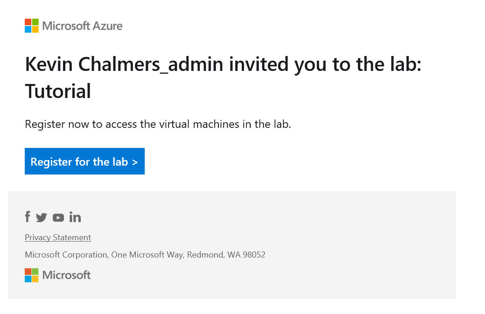
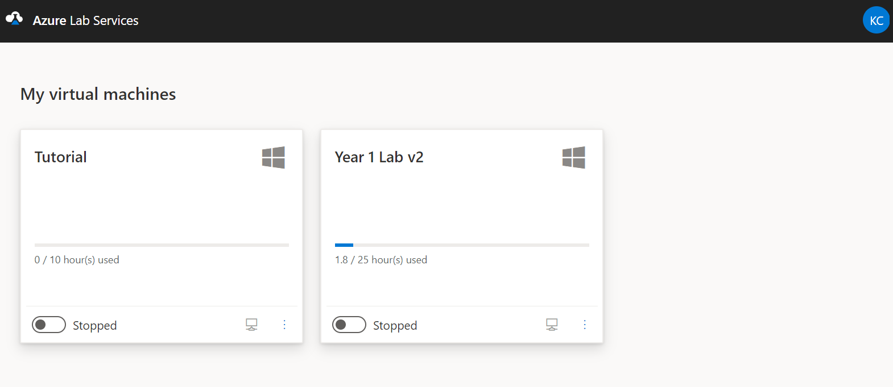
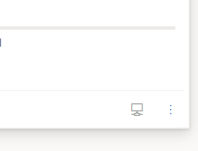
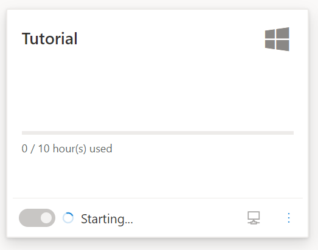
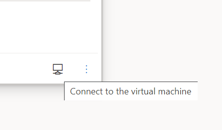
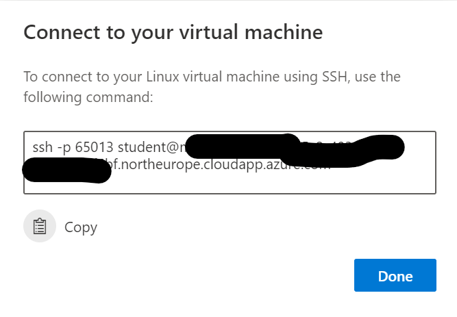

# Accessing Azure Labs Linux Virtual Machine

## Registering for the Lab

When we add you to a lab, you will receive an email from Microsoft titled "Register for Lab - xxx" to your University of Roehampton email address. Check your spam folder if it is not there.

Click on the **Register for the lab** button in the email. The link will take you to the labs' dashboard. You log in using your usual University username and password.

## Your Labs' Dashboard

You can access your labs' dashboard using the following URL [https://labs.azure.com/virtualmachines](https://labs.azure.com/virtualmachines). The dashboard is quite simple. It displays the current labs you have access to and their state.:

- The name of the lab.
- The operating system of the lab represented by either the Windows logo or Linux logo.
- The number of hours used based on your quota.
- If the lab is running or stopped.

## Changing Your Password

The first thing you should always do is change the password of the lab.

1. Click the **three dots** at the bottom right of a lab.

    ]

2. Select **Reset password**.
3. Enter your new password.
4. You can always change your lab password from here, so even if you forget it, you can change it.

## Starting a Lab

Before you can access a lab, you must start the remote virtual machine.

1. Click the **Stopped Toggle** to start the machine.

    

2. The machine will take a few minutes to start-up, depending on the current demand for Azure. Once started, it can be connected to.

## Logging into Your Linux Lab Machine

### Windows 10 / Mac OS X / Linux Desktop

1. At the bottom right of the lab, next to the three dots, you will see a **Remote Desktop Icon**. Click on the icon.
2. The following window will be opened.

    

3. Copy the information to the clipboard. This is a Secure Shell (ssh) connection string, allowing you to access the command line o the remote machine

    

4. Depending on your operating system, open the command line terminal:
    - Windows 10 - Command Prompt, PowerShell, or Terminal.
    - Mac OS X - Terminal.
    - Linux - depends on your distribution, but there will a terminal or command interface.
5. Paste the connection information into the command line and press return.
6. You will be prompted for your password. This is the password you set for the lab.
7. You can now enter commands on the remote machine.

### iPad / Android Tablets

There are numerous apps for creating an SSH connection. Search the relevant app store and install one that looks of high quality.

1. Follow the first three steps for Windows 10 / Mac OS X / Linux Desktop provided above.
2. The lab connection information from Step 3 can be used for the hostname/IP information in your app of choice. You may have to modify some of the information depending on the app used.
    - Remove `ssh` from the start.
    - The `-p XXXX` (some number) defines the port to connect to. You might have to use the number in a separate input box of the connection information and remove `-p XXXX` from the connection information.
    - The `username@` (probably `student@`) part denotes the username to log in with. The username might have to be entered in a different input box, and `username@` removed from the connection information.

## Stopping Your Lab Machine

It is your responsibility to turn off the remote machine. You have been provided with a limited number of hours of access which will run out if you do not switch off the machine. **Linux machines do not automatically shutdown**.

To exit the command prompt, you can type `exit`, although it is probably safer to use `sudo shutdown now`. In either case, go to your [labs' dashboard](https://labs.azure.com/virtualmachines) and toggle the lab to **Stopped**.