# Accessing Azure Labs Windows Virtual Machine

## Registering for the Lab

When we add you to a lab, you will receive an email from Microsoft titled "Register for Lab - xxx" to your University of Roehampton email address. Check your spam folder if it is not there.

Click on the **Register for the lab** button in the email. The link will take you to the labs' dashboard. You log in using your usual University username and password.

## Your Labs' Dashboard

You can access your labs' dashboard using the following URL [https://labs.azure.com/virtualmachines](https://labs.azure.com/virtualmachines). The dashboard is quite simple. It displays the current labs you have access to and their state.:

- The name of the lab.
- The operating system of the lab represented by either the Windows logo or Linux logo.
- The number of hours used based on your quota.
- If the lab is running or stopped.

## Changing Your Password

The first thing you should always do is change the password of the lab.

1. Click the **three dots** at the bottom right of a lab.

    

2. Select **Reset password**.
3. Enter your new password.
4. You can always change your lab password from here, so even if you forget it, you can change it.

## Starting a Lab

Before you can access a lab, you must start the remote virtual machine.

1. Click the **Stopped Toggle** to start the machine.

    

2. The machine will take a few minutes to start-up, depending on the current demand for Azure. Once started, it can be connected to.

## Logging into Your Windows Lab Machine

### From a Windows 10 Desktop/Laptop

1. At the bottom right of the lab, next to the three dots, you will see a **Remote Desktop Icon**. Click the icon, and a **Remote Desktop Profile** (`*.rdp`) file will be downloaded.
    
2. Once downloaded, open the file, and the remote connection will be created. First, the following window is opened:
    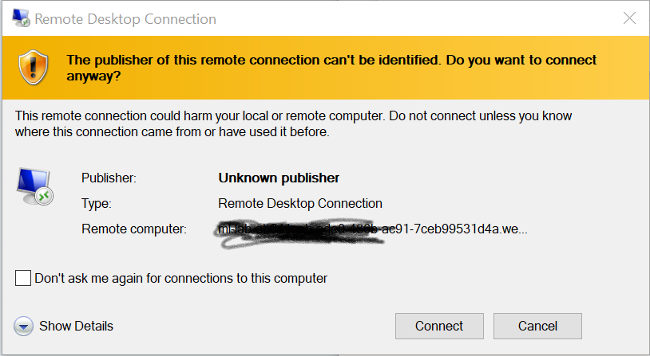
3. Click **Connect**. You will then be asked for your password. Enter the password you have set for the lab and click **OK**.
    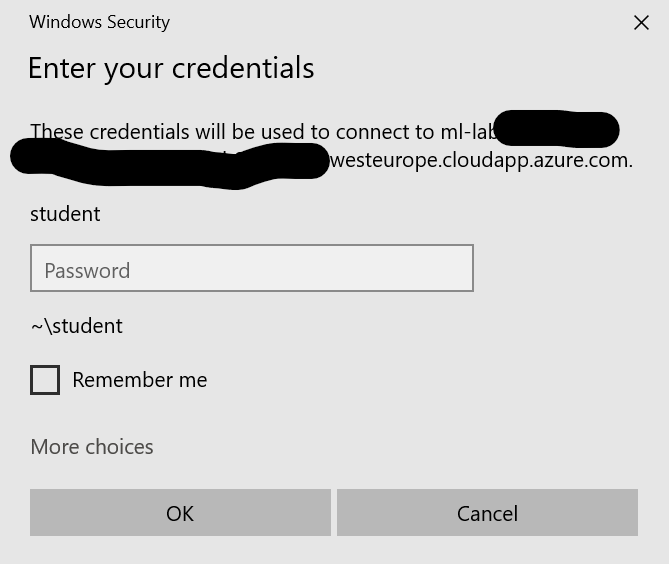
4. A final security prompt will be displayed. Select **Yes** and the remote machine will log in. From here, it is just as using a normal desktop.
    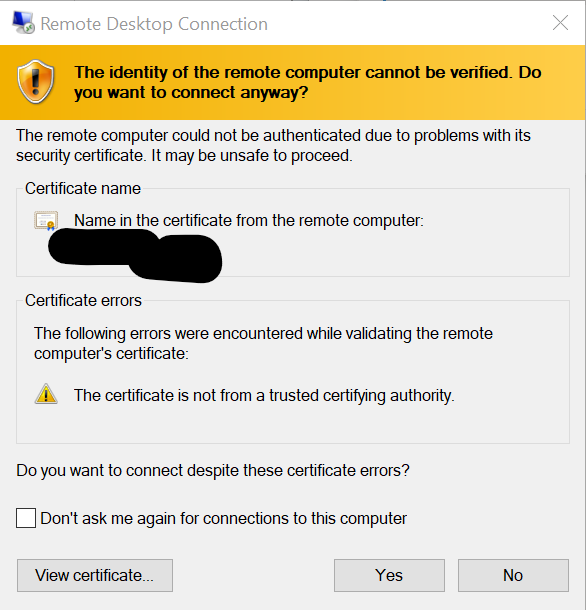

### From a Mac Desktop/Laptop

1. You will need Microsoft Remote Desktop installed. It is available from the Mac App Store.
2. Follow the steps for Windows 10 Desktop/Laptop. The security check windows will be different but should appear during the same steps.

### From a Linux Desktop/Laptop

1. At the bottom right of the lab click the three dots and select **Show RDP Information**.
    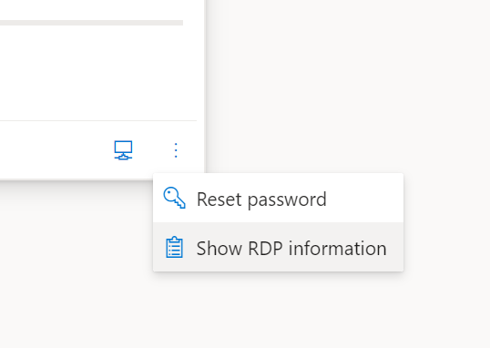
2. A window will open with the connection information.
    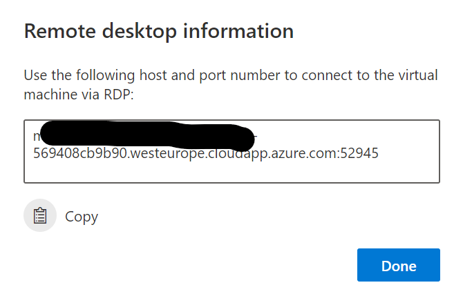
3. Copy this information as you will need it to connect to the remote desktop.
4. The following steps are for Remmina, a remote desktop client available for most Linux distributions. You will have to review your Linux distribution's online help about how to install Remmina.
5. Start Remmina. You will be presented with the following screen.
    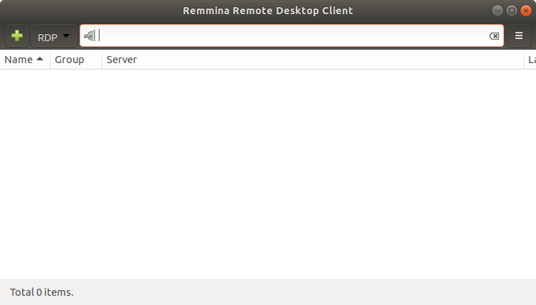
6. Click the **green plus button** at the top-right of the window. The new remote connection window will open.
    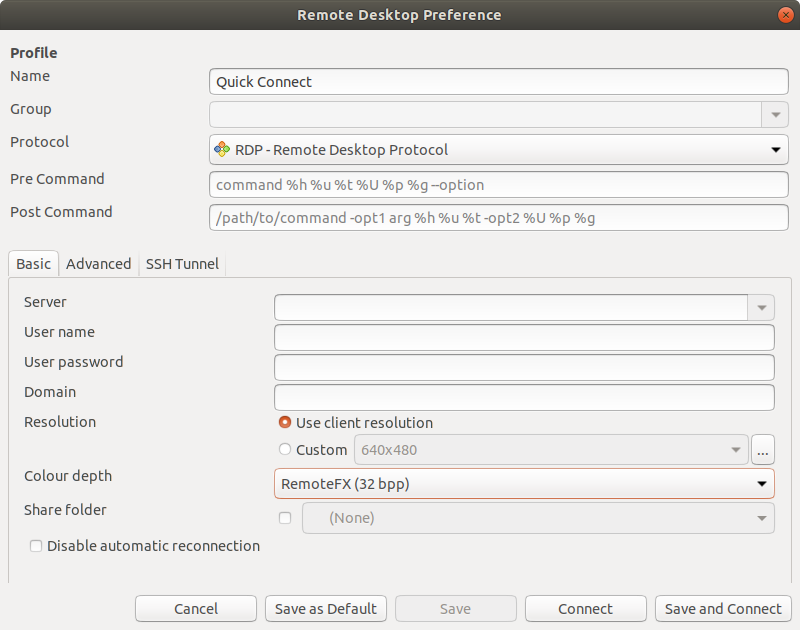
7. You will have to enter the following details:
    - **Name** - it is easiest to use the name of the lab to remember which one you are working with.
    - **Server** - the details you copied from the Azure Labs dashboard in Step 3.
    - **User name** - the username for the lab. Usually, the default is **student**. If you are unsure, then check Moodle or ask.
    - **User password** - can be entered here or when connecting. This is the password you have set for the lab machine.
    - **Colour depth** - this depends on the version of Remmina installed and the drivers installed in your Linux distribution. The safest option seems to be **True Colour (32 bpp)**.
8. Click **Save and Connect** to save the information and connect to the remote machine. You will be asked to accept a certificate.
    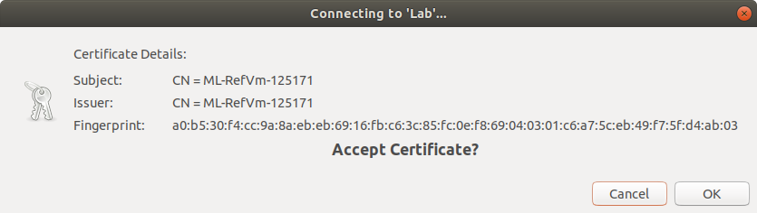
9. Click **OK** and the machine will connect.

### From an iPad or Android Tablet

You will need to install Microsoft Remote Desktop (known as RD Client on Apple App Store).

1. At the bottom right of the lab click the three dots and select **Show RDP information**.
    
2. A window will open with the connection information.
    
3. Copy this information as you will need it to connect to the remote desktop.
4. Open the Remote Desktop app on your device. You will be presented with the start screen. The following is a screenshot from the iPad version.
    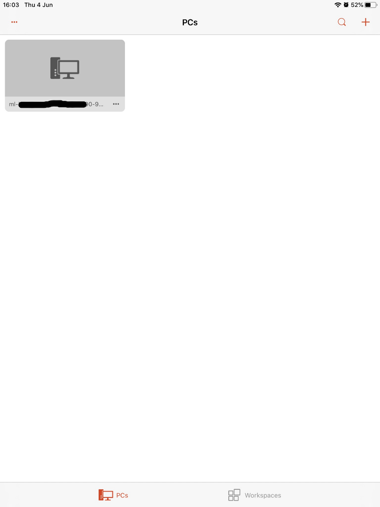
5. Press the **plus** button in the top-right corner to create a new connection. This will open a window to enter the connection information. The following image is a screenshot from the iPad version.
    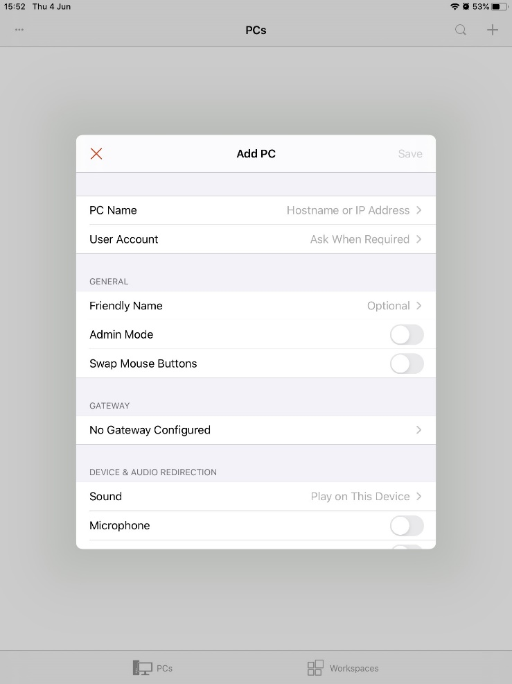
6. Select **PC Name** and paste the details you copied in Step 3.
7. You probably want to set **Friendly Name** to the name of the lab.
8. Press **Save**. Back at the initial window, you can now connect to the remote machine by pressing it. You will be asked for the username and password. The following image is an example from the iPad version.
    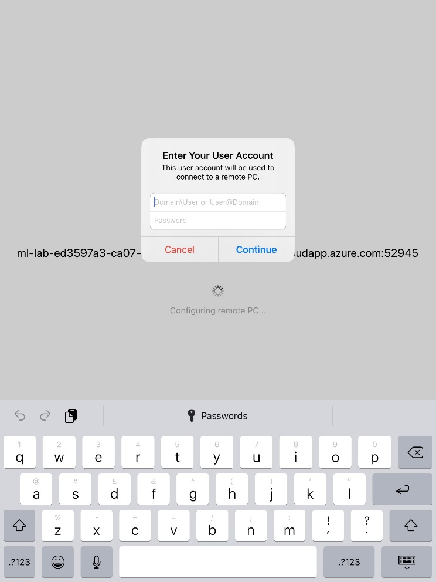
9. The username usually is **student** but if you are unsure check Moodle or ask. The password is the one you set for the lab. You will now connect to the remote machine and be presented with the Windows 10 desktop.