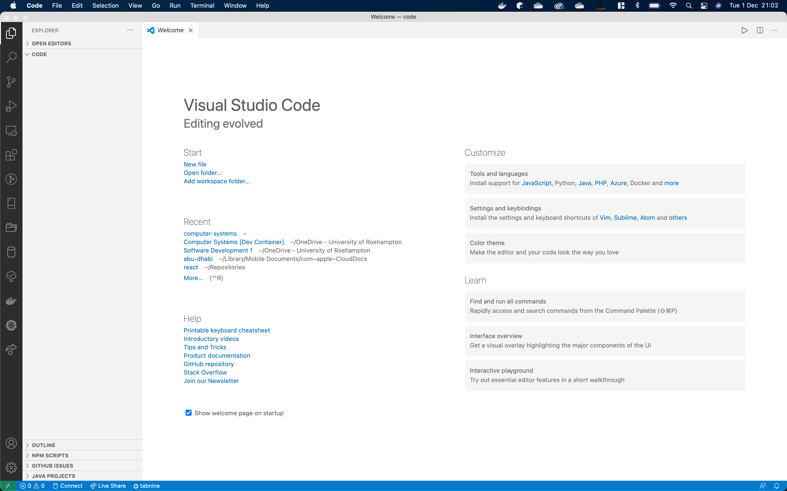

# Getting Started with Visual Studio Code

[Visual Studio Code](https://code.visualstudio.com/) is essentially a text editor with plugin support.  You should download and install Visual Studio Code to your own machine now. If you are using Azure Labs, it is already installed.

Other text editors exist. Windows comes with Notepad. Linux and MacOS come with a variety of tools. Sublime Text is a very popular text editor, but it isn't free. We do not specify a text editor you must use. It is up to your own personal preference.

We will look at Visual Studio Code as an example of starting up.  When run, you should see a screen similar to the following:

## Installing Plugins

