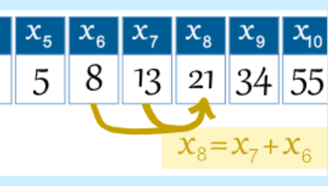

# Computational Thinking Seminar 05 -- Pseudocode

These tutorials are designed to teach you a number of techniques. As all of you know a Pseudocode is an informal high-level description of the operating principle of a computer program or other algorithm. Pseudocode is not actual programming language. It uses short phrases to write code for programs before you actually create it in a specific language. In computer science, pseudocode is a plain language description of the steps in an algorithm or another system. Pseudocode often uses structural conventions of a normal programming language but is intended for human reading rather than machine reading.

Most importantly, pseudocode is another useful method for designing software and this is a program outline in text form that can be entered directly into the source code editor as a set of general statements that describe each major block, which would be defined as functions and procedures in a high-level language. 

## Exercises 

1. Write a pseudocode which generates first 50 items of the Fibonacci series:

   Note: Fibonacci series is defined as a sequence of numbers in which the first two numbers are 1 and 1, or 0 and 1, depending on the selected beginning point of the sequence, and each subsequent number is the sum of the previous two. 

   **How to Generate Fibonacci Series?**

   

 

2. Write a pseudocode of printing even numbers between 1 to 100

   Note: Any integer that can be divided exactly by 2 is an even number.

      Example of even number  2, 4, 6, 8, 10, . . . 

3. Write a pseudocode to print all the odd numbers from 1 to 100

   Note: Odd numbers are whole numbers that cannot be divided exactly into pairs. Odd numbers, when divided by 2, leave a remainder of 1. 1, 3, 5, 7, 9, 11, 13, 15 … are sequential odd numbers.

4. Write a pseudocode describes an algorithm which will accept two numbers from the keyboard and calculate the sum and product displaying the answer on the monitor screen. 

5. How the selection control structure is used in a program: 

   Write a pseudocode where a user chooses the options for multiplying the    numbers or adding them or subtracting.

6. Compound Logical Operators scenarios:

   Write a pseudocode is to input an examination mark and test it for the award    of a grade. The mark is a whole number between 1 and 100. Grades are awarded according to the following criteria:

   - \> = 80 Distinction
   - \> = 60 Merit
   - \> = 40 Pass
   - < 40 fail

7. The case statement or if … else statements scenarios: 

   Write a pseudocode solution which outputs a message (e.g., insurance is not available, insurance is double, insurance is normal, insurance is medically dependent, and entry invalid) to the monitor screen describing the insurance available according to a category input by the user.

8. Write a pseudocode with the below scenarios: 

   A small start-up software developer company needs to create a program that will calculate the pay of its employees. For the third version of the program, the company wants the program to accept an employee’s name, the number of hours that the employee worked, and the hourly pay rate. The program will then calculate the gross pay, display the employee’s name, number of hours worked, pay rate, and gross pay, but also calculate and display the net pay of the person after taxes have been calculated and deducted.