# Computational Thinking Lab 08 -- Functions in Blockly 

## Practical Fundamental Concepts of Function 

Functions are “self-contained” modules of code that accomplish a specific task. Functions usually “take in” data, process it, and “return” a result. Once a function is written, it can be used over and over and over again. Functions can be “called” from the inside of other functions.

Most programming languages come with a prewritten set of functions that are kept in a library. For instance, C and C++ etc. You can also write your own functions to perform specialized tasks.

### Related Terms

- **Routine:** A section of a program that performs a particular task. Programs consist of modules, each of which contains one or more routines. The term routine is synonymous with procedure, function, and subroutine.
- **Function Block:** In software languages, a function block contains input variables, output variables, through variables, internal variables, and an internal behaviour description of the function block. Function blocks are used primarily to specify the properties of a user function. Many software languages are based on function blocks.
- **User Defined Function:** A user defined function is a programmed routine that has its parameters set by the user of the system. User defined functions often are seen as programming shortcuts as they define functions that perform specific tasks within a larger system. 

### Why do we use functions?

A function is almost like a mini program that you can write separately from the main program, without having to think about the rest of the program while you write it. This allows you to reduce a complicated program into smaller, more manageable chunks, which reduces the overall complexity of your program.

Moreover, the use of functions enhances the readability of a program. A big code is always difficult to read. Breaking the code in smaller Functions keeps the program organised, easy to understand and makes it reusable. 

## Implementation

If you want to work with function in **Google’s Blockly** you need to know the - **THE PROGRAMMING BLOCKS** below: 

**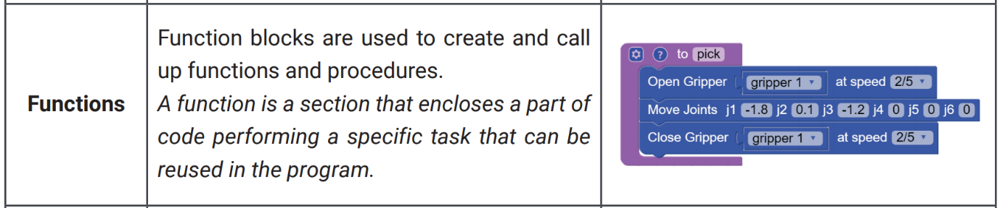**

Here, created a simple function (using the graphical interface) which is declared the function name Say Something and called outside from the function. The results are below:

**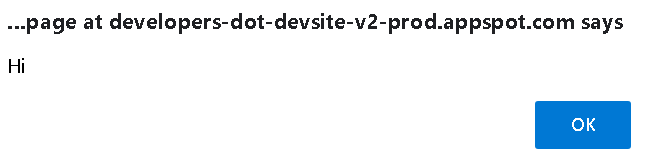** **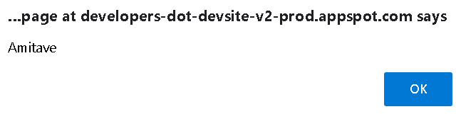**

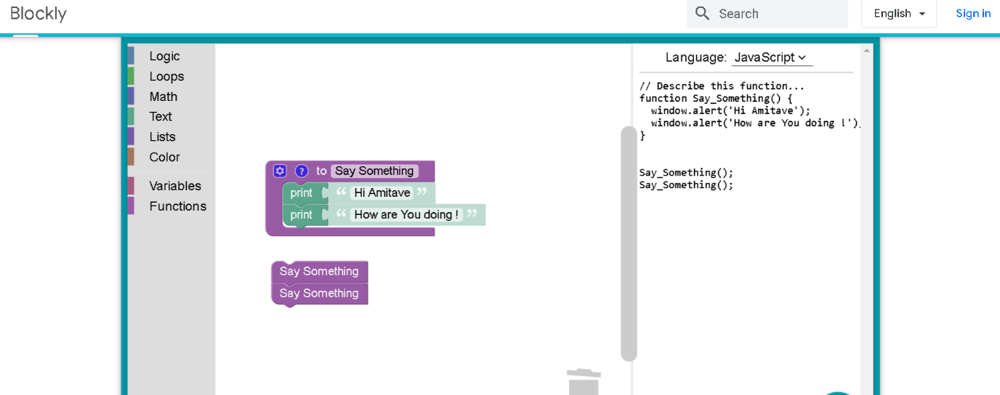

- Try yourself and make familiar with function, how to create/build a function. 

In Essence, you can see in Function category, there are three blocks to create/build a function:

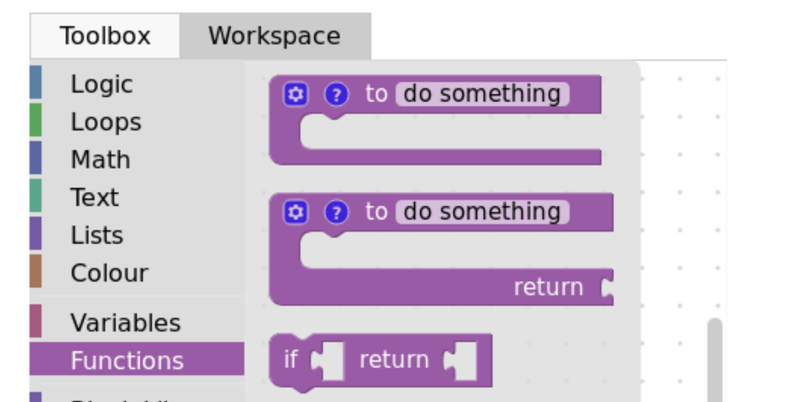

Now, you can configure the function. The wheel icons allow you to add parameters. Simply name your parameter (x by default), then connect the block into the right space, like so:

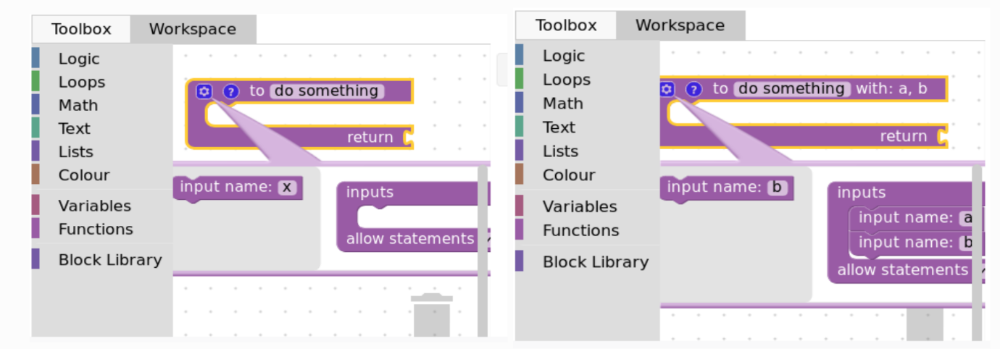

The `?` icon allows you to set a tooltip (text that show on mouseover) simply by typing in the field:

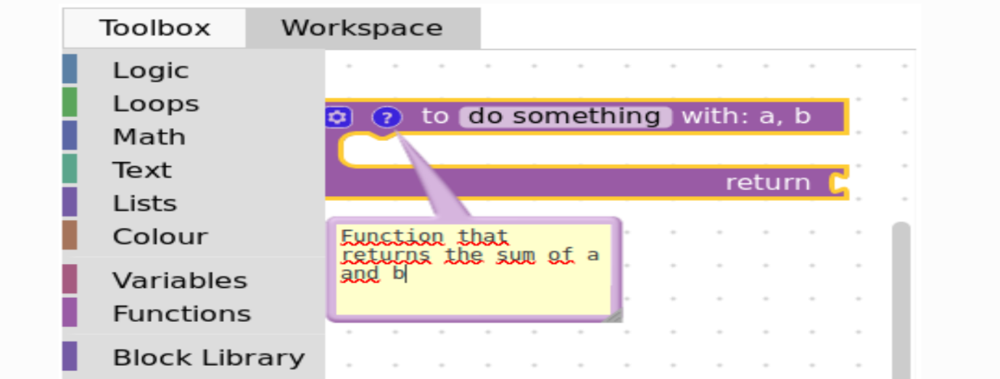

A function definition in **Google’s Blockly** consists of a function name and a function body. Here are all the parts of a function - 

- **Return Type** − A function may return a value. The return_type is the data type of the value the function returns. Some functions perform the desired operations without returning a value.

- **Function Name** − This is the actual name of the function. The function name and the parameter list together constitute the function signature.

- **Parameters** − A parameter is like a placeholder. When a function is invoked, you pass a value to the parameter. This value is referred to as actual parameter or argument. The parameter list refers to the type, order, and number of the parameters of a function. Parameters are optional; that is, a function may contain no parameters.

- **Function Body** − The function body contains a collection of statements that define what the function does.

The below example showed that passing text and displayed “How are You “ 

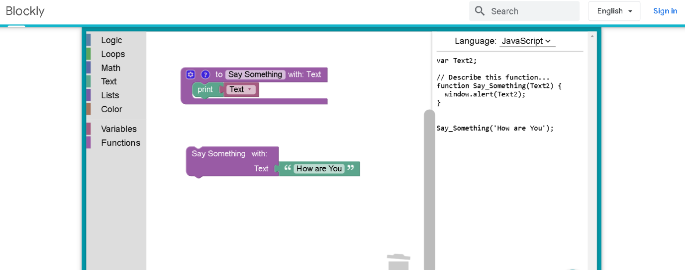

- Try yourself and analysis the function, how does it work! 
- The below function showed math operations. Try the function by yourself and analysis the function, how does it work! 

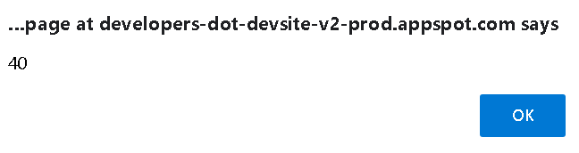

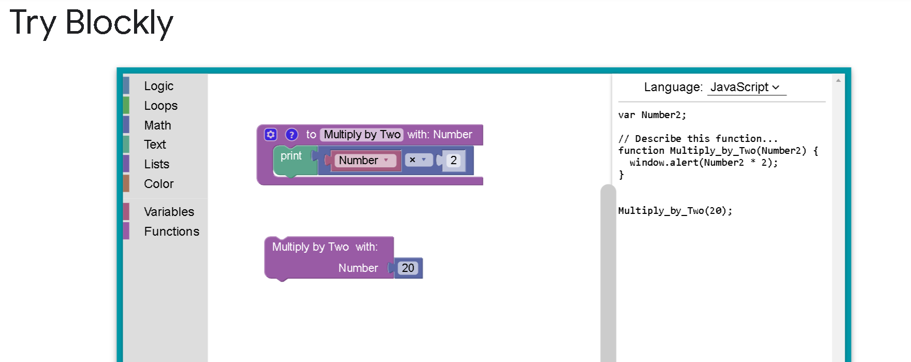 

- More math function with return value. The below function showed math operations. Try the function by yourself and analysis the function, how does it work! 

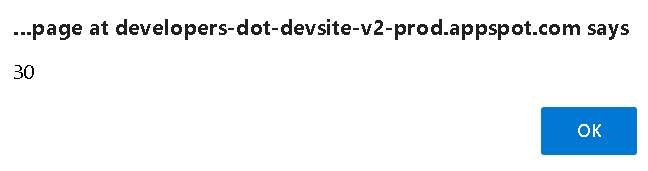

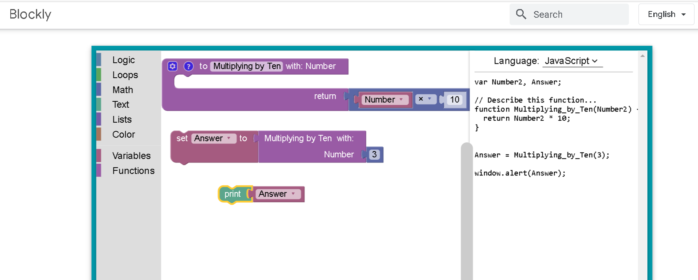

- More math function with return value as well as multiple numbers as a parameter. The below function showed math operations. Try the function by yourself and analysis the function, how does it work! 

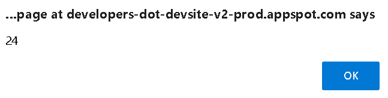

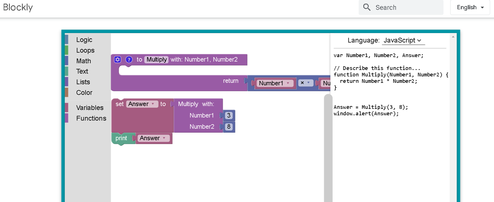

 

## Calling a Function

While creating a **Google’s Blockly** function, you give a definition of what the function has to do. To use a function, you will have to call that function to perform the defined task.  

When a program calls a function, the program control is transferred to the called function. A called function performs a defined task and when its return statement is executed or when its function - ending closing brace is reached, it returns the program control back to the main program.

To call a function, you simply need to pass the required parameters along with the function name, and if the function returns a value, then you can store the returned value. Now, let’s create a variable to hold the returned value below: 

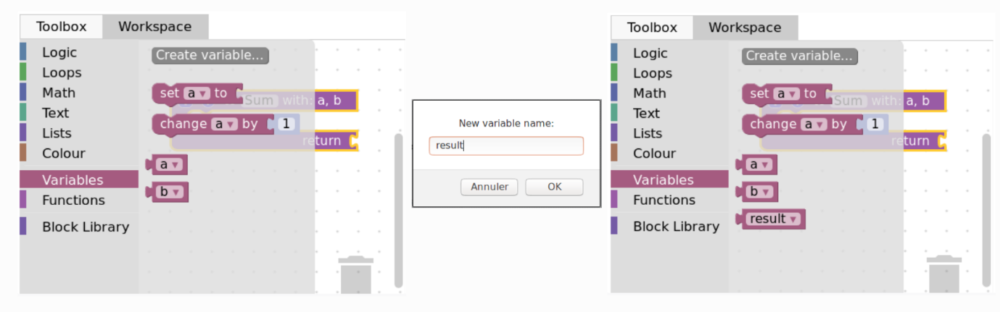

### Passing arguments to a Function

In programming, argument refers to the variable passed to the function. In the above example, two variables n1 and n2 are passed during the function call.

The parameters a and b accept and passed arguments in the function definition. These arguments are called formal parameters of the function. 

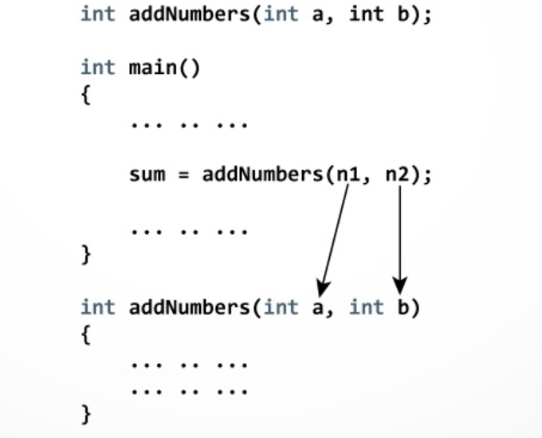

- This is your tasks mow and create function with return value. Find out the sum of the function. 

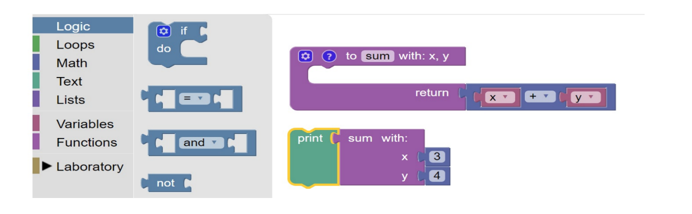

- This is your tasks and create this programme block. Find out the results! 

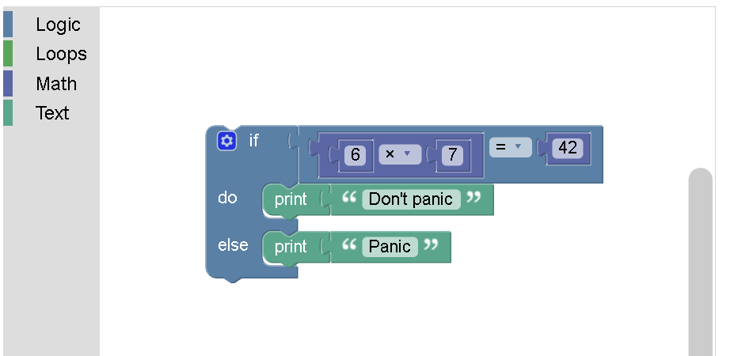 