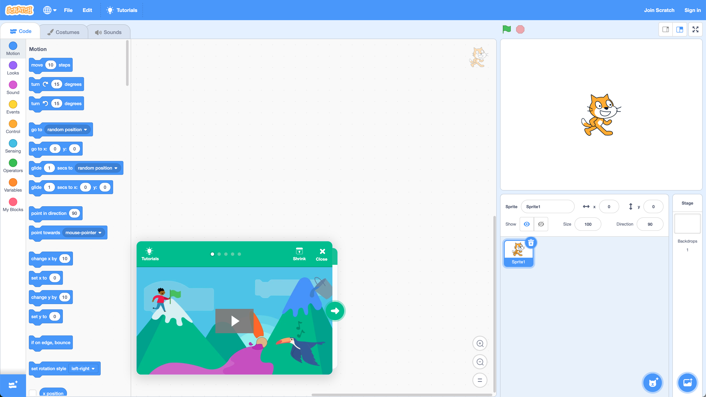
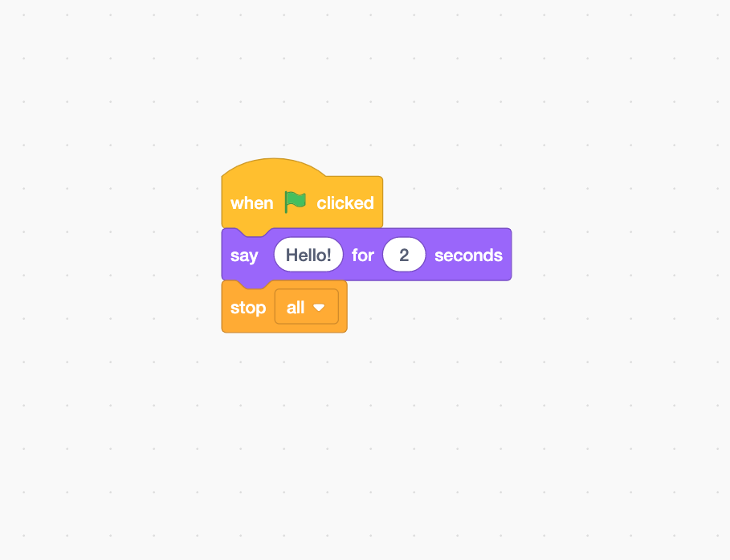
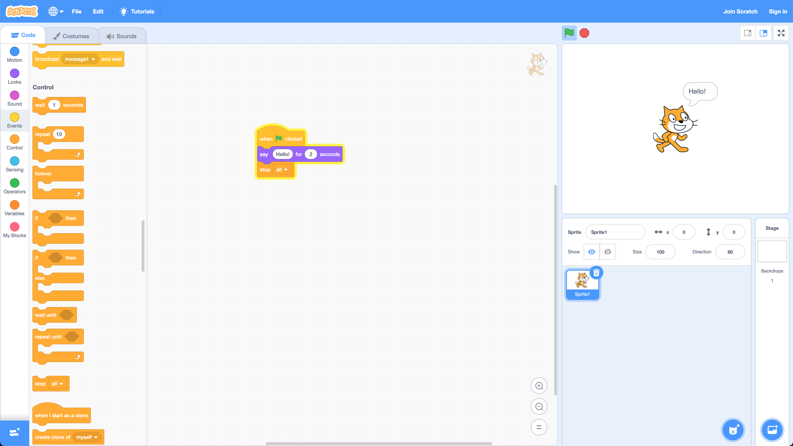
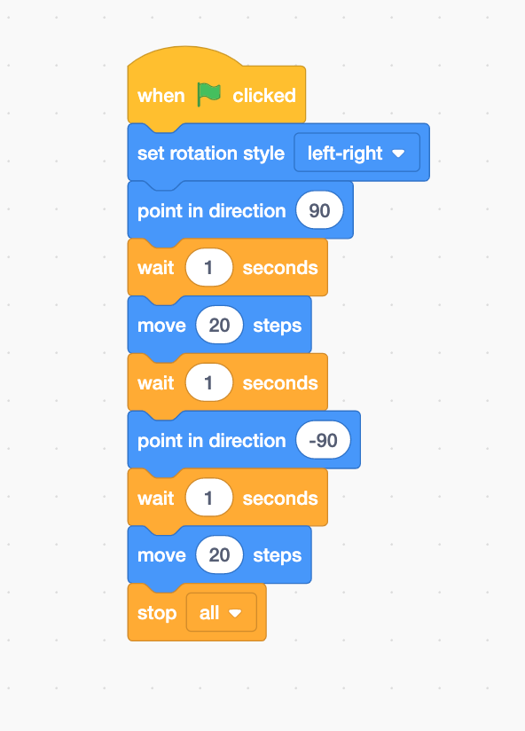
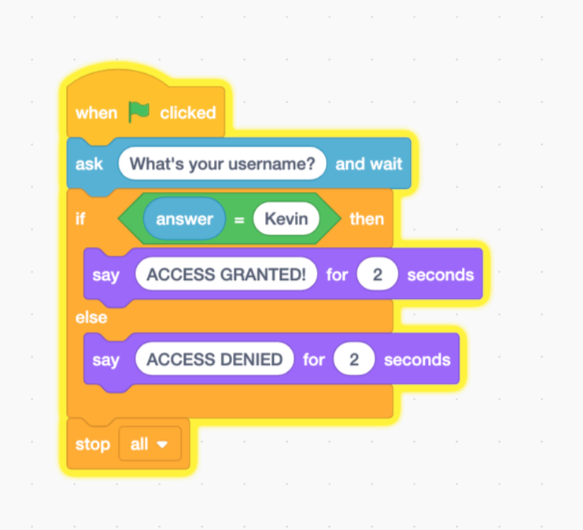

# Computational Thinking Lab 08 -- Introduction to Programming in Scratch

In this lab, we will work in [Scratch - Imagine, Program, Share (mit.edu)](https://scratch.mit.edu/). Scratch is a visual programming language, normally aimed at students at school, but used in various avenues due to its creative nature. For example, people have made simple games using Scratch. For more examples, see [Scratch - Explore (mit.edu)](https://scratch.mit.edu/explore/projects/tutorials/).

## Getting Started with Scratch

When you get to the main Scratch page, **Click Create at the top of the screen.** This will open a new Scratch window:



At the bottom of the window is a short tutorial (the part in green). First, follow this tutorial to get started.

## Hello World

We are going to use Scratch for simple examples. First, let us write a program that says `Hello!` to the user. Create the following program:



To give you an idea of what this program does, read the following pseudocode.

```
WHEN FLAG CLICKED
    SAY HELLO FOR 2 SECONDS
STOP ALL
```

**Click the Green Flag near the top right of the screen.** The character will say hello.



OK, a simple example. Let us do something a little more advanced.

## Moving

Remember our simple example of a program we have used in the past.

```
WHEN FLAG CLICKED
	SET ROTATION STYLE LEFT-RIGHT
	POINT IN DIRECTION 90
	WAIT 1 SECONDS
	MOVE 20 STEPS
	WAIT 1 SECONDS
	POINT IN DIRECTION -90
	WAIT 1 SECONDS
	MOVE 20 STEPS
STOP ALL
```

We add some `WAIT` commands so we can see the result. In Scratch, create the following:



## Egg Boiling

Now implement the egg boiling example. Use the `Say for 2 seconds` block to give instructions.

```pseudocode
BEGIN
    FILL SAUCEPAN WITH WATER
    SET HOB TO HIGH
    PUT SAUCEPAN ON HOB
    WAIT UNTIL WATER BOILING
    ADD EGG TO WATER
    WAIT ONE MINUTE
    REMOVE SAUCEPAN FROM HOB
    WAIT SIX MINUTES
    REMOVE EGG FROM WATER
END
```

## Conditionals

Scratch also supports conditionals. Remember we had the username check program:

```pseudocode
BEGIN
    READ username
    IF username = "Kevin" THEN
        PRINT "ACCESS GRANTED"
    ELSE
        PRINT "ACCESS DENIED"
    END IF
END
```

We can implement this in Scratch as follows:



**Now implement the social media requester example below.**

```pseudocode
BEGIN
	LET requester = RECEIVE REQUEST
	IF requester IS KNOWN THEN
	    IF requester IS LIKED THEN
	        ACCEPT REQUEST
	    ELSE
	        IGNORE REQUEST
	    END IF
	ELSE
	    IGNORE REQUEST
	END IF
END
```

