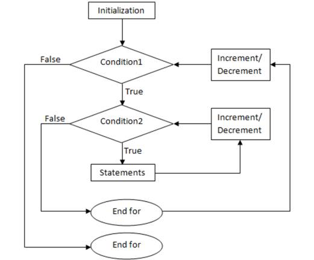
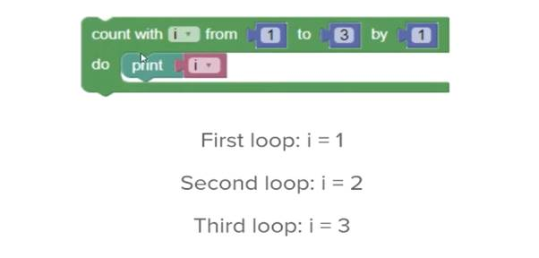
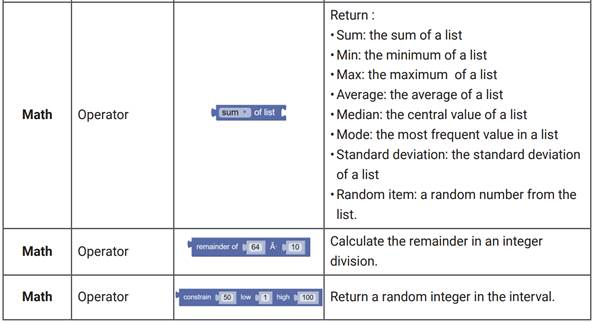
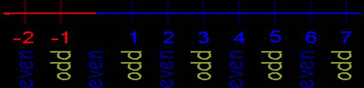
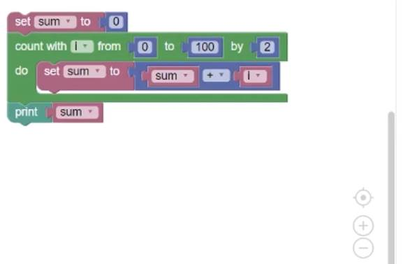
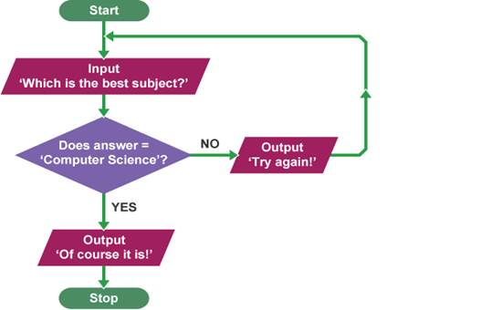

# Computational Thinking Lab 07 -- More Blockly 

## Nested Loops

A nested loop is a loop inside a loop. The “inner loop” will be executed one time for each iteration of the “outer loop”. 

Loops are control structures used to repeat a given section of code a certain number of times or until a particular condition is met.

In essence, a nested loop is a loop within a loop, an inner loop within the body of an outer one. How this works is that the first pass of the outer loop triggers the inner loop, which executes to completion. Then the second pass of the outer loop triggers the inner loop again. The below flowchart shows a nested loop - 



Now we will learn how nested loops works in Google’s Blockly ( using the graphical interface) 





 


- Try yourself and run and analyse - how may this nested loop programme work?

The below programme written in C language and using nested loop and to find the prime numbers from 2 to 20. Create a Google’s Blockly (using the graphical interface) nested loop programme to use Blockly.

```c
#include <stdio.h>

int main () 
{
    /* local variable definition */
    int i, j;
    for(i = 2; i<20; i++) 
    {
        for(j = 2; j <= (i/j); j++) 
            if(!(i%j)) break; // if factor found, not prime
        if(j > (i/j)) printf(“%d is prime\n”, i);
    }
    return 0;
}
```

If you want to do these tasks you need to know the - **THE PROGRAMMING BLOCKS** below - 




## While Loop

A while loop is the most straightforward looping structure. Syntax of while loop in programming is as follows:

```c
while (condition) {
	statements;
}
```

It is an entry-controlled loop. In while loop, a condition is evaluated before processing a body of the loop. If a condition is true, then and only then the body of a loop is executed. After the body of a loop is executed then control again goes back at the beginning, and the condition is checked if it is true, the same process is executed until the condition becomes false. Once the condition becomes false, the control goes out of the loop.

Following program illustrates while loop in C programming example - 

```c
#include<stdio.h>
#include<conio.h>
int main()
{
    int num=1; //initializing the variable
    while(num<=10)     //while loop with condition
    {
        printf(“%d\n”, num);
        num++;        //incrementing operation
    }
    return 0;
}
```

- Try yourself and develop a Google’s Blockly (using the graphical interface) and find out the output printed series of numbers from 1 to 10 using a while loop

Now we will learn about Even Number: 



Any integer (never a fraction) that can be divided exactly by 2. The last digit is 0, 2, 4, 6 or 8 etc    

We will find out the sum of even number from 0 to 100 by using Google’s Blockly – 



- Try yourself and run and analyse – I hope the result of the sum of even number from 0 to 100 could be 2550 

Professional programmers create programs by writing lines of text for a computer to interpret. This is the most efficient process for creating large programs, but it can be hard for a beginner to learn programming concepts and programming syntax simultaneously. As a beginner, you can get started with a visual programming tool, which lets you create programs without getting stuck over syntax rules. Google Blockly is a good tool for this purpose since it runs online and can generate actual JavaScript or Python code.

This tutorial will go through a series of Google Blockly games so you can learn programming. In Blockly, you drag around blocks to create a program. To get used to the interface, try out this simple puzzle game:

 


Please go to the below link - [**https://www.learneroo.com/modules/139/nodes/727**](https://www.learneroo.com/modules/139/nodes/727) and you will find the Blockly Games: Puzzle . Check your answers

Flowcharts can be used to plan out programs. Planning a program that ask students what the best subject you may take! Computer Science? Read form the students and develop a Flowchart whether students make decision yes means of course it is and no means try again. Now we will work with this flowchart and pseudocode below - 

 



**Start**

**REPEAT** 

**OUTPUT ‘What is the best subject you take?’** 

**INPUT user inputs the best subject they take** 

**STORE the user’s input in the answer variable**

**IF answer = ‘Computer Science’ THEN** 

**OUTPUT ‘Of course it is!’** 

**ELSE** 

**OUTPUT ‘Try again!’**

**UNTIL answer = ‘Computer Science’**

**End.**  

- Now your tasks - Create a Google’s Blockly(using the graphical interface)  programme and convert pseudocode to Blockly. 