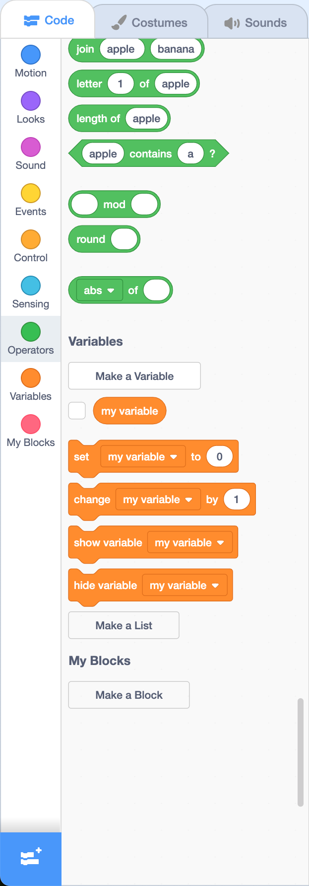
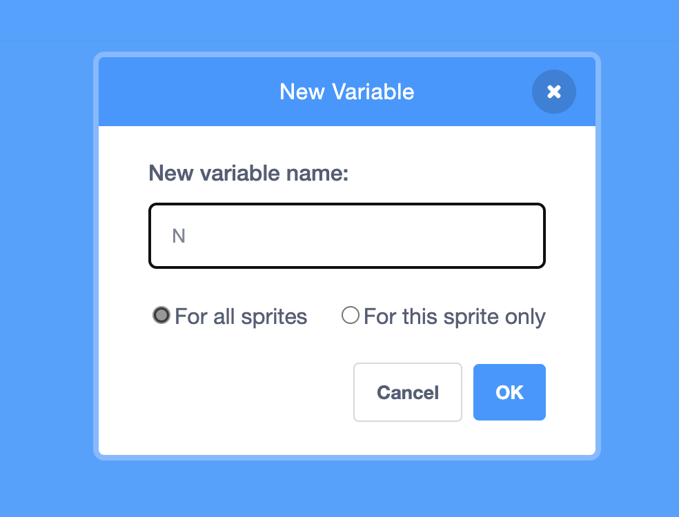
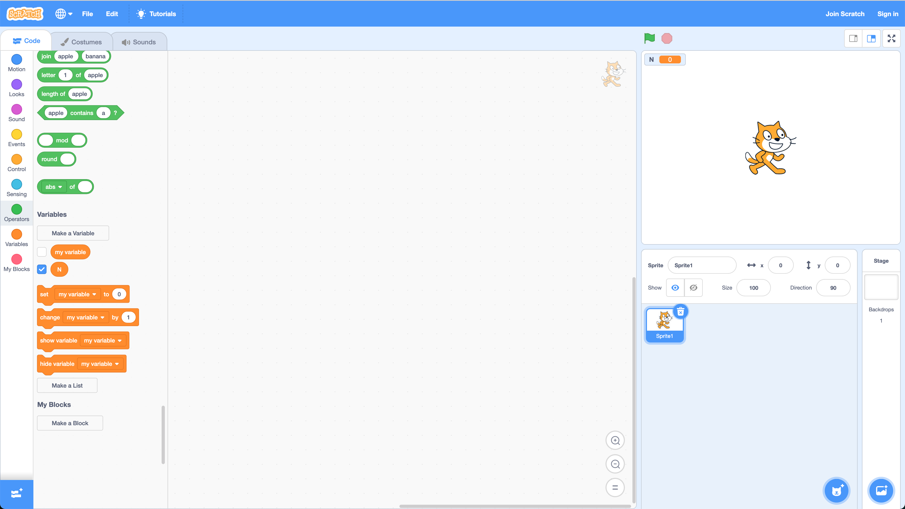
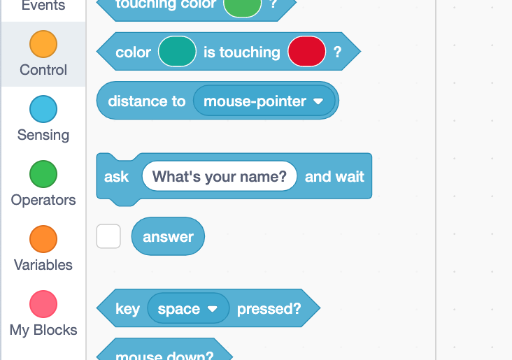
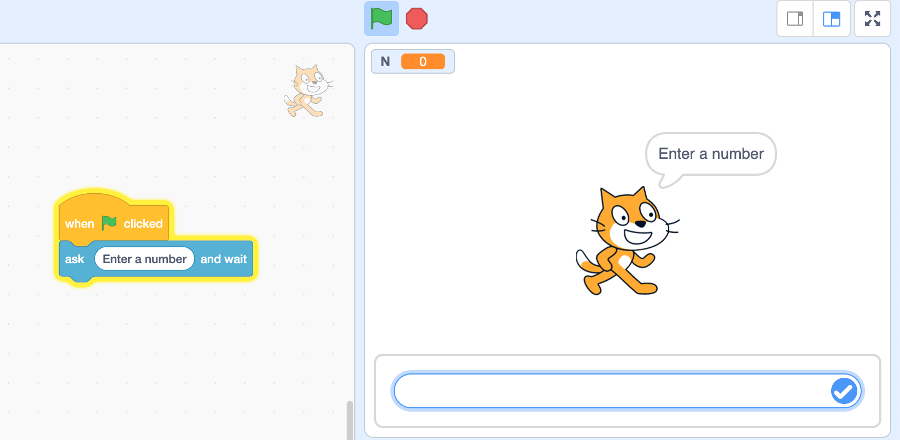
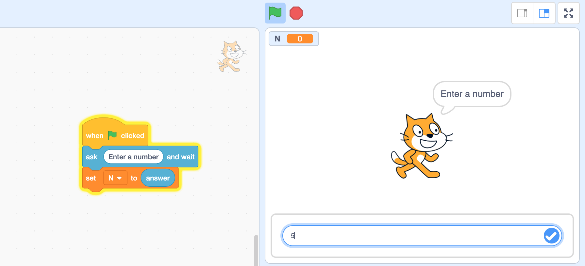
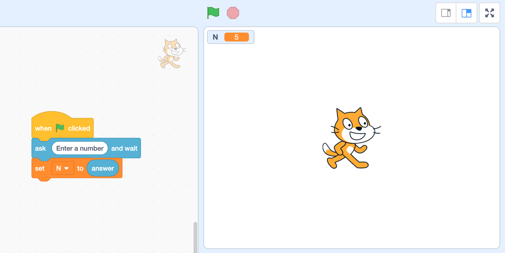
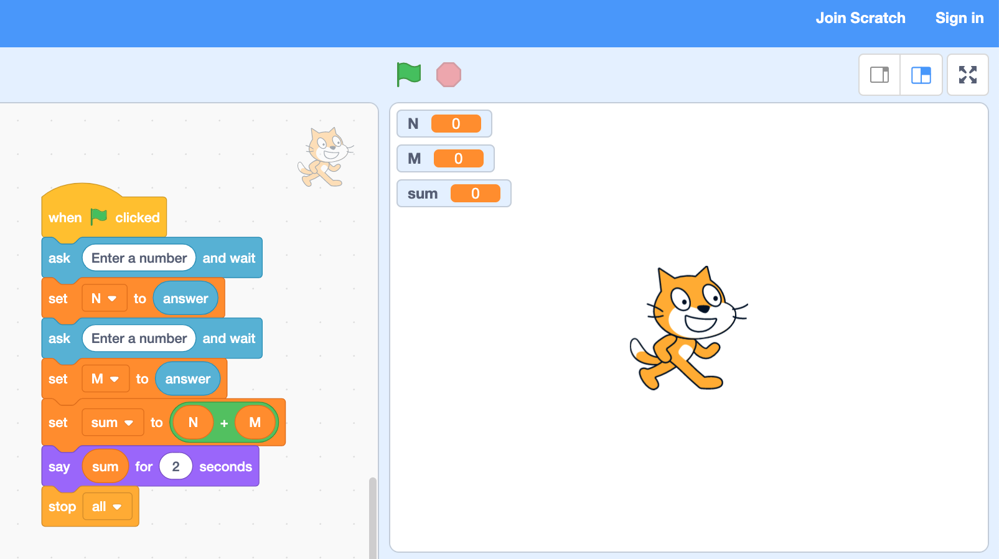
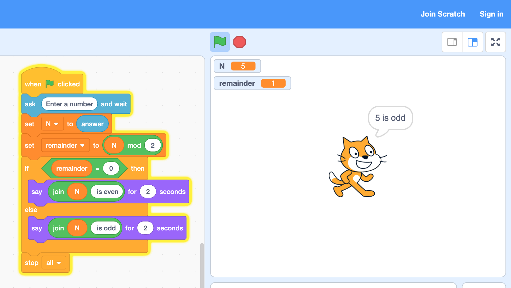
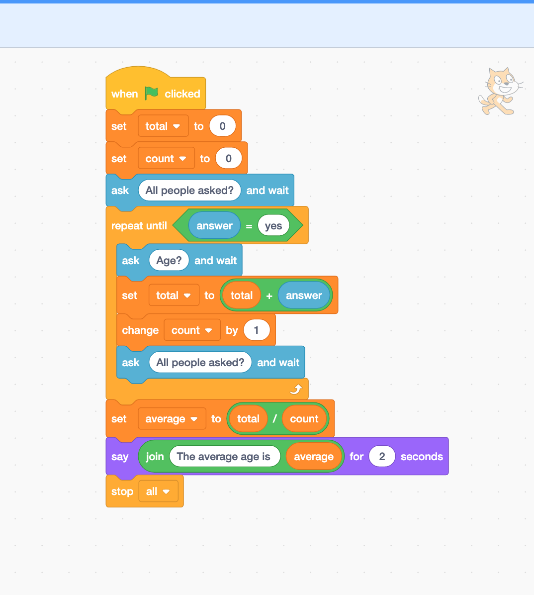

# Computational Thinking Lab 09 -- More Scratch

In this lab, we will continue to work in [Scratch - Imagine, Program, Share (mit.edu)](https://scratch.mit.edu/) looking at more advanced examples.

## Working with Variables

**A variable is just a value we want to store and possibly change during the execution of a program.** For example, if you want to hold a value read from the user, we need to store it in a variable.

### Creating Variables in Scratch

Creating a new variable in Scratch is relatively easy. In the toolbox on the left-hand side, scroll down until you find the **Make a variable** button:



**Click on this button to open the new variable prompt:**



**Call the variable `N` for the moment, and click OK.** You will now see the variable available in the toolbox, and also monitored above the sprite on the right-hand side:



### Reading Input and Setting Variables

In Scratch, we read input from the user using the **Ask and wait block:**



Using this block and running the application will prompt the user (via the Sprite) and put a textbox under the sprite on the right-hand side for the user to enter a number:



To store this value, we use the **Set variable block:**



We basically say the following:

- Ask the user to enter a number.
- Set N to user input.

This is the standard method of getting user input -- prompt and store. Running the application to the end will show you that N does indeed change:



Notice N is now 5 above the sprite.

### Extended Example

Let us look at an extended example using three variables:

```pseudocode
BEGIN
    READ N
    READ M
    LET sum = N + M
    PRINT sum
END
```

For this example we need the following variables:

- N
- M
- sum

**Create the variables M and sum now.** The Scratch equivalent of this pseudocode is:



**Create this in Scratch now and run the program by clicking the green flag. Does it work?**

## Getting Remainders

We can ask Scratch to calculate a remainder using the **Mod block**. Below is an example program that requires us to calculate a remainder:

```pseudocode
BEGIN
    READ N
    LET remainder = N % 2
    IF remainder = 0 THEN
        PRINT "N is even"
    ELSE
        PRINT "N is odd"
    END IF
END
```

**Create a new Scratch application and add a new variable N and another called remainder. Now add the following blocks:**



**Can you work out what the join block does?**

## Exercise

You now have enough knowledge to complete the following application:

```pseudocode
BEGIN
    READ x
    READ y
    READ z
    IF x > y THEN
        IF x > z THEN
            PRINT x
            IF y > z THEN
                PRINT y
                PRINT z
            ELSE
                PRINT z
                PRINT y
            END IF
        ELSE
            PRINT z
            PRINT x
            PRINT y
        END IF
    ELSE
        IF y > z THEN
            PRINT y
            IF x > z THEN
                PRINT x
                PRINT z
            ELSE
                PRINT z
                PRINT x
            END IF
        ELSE
            PRINT z
            PRINT y
            PRINT x
        END IF
    END IF
END
```

## Loops

A loop repeats the instructions inside it until a condition is met. For example, we can use a loop to get the average age of the class.

```pseudocode
BEGIN
    LET total = 0
    LET count = 0
    LOOP UNTIL ALL PEOPLE ASKED
        READ age
        total = total + age
        count = count + 1
    END LOOP
    LET average = total / count
    PRINT average
END
```

The problem here is the `LOOP UNTIL ALL PEOPLE ASKED`. We can do this by asking the user is all people are asked. The following is a Scratch implementation that does this:



### Exercise

You now know enough to complete the following program:

```pseudocode
BEGIN
    LET counter = 1
    LOOP UNTIL counter > 100
        IF counter divisible by 7 THEN
            PRINT counter
        END IF
        counter = counter + 1
    END LOOP
END
```
