# Computational Thinking Lab 09 -- Lists    

Block-based programming has become popular to teach programming to young students like you in introductory programming environments. Blockly is actually a programming language made out of several pre - existing programming languages. We expect great development will come in the future by Google’s Blockly.

## Lists

Programming languages provide the List item for storing lists of items together.

A Blockly list is an ordered collection of items, such as a “to do” list or a shopping list. Items in a list may be of any type, and the same value may appear more than once in a list. If you want to work with the Lists in **Google’s Blockly** you need to know the - **THE PROGRAMMING BLOCKS** below -  

****

**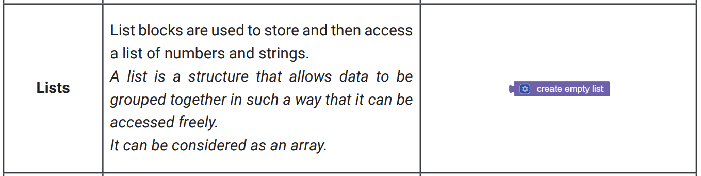**

An array is a variable that can store multiple values. For example, if you want to store 100 integers, you can create an array for it. Arrays can have multiple axes (more than one axis). Each axis is a dimension. Thus, a single - dimension array is also known as a list.

### How to declare an array?

The Syntax of an array declaration below - 

**dataType arrayName[arraySize];** Here, we declared an array - **int data [100] ;** 

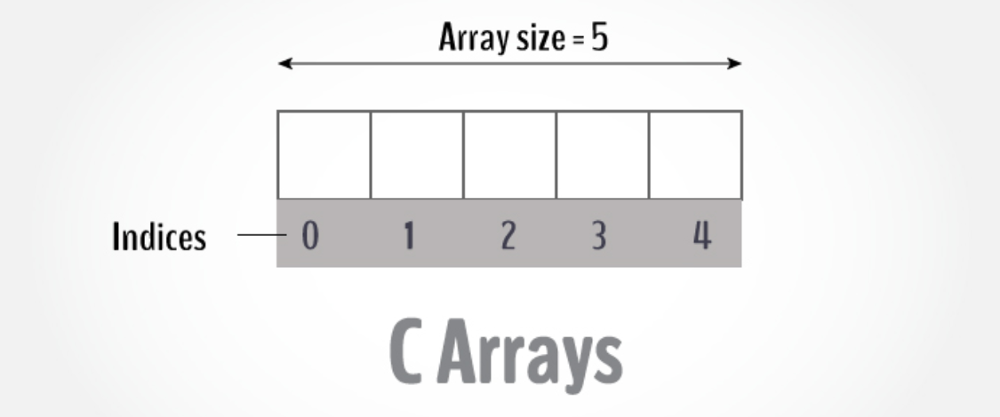

### How to initialize an array?

To initialize an array during declaration. For example, int mark [5] = {19, 10, 8, 17, 9};

### Implementation 

If you want to work with Lists further, you need to know the - **THE PROGRAMMING BLOCKS** below - 

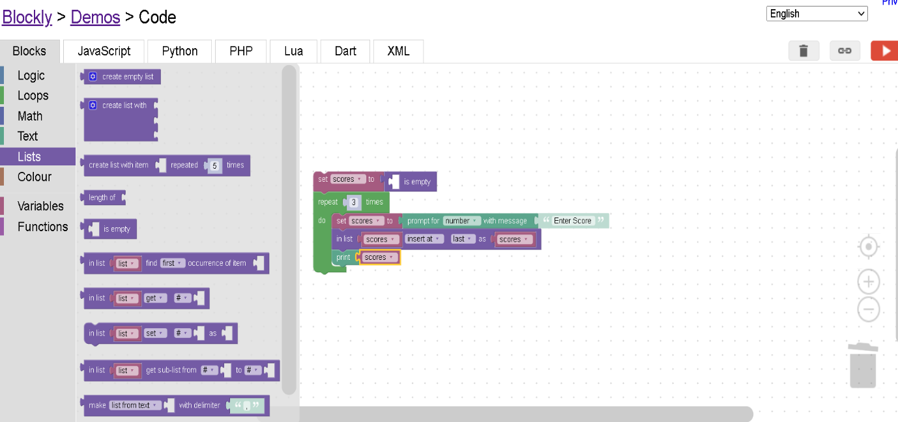

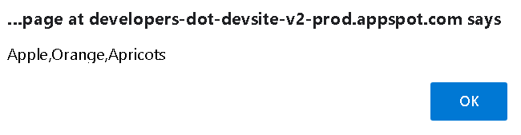

The print block in the Text or String category can print lists. The result of the above program is the shown message box on top. 

However, a variable lets you store one value, such as a string, but what if you want to store a collection of strings together? List is a just a variable that stores more than one variable. Each element in a list can be access based on its index (position of the element in a list).

- Try yourself and make familiar with Lists concepts, blocks how to create/build a Lists with the below explanations -  

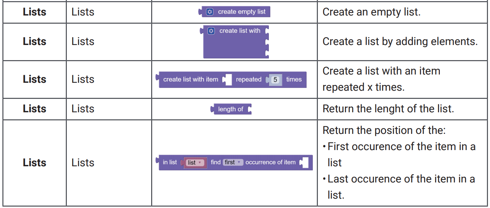

## Blocks for Loop Creation with Lists

The for each block (see https://en.wikipedia.org/wiki/Foreach) is similar, except instead of giving the loop variable values in a numeric sequence, it uses the values from a list in turn. The following program prints each element of the list: “Apple”, “Barriers” and “Orange”. 

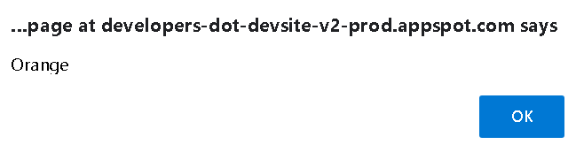

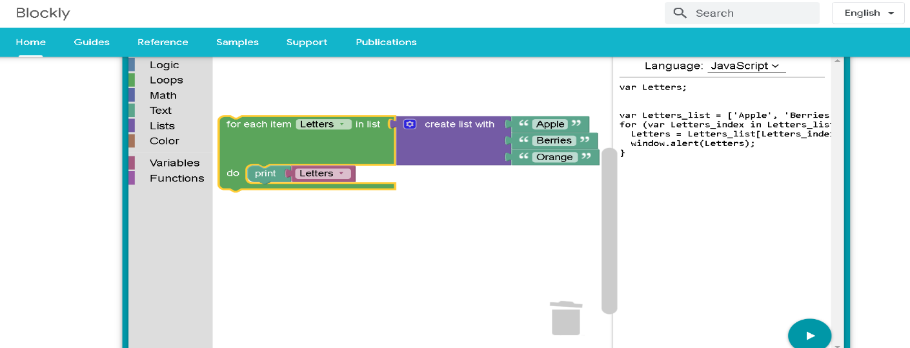

- Now your tasks - Build and analysis the visual development representations and explain how it works!

## Break out of loop with Lists 

The breakout of loop block provides an early exit from a loop. The following program prints “apple” on the first iteration and on the second iteration prints “Barriers” when the loop variable is equal to “Orange”. The third item in the list is never reached. It “breaks out” of the loop. In below example, we created and developed Break out of loop with Lists

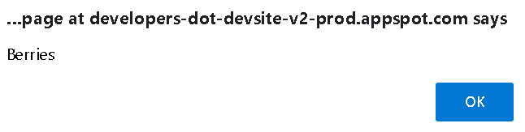

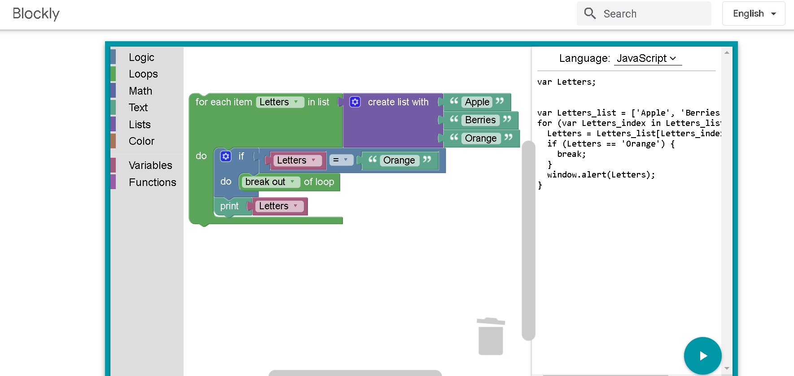

- Now your tasks – Go to this link below https://www.learneroo.com/modules/139/nodes/741 and complete the steps 1 to 3. Finally do the fourth steps by yourself 

## Adjusting text case

 

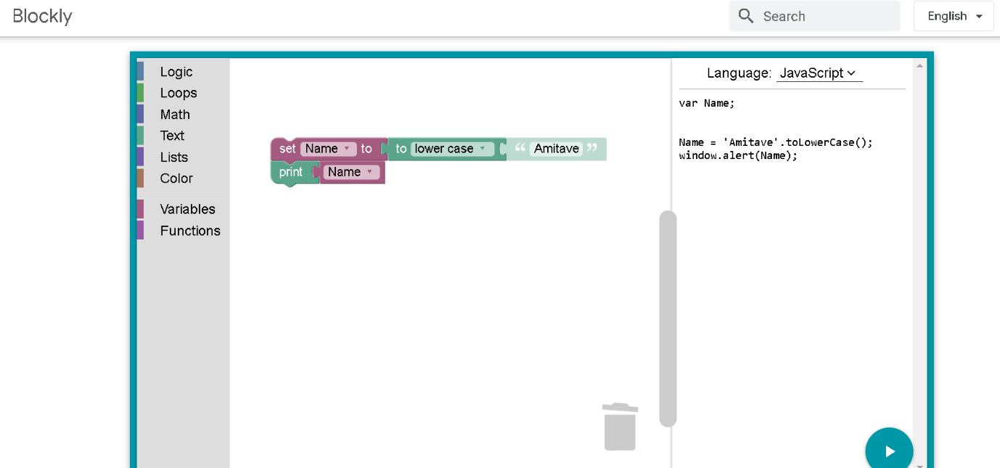

- Now your tasks - Build and analysis the visual development representations and explain how it works! Use upper case and display your name  

## Repeat

The simplest “repeat” block runs the code in its body the specified number of times. For example, the following block will print “Hello!” “ Amitave” three times.

**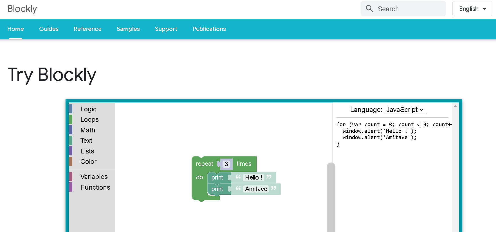**

 

- Now your tasks - Build and analysis the visual development representations and explain how it works! 

## repeat while

Imagine a game in which a player rolls a die and adds up all of the values rolled as long as the total is less than 30. The following blocks implement that game: 

1. A variable named total gets an initial value of 0.
2. The loop begins with a check that total is less than 30. If so, the blocks in the body are run.
3. A random number in the range 1 to 6 is generated (simulating a die roll) and stored in a variable named roll.
4. The number rolled is printed.
5. The variable total gets increased by roll.
6. The end of the loop having been reached; control goes back to step 2. 

In below example, we will create and develop - 

**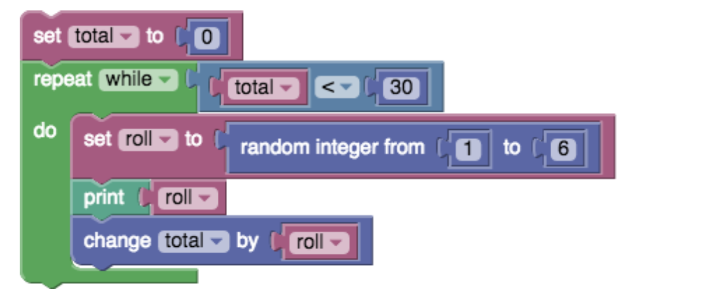**

When the loop completes, any subsequent blocks (not shown) would be run. In our example, the loop would end after some number of random numbers in the range 1 to 6 had been printed, and the variable total would hold the sum of these numbers, which would be guaranteed to be at least 30.

## Conclusions

Google’s Blockly very simple to operate. Users take the blocks out of the toolbox (one at a time) and arrange them in sequences until they solve their problem. Once they finish, the program runs a check up, looks at what has been done, and if the solution is not correct – it goes back and analyzes the code again until it finds an error. 

