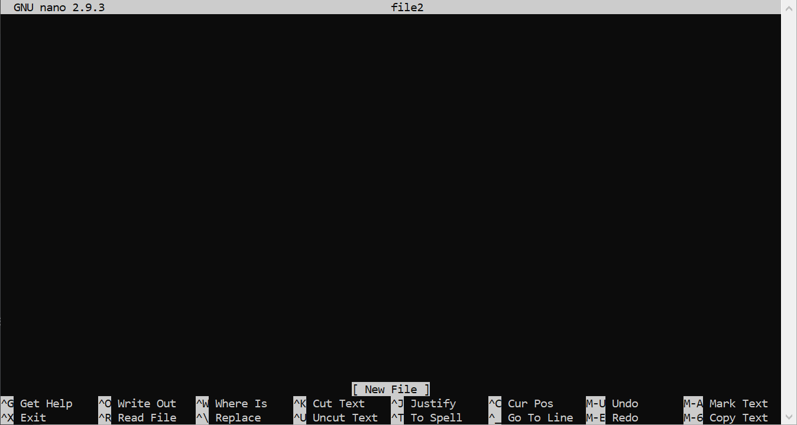

# Computer Systems Lab 1 - Introduction to C Programming

<script src="https://cdn.jsdelivr.net/npm/code-line"></script>
<script>CodeLine.initOnPageLoad({toggleBtn: {show: false}, copyBtn: {show: false}})</script>

<link rel="stylesheet" href="/module-content/css/block.css">

## Aim

The aim of this lab is to introduce you to the C programming language and output some data in different formats. Along the way, we will examine the basics of working with a Unix command line. This is to allow you to create simple C programs and run them.

## Basics of the Unix Command Line

Unix is a family of operating systems that has heavily influenced modern computing. In particular, the directory structure and commands of many modern operating systems derive from Unix:

- Linux is very similar to Unix. We will be using Linux for this lab. Android is a Linux-based operating system, although the Linux part is hidden.
- Mac OS X is another Unix derivative, although this is more hidden from the end user. iOS is similarly derived from Unix but hidden.
- Windows is not Unix based, although has some influences. Windows has slowly been moving towards a stronger Unix influence over the past few years.

We will use the command line in this lab to create folders and files using commands that will work in Linux and Mac OS X, and partially in Windows. You can also install a Linux command line in Windows via [Windows Subsystem for Linux](https://docs.microsoft.com/en-us/windows/wsl/install-win10).

The command line is case sensitive. You need to enter commands using the right capitalisation of letters.

> The **computer is dumb.** It does not know when you type `LS` you actually meant `ls`. To the computer, these are different. One of the first skills you have to learn when studying computing is **precision**. The computer has no ability to guess what you mean. It works on exactly interpreting what you enter. This also means you need **patience**. Developing the skills and problem solving ability in computing means taking your time. This takes **practice**.

### Command Prompt

On the Linux lab machine, once you have logged in, you will be presented with something similar to the following:

```bash
student@ML-RefVm-999999:~$
```

The command prompt has the following parts:

- `student` is the **user name**.
- `ML-RefVM-999999` is the **computer name**. So `student@ML-RefVm-999999` means the user `student` on computer `ML-RefVm-999999`. Your computer name is probably different.
- `~` is the current directory. We will examine what this means next.
- `$` is the start of the command prompt we can start typing at.

We don’t need to concern ourselves too much with the command prompt.

### Print Working Directory

The **working directory** is the current directory the command prompt is running in. We can print the current working directory string by using `pwd`.

```bash
student@ML-RefVm-999999:~$ pwd
/home/student
```

When you first login you are in the user’s (`student`) home directory - `/home/student`. As this folder is regularly used, we have a shortcut rather than typing `/home/student` each time - `~`.

> `~` is a shortcut for the current user’s home directory - `/home/<username>`.

#### Directory Structure

You are probably familiar with how a folder structure works on a computer. When working on the command line, we can move to a different folder (directory). We just need to understand how a directory string is constructed.

Each `/` breaks the different directory and file names up, much like a URL on a website. So `/home/student` is a directory `student` within the `home` directory. When we type a whole directory string such as `/home/student`, we are giving the **absolute path**.

> Full directory strings, such as `/home/student` are **absolute paths**.

All absolute paths are relevant to the root directory `/`,

A **relative path** is based on the current location of the command prompt or file. For example, when you are in the `/home` directory, you can refer directly to `student`.

> A directory string referring to subdirectories and files from the current location are **relative paths**.

### Listing Directory Contents

You can list the current contents of a directory using the `ls` (short for *list*) command.

```bash
student@ML-RefVm-999999:~$ ls
student@ML-RefVm-999999:~$ 
```

Nothing will be printed right now as there are no files in our home directory. Let us create some.

### Creating a File

We can create a file from the command prompt using `touch`. Let us create a file called `file1`.

```bash
student@ML-RefVm-999999:~$ touch file1
```

Now let us list the directory contents again:

```bash
student@ML-RefVm-999999:~$ ls
file1
```

We can use `ls` to print more details. The `-l` flag prints the **long format** details.

```bash
student@ML-RefVm-999999:~$ ls -l
total 0
-rw-rw-r-- 1 student student 0 Jul 25 10:44 file1
```

`file1` has a further collection of details associated with it.

- `-rw-rw-r---` is the file permissions which we don’t examine in this module.
- The first `student` is the user who owns the file.
- The second `student` is the user belongs to. The `student` user belongs to the `student` group; i.e., their own group.
- `0` is the size of the file in bytes. The file is empty so has `0` size.
- The date and time of the last file modification is also provided.

You can also use `ls` to list hidden files:

```bash
student@ML-RefVm-999999:~$ ls -a
.  ..  .bash_history  .bash_logout  .bashrc  .cache  .gnupg  .local  .profile  .ssh  file1
```

These files have special meanings in Linux which we don’t cover here. For those who want to learn more about using the Linux operating system can use the following tutorials.

- [Guru 99](https://www.guru99.com/unix-linux-tutorial.html)
- [Ryan’s Tutorials](https://ryanstutorials.net/linuxtutorial/)

### Deleting a File

Let us delete the file we just created. We can do this with the `rm` (short for *remove*) command:

```bash
student@ML-RefVm-999999:~$ rm file1
student@ML-RefVm-999999:~$ ls
student@ML-RefVm-999999:~$
```

### Creating a Directory

We can create a new directory using the `mkdir` (short for *make directory*) command. Let us create a new directory called `directory`.

```bash
student@ML-RefVm-999999:~$ mkdir directory
student@ML-RefVm-999999:~$ ls
directory
```

### Changing Directory

Now that we have a directory let us move into it using the `cd` (short for *change directory*) command:

```bash
student@ML-RefVm-999999:~$ cd directory
student@ML-RefVm-999999:~/directory$
```

Notice how the command prompt has changed to reflect the directory we are in - `~/directory`.

### Editing a File

We have used `touch` to create a file, but how do we edit a file? There are actually several options. We will use a tool called `nano` which is probably the easiest to work with.

`nano` can also create files. Let us use `nano` now to create and open a file, `file2` for editing:

```bash
student@ML-RefVm-999999:~$ nano file2
```

This will change the command prompt window to the `nano` editor screen.



You can type straight into the window as if it was a simple text editor. Write the following into the window:

```
Hello world!
```

To save the file, we need to `Write Out`. At the bottom of the window, you will see this is signified by `^O`. This just means holding down the `Ctrl` key (`Command` on a Mac) and pressing `O`. `nano` will ask you the name of the file:

```
File Name to Write: file2
```

Just press return to use the name we already used. The file will be saved with the current contents.

To exit `nano` we use `^X`. Remember, this means holding down `Ctrl` (or command) and pressing `X`.

Back on the command line, we can now list the file details to see that the file exists.

```bash
student@ML-RefVm-999999:~/directory$ ls -l
-rw-rw-r-- 1 student student 14 Jul 25 14:45 file2
```

### Deleting a Directory

We can delete a directory using the `rmdir` (short for *remove directory*) command. Let us remove the directory we just created. First we have to move out of the directory. We can move up the directory structure to the parent directory using `cd`:

```bash
student@ML-RefVm-999999:~/directory$ cd ..
student@ML-RefVm-999999:~$ 
```

Let us now remove `directory`:

```bash
student@ML-RefVm-999999:~$ rmdir directory
rmdir: failed to remove 'directory': Directory not empty
```

OK, that didn’t work. We cannot simply remove a directory that it not empty. As `directory` contains `file2` we cannot delete it.

We have two options here:

1. Change into `directory` and delete `file2`. This is OK here, but would take a lot of time if we had multiple files and subdirectories.
2. Delete `directory` and all its contents in one command.

For option 2, we can use `rm` (*remove*) with the `-r` option, which means recursively delete the contents:

```bash
student@ML-RefVm-999999:~$ rm -r directory
student@ML-RefVm-999999:~$ ls
student@ML-RefVm-999999:~$ 
```

### Reference Unix Commands

We have used all the commands necessary for this lab. You should try and practice using the command line as much as possible on your computer rather than using the window system. The more you practice the better you will be.

- `pwd` - prints current directory.
- `ls` - lists directory contents.
- `touch` - creates a file.
- `rm` - removes a file.
- `mkdir` - creates a directory.
- `cd` - changes directory.
- `cd ..` - move up the directory structure.
- `cd ~` - change to the user’s home directory.
- `nano` - opens file editor.
- `rmdir` - removes (deletes) a directory.
- `rm -r` - recursively deletes a directory and its contents.