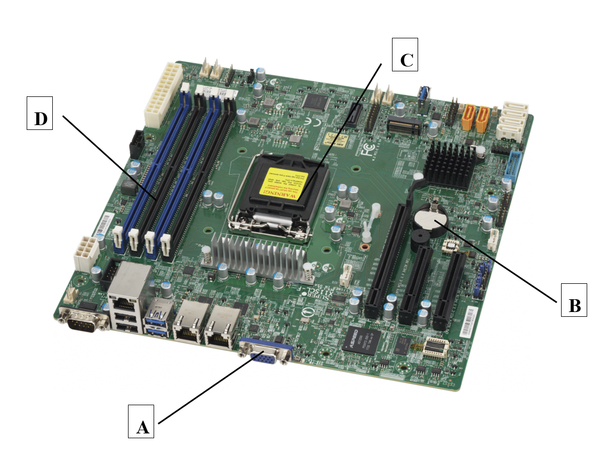

# Computer Systems Seminar 1 - Introduction to Computer Systems

1. Examine the diagram above. Identify the parts of the computer labelled A, B, C, and D.
2. What is the name of the electronic board shown above?
3. Examine the table below and match the features with the appropriate generation of computers.

| **Feature**             | **Computer generation** |
| ----------------------- | ----------------------- |
| Stored program          | Third generation        |
| Punch cards             | Fourth generation       |
| Artificial intelligence | First generation        |
| Transistors             | Fifth generation        |
| Microcomputers          | Second generation       |

4. Differentiate between primary memory and secondary memory.
5. Is Android system software? Justify your answer.
6. Outline the difference between input and output devices.
7. Define the different input and output ports on a computer.
8. Identify the purpose of the following devices:
   - RAM
   - ROM
   - HDD
   - Motherboard
   - Graphics card
9. What is the difference between system software and application software? Provide examples.
10. Convert the following decimal values into octal:
    - 34567
    - 763456
    - 12373
    - 56443
11. Convert the following decimal values into binary:
    - 101
    - 95
    - 28
    - 19
12. Convert the following hexadecimal values into octal:
    - 1DA
    - DFC
    - BBC

