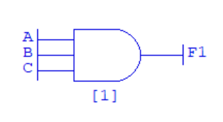
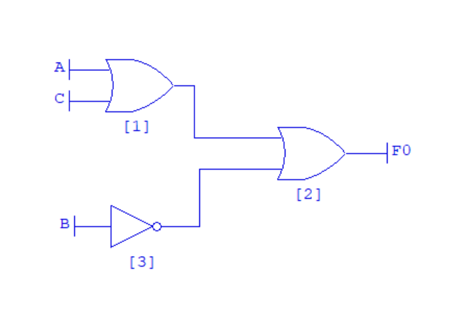

# Computer Systems Lab 2 - Logic Design

<script src="https://cdn.mathjax.org/mathjax/latest/MathJax.js?config=TeX-AMS-MML_HTMLorMML" type="text/javascript"></script>

1. Work environment
2. Basic one -- switch and light
3. Inverter
4. OR
5. AND
6. XOR
7. Complex logic circuits
8. 


This lab aims to implement simple logic circuits. The software used is Logic.ly The focus is to learn how to design the circuits, find the truth table for the gates, and simulate the combination of gates.

## Work Environment

When you start Logic.ly, a startup platform shows with, tool box showing on the left side of the window and a blank canvas on the right side as an editing surface.


From the tool box It is easy to add,delete and connect switches,gates and other devices. Logic.ly gives users the flexiblity for components to be dragged and dropped onto the editable blank surface.Hence manipulate as desired.Use the label tool to write and define input and output features.


The logic.ly platform opens up with two seperate area as shown above.The left hand side which is the tool box area has different segments which are the input controls, output control components, Logic gates, flip-flops components and others.


In order to create any logic design with logic.ly we have to always use the toggle switch component every time we want to indicate the input:This enable users turn **ON** and **OFF** the switches.


Drag and drop the toggle switch.
Use the label tool to define the number of input and there names such 2input **A** **B**.
Then drag the AND operation from the logic gate control session on the tool box.
Wires then together with the toggle switch
final drag the output bulb
Experiment by swtiching on and off the switches at different intervals and record your output using the label component.

## Finding a Truth Table

We will now examine the truth table for an **AND** gate.

1. **Add a 2-in AND gate to the canvas.**
2. **Add an Input to the canvas to the left of the AND gate. For the Variable Name leave it as default (A).**
3. **Add a second Input to the canvas below the other Input. For the Variable Name leave it as default (B).**
4. **Connect the two Inputs to the AND gate using a wire.**
5. **Add an Output to the canvas to the right of the AND gate. For the Variable Name leave it as default (F0).**
6. **Connect the AND gate to the Output using a wire.**

Your diagram should look something like this:


Now, **click the Submit button on the Components Window.** The logic diagram will be analysed and the equation and truth table generated. Your screen will look something like this:


At the moment, only the 1 (true) outputs are shown on the truth table on the left. In the menu, **select Truthtable** then **Show all rows.** The full truth table will be shown.

Above the canvas, the function equation is shown. This is:

```
F0 = A B;
```

An AND gate is sometimes represented by multiplication (e.g., A B) rather than with the logical and symbol. An OR gate is sometimes represented by a plus (e.g., A + B) rather than with the logical or symbol. This does not matter for this lesson. We are only concerned with gates and truth tables.

### Increasing the Inputs

We can edit the gate diagram by clicking **Gates** then **Modify Gate Diagram**. Now perform the following steps:

1. **Delete the existing 2-In AND gate.**
2. **Add a 3-In AND gate.**
3. **Wire up the existing two Inputs and Output to the gate.**
4. **Add a third Input (C) to the diagram and wire it to the gate.**
5. **Click Submit to analyse the system.**
6. **Select Truthtable then Show all rows to see all the rows.**

Your diagram should be:



### Exercises

1. Find the truth table for OR, NOT, and NOR with two inputs.
2. Find the truth table for a NAND with four inputs.
3. Find the truth table for an XOR with four inputs (hint - you need three gates in total).

## Working with Multiple Gates

Let us draw the logic circuit for the following:


$$
f = A \lor C \lor ¬B
$$


We will need two 2-in OR gates and one NOT gate (Invertor).

1. **Create a new Gate Diagram.**
2. **Draw the three gates.**
3. **Add three Inputs: A, B and C.**
4. **Wire A and C into a single OR gate**.
5. **Wire the output from this gate into the second OR gate.**
6. **Wire B into the NOT gate.**
7. **Wire the output from the NOT gate into the second OR gate.**
8. **Add an Output F0.**
9. **Wire the output from the second OR gate into F0.**

Your diagram should look something like this:



**Click Submit**, then **Truthtable, Show all rows** to analyse the diagram. It should be the same as:

| A    | B    | C    | =>   | F0   |
| ---- | ---- | ---- | ---- | ---- |
| 0    | 0    | 0    |      | 1    |
| 0    | 0    | 1    |      | 1    |
| 0    | 1    | 0    |      | 0    |
| 0    | 1    | 1    |      | 1    |
| 1    | 0    | 0    |      | 1    |
| 1    | 0    | 1    |      | 1    |
| 1    | 1    | 0    |      | 1    |
| 1    | 1    | 1    |      | 1    |

## Exercises

Implement the following logical expressions and derive their truth tables.

1. $$¬(A \land B) \lor ¬B$$
2. $$(A \land B) \lor ¬(B \land C)$$
3. $$(A \oplus C) \land ¬B$$
4. $$(A \land B \land (C \lor D)) \lor (C \land D)$$
