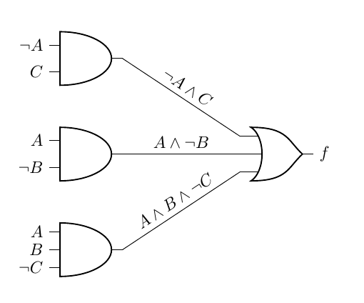
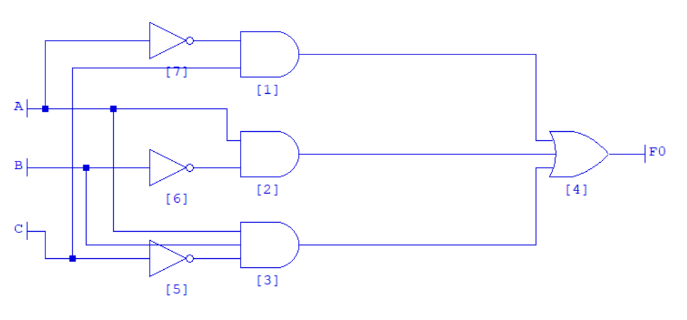
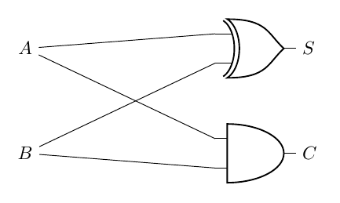
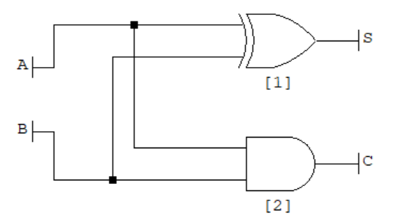
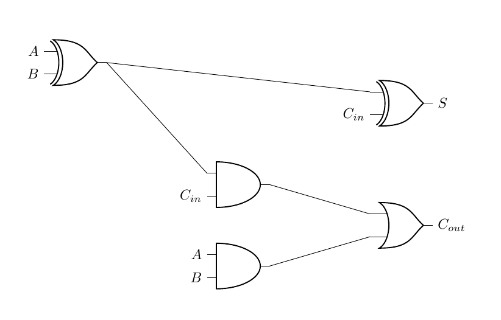
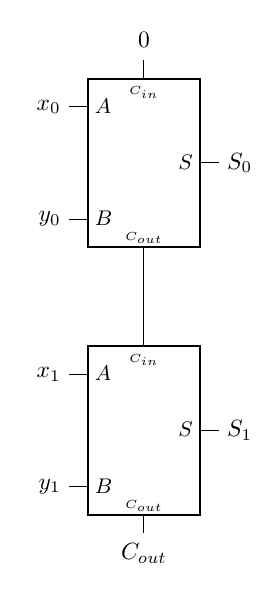

# Computer Systems Lab 3 - Building Complex Logic Circuits

This lab aims to implement complex logic circuits. The implementations include the Half Adder, Full Adder, Four Bit Parallel Adder, and Carry Look Ahead Adder. At the end of the lesson, you will be able to design complex multiple output circuits. We are again using Logic Friday.

## Derive Equation from Logic Circuit

Design the circuit below and derive the equation.

First, identify the components for the circuit. In this case, it is 3 AND gates (one 3-in, two 2-in) and 1 OR gate (3-In).

1. Draw the two 2-In AND gates.
2. Draw the 3-In AND gate.
3. Draw the 3-In OR gate.
4. From the diagram, there are inverse inputs into each AND gate. This means there are three NOT gates (Invertors) required. Draw the three NOT gates.
5. Create the three inputs: A, B and C.
6. Connect the three inputs to the correct input ports.
7. Connect the AND gates to the OR gate.
8. Create an output: F0.
9. Connect the OR gate to the output.
10. Show the truth table.

Your diagram should look something like this:

The equation for this diagram is:

$$
F0 = (\neg A \land C) \lor (A \land \neg B) \lor (A \land B \land \neg C)
$$

For practice, you should try simplifying this diagram using the Karnaugh Map method.

## Implementing the Half-Adder

Remember the half-adder lets us add two binary digits ($A$ and $B$) and output the sum ($S$) and carry ($C$). The circuit diagram is below:

It involves one XOR gate and one AND gate. **Draw this now in Logic Friday**. It should look something like this:

**Show the truth table and ensure it is giving the output you expect.**

## Implementing the Full-Adder

The full-adder extends the half-adder by letting us add two binary digits while accounting for any carry from the previous add. The diagram for the full-adder is:

1. **Draw the full-adder in Logic Friday.**
2. **Check the truth table and confirm your full-adder is behaving as expected.**
3. **Define the equation for $S$ and $C_{out}$ from the diagram.**

## Exercise

Implement the two-bit adder from the diagram below. The circuit adds two two-bit binary numbers, $x$ and $y$. The individual bits of the numbers are represented by $x_0, x_1$ and $y_0, y_1$. The sum, $S$, is also represented by two binary digit outputs $S_0$ and $S_1$. We have put the full-adder in a box with the relevant pins. We have also put $0$ in as the first $C_{in}$ value. Remember to check the truth table for correctness.

Can you extend this to a three-bit then a four-bit adder?