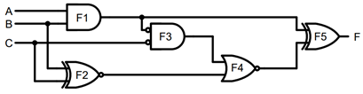

# Computer Systems Seminar 3 - Further Logic Design

1. Derive the equation for the following Boolean function and design the logic circuit.
   - $F(A,B,C)=(0,2,6,7)$
   - $F(A,B,C)=(1,3,4,5)$
2. Implement $F=¬B\ \land ¬(¬A \land C)$ using NAND gates.
3. Implement $F = ¬(¬(¬A \lor B) \lor (B \lor C))$
4. Use a K-map to simply the equation below and implement it with minimum gates.

| AB    | 00   | 01   | 10   | 11   |
| ----- | ---- | ---- | ---- | ---- |
| **C** |      |      |      |      |
| **0** | 1    | 1    | 0    | 0    |
| **1** | 0    | 0    | 1    | 1    |

5. Derive the equation for the circuit below and use a K-map to simplify the equation.

6. Using BCD, add the following binary numbers:
   - 0001 and 0100
   - 0010 and 0101
7. Using Parallel Adder, add the following:
   - 0011 and 0001
   - 0100 and 0001

