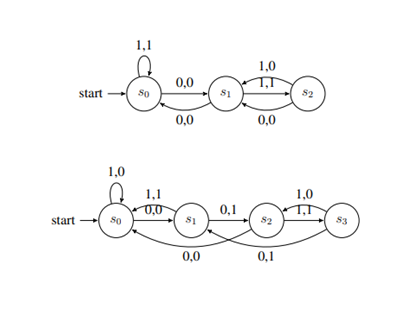

# Computer Systems Seminar 3 - State Machines

1. Design a digital watch where a sequence of button pushes sets an alarm. Hint - the three states include alarm beeping, displaying, and setting.
2. Can you draw a state machine that can accept an input string starting with 11?
3. Draw a finite state machine representing a parking machine where parking costs 50p. The machine only accepts 10p, 20p, and 50p coins.
4. Tabulate the possible inputs and outputs for each state in the two state machines below.

5. Construct a finite-state machine with output that produces a 1 if and only if the last three input bits read are 0s.

