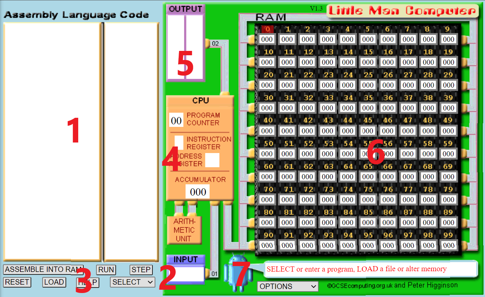
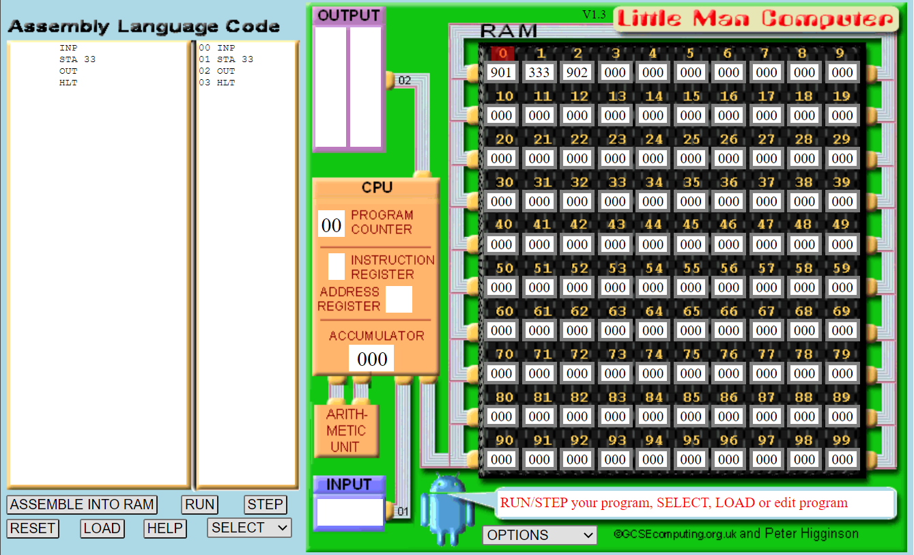
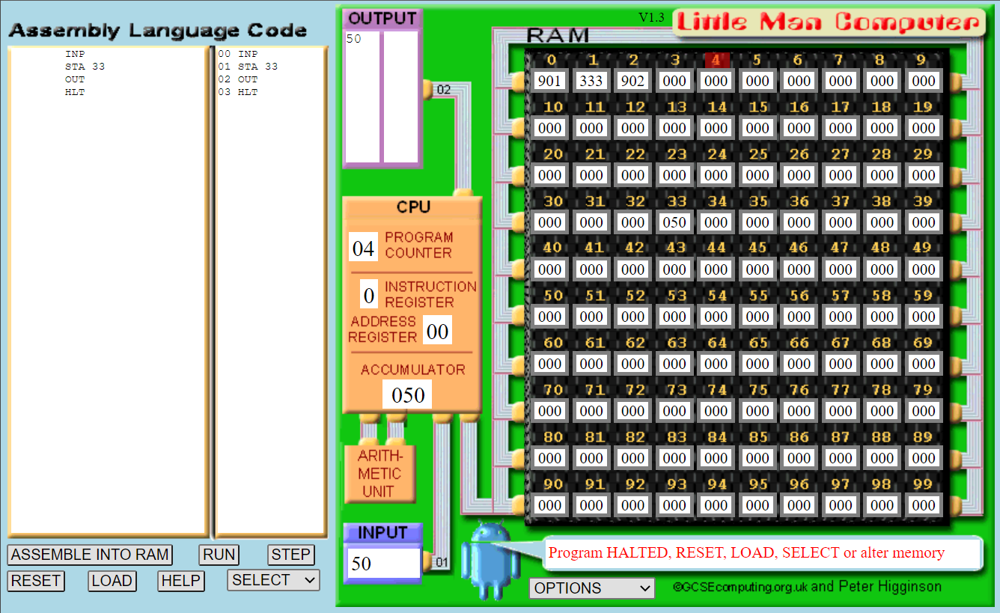
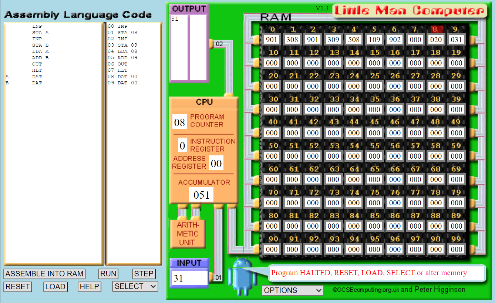
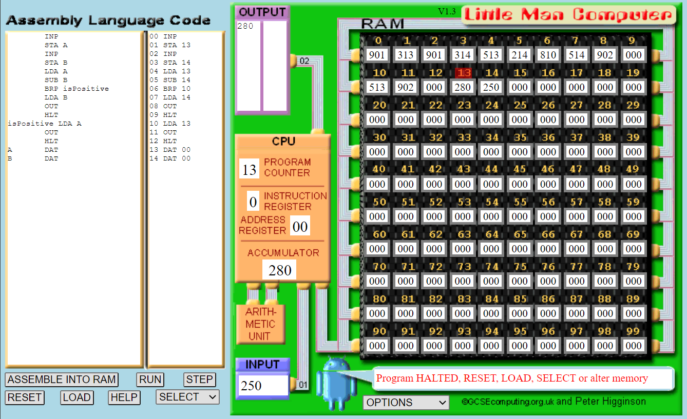
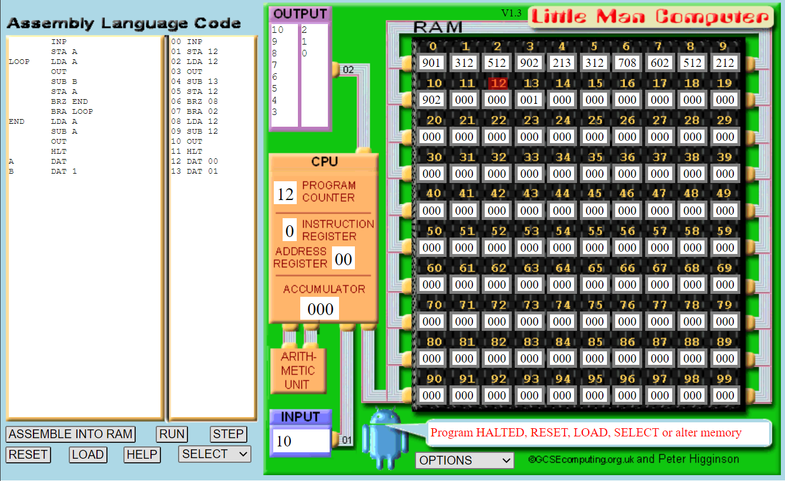
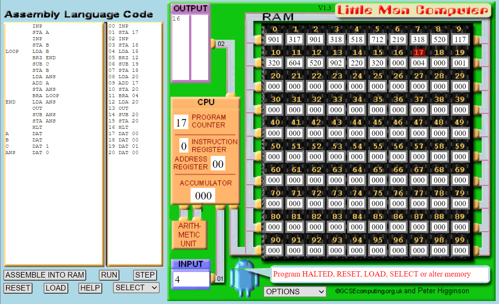

# Computer Systems Lab 4 - Little Man Computer

<script src="https://cdn.mathjax.org/mathjax/latest/MathJax.js?config=TeX-AMS-MML_HTMLorMML" type="text/javascript"></script>

This lab focuses on using the *Little Man Computer (LC-3)* computer simulator to understand the workings of the von Neumann architecture. The simulator was design by Peter Higginson. To access the simulator, visit [here](https://peterhigginson.co.uk/lmc).

## Interface Overview

The main parts of the LMC interface are highlighted below:



1. This is the area to input code.
2. The window for any input from the user.
3. Buttons to load the code into memory, run the code, reset the machine, load a code file, and select an instruction to add.
4. An indicator that displays the step-by-step progress of the code.
5. The window for displaying the output(s) during code execution.
6. The window displaying the memory, including both data and instructions. Memory locations are numbered from 0 to 99.
7. Options for controlling execution flow (between slow and fast).

## LMC Basic Instruction Set

The LMC instruction set is defined below. The numeric codes are how these instructions will appear in memory. Refer to these instructions when you are writing your own applications.

| **Mnemonic Code** | **Numeric Code** | **Details**                                                  |
| ----------------- | ---------------- | ------------------------------------------------------------ |
| `INP`             | 901              | Input data into the accumulator.                             |
| `OUT`             | 902              | Output data from the accumulator.                            |
| `ADD`             | 1XX              | Add to the accumulator. XX represents the memory location.   |
| `SUB`             | 2XX              | Subtract from the accumulator. XX represents the memory location. |
| `STA`             | 3XX              | Store data from the accumulator in memory. XX represents the memory location. |
| `LDA`             | 5XX              | Load data from memory into the accumulator. XX represents the memory location. |
| `BRA`             | 6XX              | Branch to a specified memory cell. XX represents the memory cell. |
| `BRZ`             | 7XX              | If 0, branch to a specified cell. XX represents the memory cell. |
| `BRP`             | 8XX              | If >= 0, branch to a specified cell. XX represents the memory cell. |
| `DAT`             |                  | Treat content as data                                        |
| `HLT`             | 000              | Stop execution                                               |

 ## First LMC Program

Type the code in the LMC code input area:

```
INP
STA 33
OUT
HLT
```

Click **Submit** and the code will be loaded into memory. Your screen should now look as follows:



Notice the first few memory locations:

0. Our input instruction, represented by 901.
1. Our store instruction to location 33, represented by 333.
2. Our output instruction, represented by 902.
3. Our halt instruction, represented by 000.

Click **Run**. The animation will start to run. It illustrates the different parts of the machine as it starts to execute the program.

1. The computer fetches the memory location indicated by the current program counter value (to start this is 000).
2. Simultaneously, the CPU asks the arithmetic unit to add 1 to the program counter.
3. Once the instruction is retrieved from memory, it is decoded. LMC shows this as the instruction register and any necessary address register.
4. The CPU executes the instruction accordingly.

These four steps make up the **fetch-execute cycle**. Every instruction in the program has this cycle performed upon it. It is the most basic operation of the CPU that makes the computer run.

After the first instruction is run, LMC will ask for input. Enter 50 and let the simulator complete.



Notice that 50 is stored in memory location 33, and that 50 is also output.

Alternatively, this first program can also be written as:

```
INP
STA A
OUT
HLT
A DAT
```

Here we define a data value, `A`, to store our value. We then let the assembler work out which memory location to use. It will use location 4 as this is the first available memory location after the program. Notice we have to declare our data value at the end of the program, but we can now use it as a reference in the program (i.e., `STA A` rather than `STA 33`).

## Adding Two Numbers

The following program will add two numbers entered by the user:

```
INP
STA A
INP
STA B
LDA A
ADD B
OUT
HLT
A DAT
B DAT
```

We can describe the program in writing as follows:

1. Ask the user for input.
2. Store that input into A.
3. Ask the user for input.
4. Store that input into B.
5. Load the value of A into the accumulator.
6. Add B to the value in the accumulator.
7. Output the value in the accumulator.
8. Stop.

Add the numbers 20 and 31 to test that the program works. Memory locations 8 and 9 will be used as the first locations after the main program. The final window should look as follows:



If we did not want to input numbers we could retrieve them from memory. The following program adds two numbers from memory.

```
LDA A
ADD B
OUT
HLT
A DAT 20
B DAT 31
```

## Subtracting Two Numbers

The following LMC program will subtract two numbers:

```
INP
STA A
INP
STA B
LDA A
SUB B
OUT
HLT
A DAT
B DAT
```

Use the inputs 45 and 23 to test this program.

### Exercise

Create a version of the subtraction program that loads the values from memory instead of asking for input.

## Decision Making

Computers don’t just run a sequence of instructions in order. They change the next instruction to run based on some logic. On the CPU this is called *branching*. The following program ask for two numbers and output the one that is larger.

```
INP
STA A
INP
STA B
LDA A
SUB B
BRP isPositive
LDA B
OUT
HLT
isPositive LDA A
OUT
HLT
A DAT
B DAT
```

`isPositive` is a label. We use `BRP isPositive` to jump to the `isPositive` label when the accumulator is a positive number. Otherwise it continues.

The program finds the largest input from `A` and `B` by subtracting `B` from `A`. If the result is positive, then `A` is larger. Otherwise, `B` is. **Take your time and step through the program by hand to understand what is happening.**

Run the program, and use the inputs 280 and 250. The final output should be as follows:



### Exercises

Repeat this program implementation but with the following alterations, observing the output:

1. Make the second input greater than the first input.
2. Instead of taking input, load data from memory.
3. Remove the `OUT` code after `isPositive LDA A` and make the first input value greater than the second input value.

## Creating a Countdown

Let us create a program that will accept an input from the user and countdown from this value. We can achieve this with the `BRZ` and `BRA` instructions. Try the following code, and interpret what it is doing before running it.

```
INP
STA A
LOOP LDA A
OUT
SUB B
STA A
BRZ END
BRA LOOP
END LDA A
SUB B
OUT
HLT
A DAT
B DAT 1
```

The interesting bit of code is seen in lines 7 and 8.

7. Branch to `END` if accumulator is zero.
8. Branch to `LOOP`.

If you were programming in high-level language, we would write this as a `while` loop:

```
while (A > 0):
	print(A)
	A = A - 1 
```

**Run this program. You might want to change the default speed of the simulator under the options dropdown menu.** The output screen should be as follows:



### Exercises

Modify the countdown program as follows:

1. Load the starting value from memory.
2. Let the countdown occur by 2 rather than 1 each time.

## Multiplication of Two Numbers

LMC does not support multiplication or division, but we can implement them using addition and subtraction. For example:
$$
3 \times 5 = 3 + 3 + 3 + 3 + 3 \\
4 \times 4 = 4 + 4 + 4 + 4
$$
We can therefore combine an adding program with the countdown program to get the same effect as multiplication. The following program performs this operation. **As you enter the program evaluate what it is doing.**

```
INP
STA A
INP
STA B
LOOP LDA B
BRZ END
SUB C
STA B
LDA ANS
ADD A
STA ANS
BRA LOOP
END LDA ANS
OUT
SUB ANS
STA ANS
HLT
A DAT
B DAT
C DAT 1
ANS DAT 0
```

**Run the program using 4 for the first input and 4 for the second input.** The final window should look like this:



## Exercise - Division

Now implement a program on the LMC that divides an input number by the second input number. For this, you will need to use branching for the loop, and subtraction.

## Further Study

There are computer games based on the principles from LMC. If you are interested, and think solving puzzles via games will help your understanding, look into the following:

- [TIS-100](https://en.wikipedia.org/wiki/TIS-100)
- [Human Resource Machine](https://en.wikipedia.org/wiki/Human_Resource_Machine)
