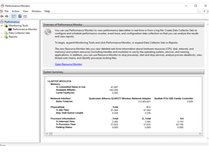
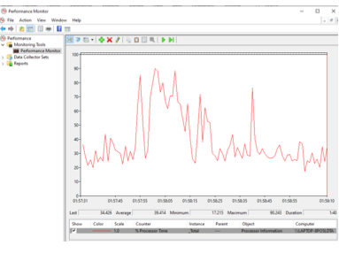
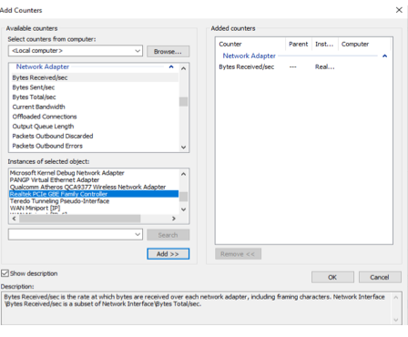
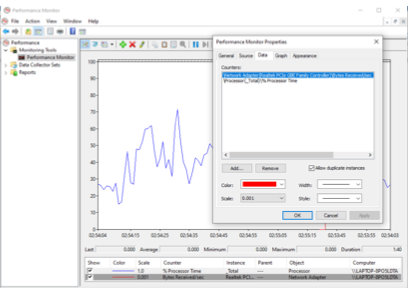

# Computer Systems Lab 8 -- System Performance Evaluation

The aim of this laboratory session is for you to be able to monitor the performance of a computer system. The laboratory requires a computer system with Windows 10. The operating system has a *Performance Monitor* tool. The Performance Monitor tool can analyse data of processor, memory, hard drive and network usage.

## Open Performance Monitor

The performance monitor tool can be opened in three ways:

·   Open Start Menu  and search for *Performance Monitor*. Click the application result.

·   Press the *Windows key* and *R* to open the run command interface. Type `perfmon` and click OK to open.

·   Press the *Windows key* and *X* to open the *Power User* menu, select the *Computer Management*, then click *Performance*.

## Working with Performance Monitor

The figure below is the interface of the tool.

The navigation pane is in the left side of the window. It contains nodes for Performance Monitor, Reports and Data Collector

Select *Performance Monitor*. The graph displayed below will be plotted showing the movement in the processing time. 

To add other counters, select the green button on the top of the panel. The window below will be displayed. 

- Select *Local Computer* or the name of the computer from the drop-down menu
- Select and expand the category of the item. In this experiment, select the *Network Adapter* category.
- Select the *Current Bandwidth* and *Bytes Received/sec*
- To monitor a specific instance, more than one adapter can be monitored simultaneously.
- In this example, we select *Realtek PCIe GBE Family Controller* and click *Add*. Note your adapter name will be different. Please refer to your own computers specifications to know which adapter to select.

**Note** -- Click *Show Description* to see the details of each category of the counter that is selected. 

Select *Bytes Sent/sec* and *Bytes Total/sec* for the Microsoft instance and see the result in the graph. 

## Customise the View of the Graph

- Double-click on any of the counters, the *Performance Monitor Properties* window will be opened.
- Select the *Data* tab followed by the counter to be customised.
- Change the scale, colour, style and width of the counter.
- The colour for the Processing time is changed to blue in the figure below.

## Exercise

Monitor the counters under the identified categories below. Try running different applications while measuring to see how they impact performance.

- System
  - File Read Bytes/sec
  - File Write Bytes/sec
  - System Calls/sec
- Processor
  - Interrupt Time
  - Processor Time
  - Idle Time
  - User Time
- Process
  - IO Data Bytes/sec
  - IO Read Bytes/sec
  - IO Write Bytes/Sec

Use the search input to monitor the values of;

- Power
- Power Budget

## Plotting Performance Graph

The measurement below was taken as the time (seconds) it takes for a system to send data packets through its Bluetooth interfaces. Using Microsoft Excel, use graphical representation showing the trend in the performance of the Bluetooth interfaces.

- *Bluetooth Interface A*: 22, 33, 14, 35, 42, 28, 33, 45, 23, 34, 

- *Bluetooth Interface B*: 39, 21, 36, 23, 34, 36, 25, 9, 21, 39
- *Bluetooth Interface C*: 35, 26, 16, 23, 34, 24, 38, 15, 13, 35

Suggest the most suitable interface and justify this from your analysis. 

