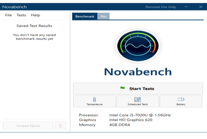
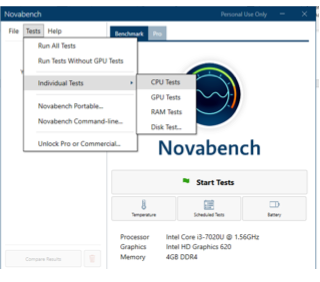
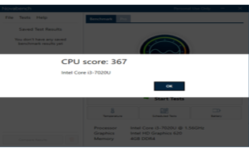
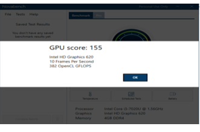
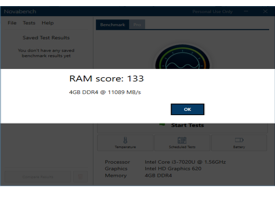
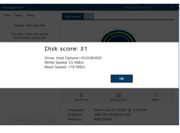
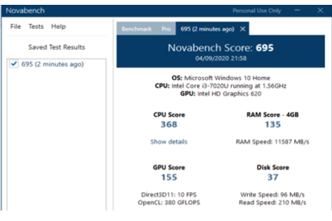
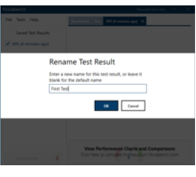

# Computer Systems Lab 9 -- Benchmarking

This laboratory is aimed at using benchmark tools to evaluate the performance of a computer system. The preferred tool for this session is Novabench.

## Download Instruction

Got to [Novabench](https://novabench.com/download), and you will be taken to the download page. Select the appropriate operating system for your computer (Windows, Mac or Linux). 

After the download is finished:

- Click on the downloaded file
- Click Install in the dialogue
- Click Next in the next dialogue window
- Click Install in the dialogue window
- Click Yes button in the User Control Dialog
- After the installation is complete, Click Finish.

## Conducting a CPU Test

Launch the Novabench Application.

The interface will show the basic information concerning your computer system. It will show a menu bar consisting of File, Test and Help Menu. To run a CPU test, Click on Test, Individual Test then CPU Test.

The result will come out in the form of a score:

Repeat the same Test for the GPU. 

In the GPU test, a new window will be opened containing graphics. Since the GPU is focused on graphics processing ability of the system, the window is used to run the Test. The result will be presented as displayed below;

Replicate the individual Test for RAM. The result will be like below;

Conduct a test for the C Drive (Disk) on your computer. The result will be displayed as below;

Run the same Test for the Desktop and extract the result. Compare the result with that of the C Drive. 

> Can you explain why the results are different or the same? 

# Running All Test

Click Test, Run All Test

The result will be displayed as shown below;

You can change the name of the Test by Selecting it in the left side panel and clicking the pen icon. A dialogue will be displayed where the choice name can be input.

## Exercise

Install the application on another computer system. Repeat the entire evaluation and compare the result.  Present the result in a graphical format using Microsoft Excel. The more computers you can compare the better understanding you will have of the results.

 