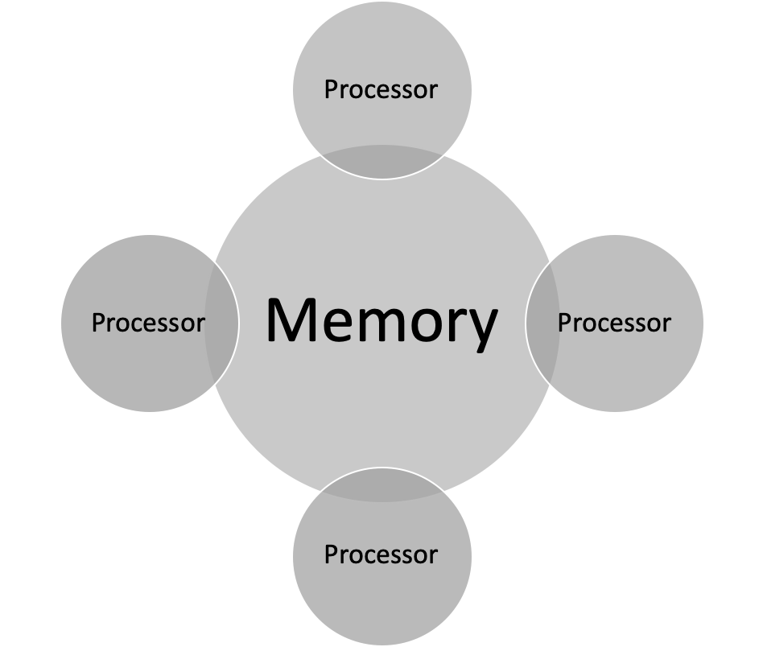

# Computer Systems Seminar 10 -- Introduction to Parallel Computing

1. Answer the following questions from the diagram above:
   - What computer resource is being shared in the diagram?
   - What are the characteristics of this type of parallel programming?

2. Differentiate between distributed memory and shared memory.

3. Differentiate between Uniform Memory Access (UMA) and Non-Uniform Memory Access (NUMA).

4. What is the difference between MIMD and SIMD?

5. Differentiate between processes and threads.

6. What is the difference between strong and weak scaling?

7. Using your understanding of parallel memory programming, explain the process of memory sharing in this diagram.

8. What are the three types of granularity and the fundamental differences?