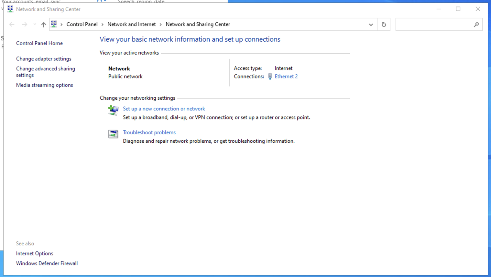
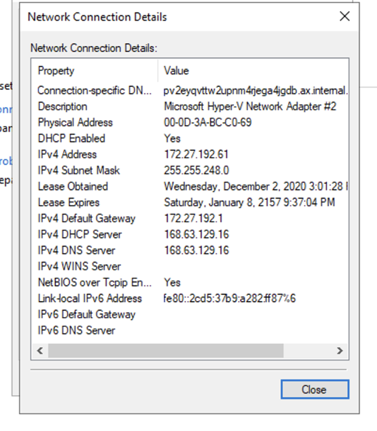
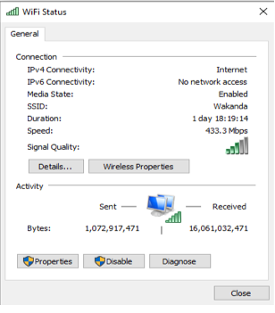
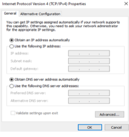

# Computer Systems Lab 5 -- Networking Fundamentals

The aim of this laboratory session is to introduce you to the basics of network configuration and file sharing.

## Deriving Network Configuration Details

1. Log into a Windows 10 system.
2. Click Start (or the Window button), and then click Settings. Open Network & Internet.
3. Click Network and Sharing Centre.
4. Click on the active connection. For example, this would be Ethernet 2 here 
5. Click Details.
6. Record the various network parameters. For example, here we are interested in 
   - IP v4 Address (172.27.192.61) - the network address of this machine.
   - IP v4 Subnet Mask (255.255.248.0) - this means only the last three bits of the third chunk and the full forth chunk are for the host identifier here. That is, if each letter represents a bit: NNNNNNNN.NNNNNNNN.NNNNNHHH.HHHHHHHH is the distribution between network and host identifiers.
   - IP v4 Default Gateway (172.27.192.1) - the address of the router.
7. Can you identify the network interface type of the connection?
8. Can you identify the type of network connection of the system?



## Configuring the Network

1. Close the window.
2. Click Properties
3. Select Internet Protocol Version 4 (TCP/IPv4)
4. Click Properties. 
5. Here you can fill the IP Address, Subnet Mask and Default Gateway with the values that you earlier recorded. **NOTE** - on the Azure Labs machines this might not be a good idea as you could lose connection.
6. Click OK.
7. Click Close

### Exercise

**If you are on your own machine on your own network**, you can manually configure the network details on your device. **REMEMBER TO GO BACK TO AUTOMIC AT THE END.**

Change the following parameters:

- IP Address: 198.4.67.1

- Subnet Mask: 255.255.255.0

- Default Gateway: 198.4.1.1

Open a web browser and browse website as normal. What is the difference when you try to use the browser?

Select option *Obtain an IP address automatically*. What is the difference in the values of IP Address, Subnet Mask and Default Gateway?

##  Network Configuration commands

The `ping` command sends ICM_ECHO_REQUEST packet to a target host. A live target will respond with an ICMP packet. **Open the command prompt** and try the following:

```shell
ping 192.168.1.1
ping www.google.com
ping www.roehampton.ac.uk
ping www.gov.uk
ping <your default gateway ip>
```

Many systems now don't respond to a ping request. Can you find some that do?

`tracert` is another command used to display the path of a data packet from the specified computer. **Try the following on the command line** (use CTRL-C to cancel at any point):

```shell
tracert 192.168.1.1
tracert www.google.com
tracert www.roehampton.ac.uk
tracert www.gov.uk
tracert <your default gateway ip>
```

Many systems will also not return trace information.

`pathping` is an advanced network ping with more statistics about latency and packet loss. **Try the following**:

```shell
pathping 192.168.1.1
pathping www.google.com
pathping www.roehampton.ac.uk
pathping www.gov.uk
pathping <your default gateway ip>
```

`netstat` is a command that displays active TCP connections, ports on which the computer is listening, Ethernet statistics, the IP routing table, IPv4 statistics and other information.

**Type `netstat` and press enter.** Terminate with Control+C

### Exercise

Execute netstat with the different parameters.

`netstat [-a] [-e] [-n] [-o] [-p Protocol] [-r] [-s] [Interval]`

Parameter:

- a Displays all active TCP connections and the TCP and UDP ports on which the computer is listening. 

- e Displays Ethernet statistics, such as the number of bytes and packets sent and received. This parameter can be combined with -s. 

- n Displays active TCP connections, however, addresses and port numbers are expressed numerically and no attempt is made to determine names. 

- o Displays active TCP connections and includes the process ID (PID) for each connection. You can find the application based on the PID on the Processes tab in Windows Task Manager. This parameter can be combined with -a, -n, and -p. 

- p Protocol Shows connections for the protocol specified by Protocol. In this case, the Protocol can be tcp, udp, tcpv6, or udpv6. If this parameter is used with -s to display statistics by protocol, Protocol can be tcp, udp, icmp, ip, tcpv6, udpv6, icmpv6, or ipv6. 

- s Displays statistics by protocol. By default, statistics are shown for the TCP, UDP, ICMP, and IP protocols. If the IPv6 protocol for Windows XP is installed, statistics are shown for the TCP over IPv6, UDP over IPv6, ICMPv6, and IPv6 protocols. The -p parameter can be used to specify a set of protocols. 

- r Displays the contents of the IP routing table. This is equivalent to the route print command. Interval Redisplays the selected information every Interval seconds.

Press CTRL+C to stop the redisplay. If this parameter is omitted, netstat prints the selected information only once.

### Exercise

** Using Cisco Packet Tracer** 
- Create a simple point to point Topology.

- Assign IP address and subnet mask to the network.

- Use ping to observe the communication flow

- Display your simulation result.

 
