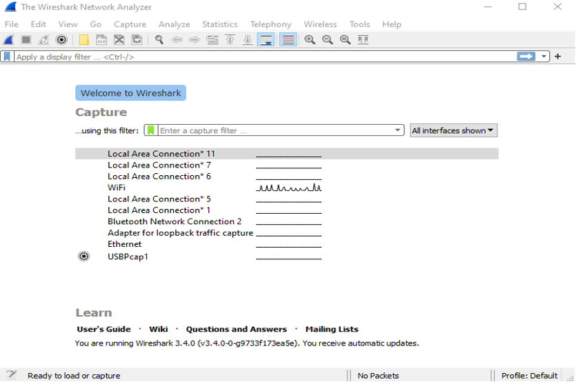
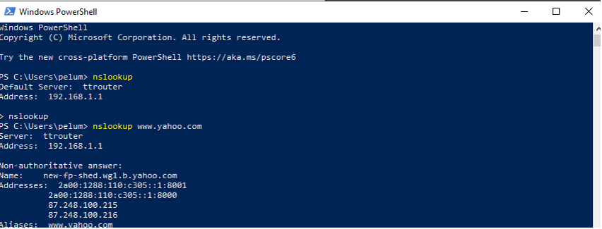
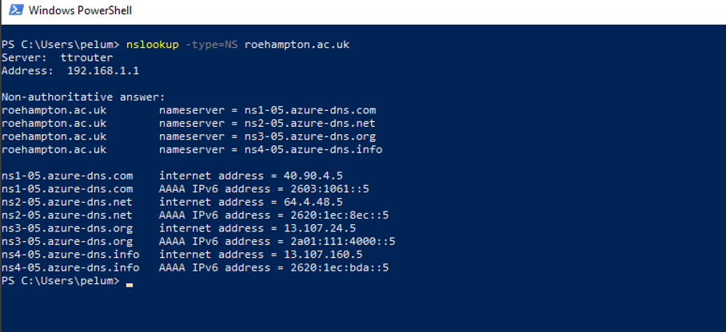
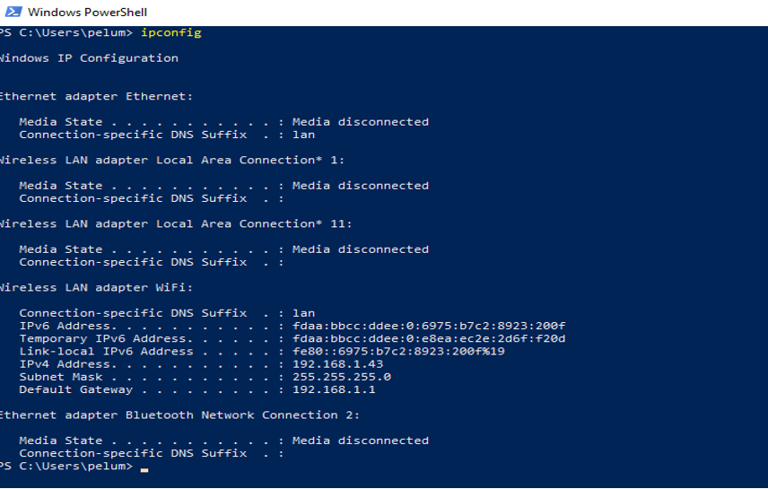

# Computer Systems Lab 12 -- Capturing Network Traffic with Wireshark

The aim of this laboratory session is to understand Internet network data traffic. This lesson will be conducted using Wireshark. It can be downloaded from https://www.wireshark.org/download.html.

## Wireshark Interface

When Wireshark is launched, the graphical user interface will be displayed. It will be empty as no data has been captured.

There are five core components of Wireshark's interface. 

- The command menus at the top of the window. 
- The packet-listing window displays a one-line summary for each captured packet.
- The packet-header details window displays details of packet selected in the packet-listing window.
- The packet-contents window shows the entire contents of the captured frame.
- The packet display filter field is used to collect parameter to filter the displayed information in the packet-listing window.

## Capture Data with Wireshark

- Start up a web browser
- Start up Wireshark.

- Select the interface among the one listed in the home page.
- While running Wireshark, input the following URL into the browser: www.roehampton.ac.uk
- Stop the Wireshark in the capture window. The entire packets will be displayed.
- Type `TCP` in the display filter at the top of the main Wireshark window, then click Apply.
- This will cause only TCP message to be displayed in the packet listing window
- Select any of the tcp message in the packet-listing window
- Record the following measurement:
  - Internet Protocol
  - Source
  - Destination
  - Data Size
  - Source Port
  - Destination Port

### Exercise

- Filter the result for UDP and record the contents for any of the packets.
- Filter the result for HTTP traffic.
- Discover the difference between UDP and HTTP traffic.

## Working with nslookup

The `nslookup` tool enable the computer system to query any DNS server for a DNS record. This is done by sending the DNS query to the specified DNS server and receives a DNS reply.

- Launch Windows PowerShell

- Type `nslookup www.yahoo.com`.

The results are:

As displayed, the response is the name and IP address of the DNS server that provides the answer; and the host name and IP address of www.yahoo.com.

Type this command:

`nslookup -type=NS roehampton.ac.uk`

The host names of the authoritative DNS for roehampton.ac.uk will be displayed. They are DNS servers that responds to queries just for the zones they are configured.

### Exercise

Run nslookup to obtain the IP address of Google Mail

## Working with ipconfig

`ipconfig` is used to retrieve the entire information about the host. 

Type `ipconfig \all`

The details are information concerning the host in the network.

`ipconfig` can be used to retrieve information in the cache of the host.

Type `ipconfig /displaydns`

Flushing the DNS cache clears all entries and reloads the entries from the hosts file.

`ipconfig /flushdns`

## Tracing DNS with Wireshark

- Use `ipconfig` to empty the DNS cache of the host.

- Empty your browser cache from the browser.
- Capture packets using Wireshark for about 1 minute.
- With the browser, open different websites.
- Stop the packet capture.
- Derive the ipaddress of the host.
  - In the filter, type ip.addr == "your_IP_address"

This filter removes the entire packet that is not destined or originate from the host.

Identify the various protocols, the type of data traffic, the query and response for five different data stream.

### Exercise

- Capture traffic on Wireshark.
- Visit different websites while Wireshark is open and capturing data.
- Identify websites that have images.
- Identify three different types of DNS queries.
- Identify three different types of DNS queries.
- Filter the data traffic for DNS traffic.
- Identify the following from the DNS traffic:
  - Source, destination, queries and answers for any of the traffic

## Working with ICMP and Ping

`ping` is simple tool that enables the verification of whether a host is live or not. The `ping` command from a source hosts sends a packet to the specified IP address (or website), if the host is live, the target host responds by sending a packet back to the source host.

·   Start packet capture with Wireshark

·   In PowerShell, type: `ping www.roehampton.ac.uk`

·   When the `ping` terminates, stop the packet capture in Wireshark.

·   Filter the packet list using `ICMP`.

·   Identify the two types of data packet of `ICMP`

·   Identify other parameters of the `ICMP` packets.

 

 