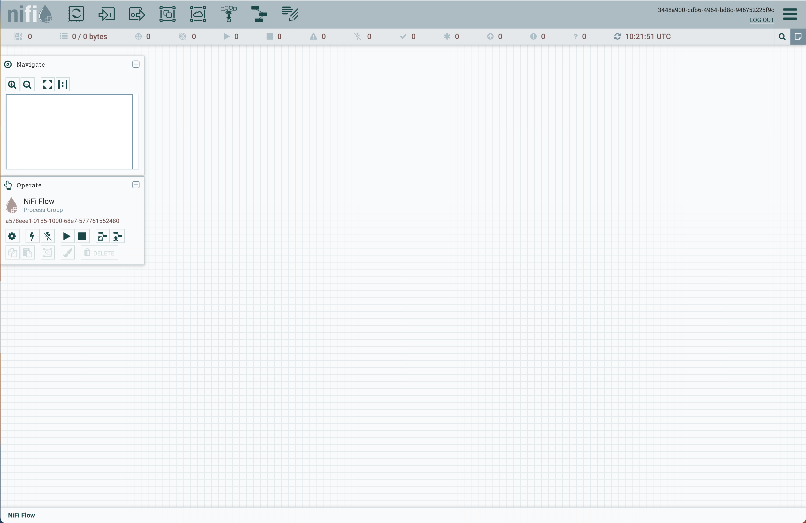

# Data Engineering Lab 01 -- Getting Started with Docker and nifi

<script src="https://cdn.jsdelivr.net/npm/code-line"></script>

<script>CodeLine.initOnPageLoad({toggleBtn: {show: false}, copyBtn: {show: false}})</script>

<script src="/module-content/script/links.js"></script>

<link rel="stylesheet" href="/module-content/css/block.css">

This lab provides information on how to get up and running with Docker and nifi. You will need the following tools:

- A suitable text editor -- we recommend [Visual Studio Code](https://code.visualstudio.com).

- An install of [Docker Desktop](https://www.docker.com/products/docker-desktop/) -- please make sure you start Docker before continuing.

## Getting Started -- Creating a Docker Environment

In Visual Studio Code (or similar), perform the following steps:

1. Open the folder you want to work from.

2. Create a new file in the folder called **docker-compose.yml**.

3. Use the following as the file contents:

```docker
version: '3'

# Define the services used in the system
services:

  # nifi service
  nifi:
    # add capability to the service
    cap_add:
      # give the docker container direct access to network
      - NET_ADMIN
    # the image that the docker container will use
    image: apache/nifi
    # a nice name for the docker container so we can connect to it
    container_name: nifi
    # set environment variables for the service
    environment:
      # set web port open
      - NIFI_WEB_HTTP_PORT=8080
    # volumes enable access to files outside the container
    volumes:
      - data:/home/nifi
    # ports to map and open to the outside world
    ports:
      - "8080:8080/tcp"
    # if the service fails, automatically restart. only stop when asked
    restart: unless-stopped

# declare used volumes
volumes:
  data:
```

**Save the file.** This is a Docker Compose file, allowing us to define a set of services that will run together. Here, we are defining a `nifi` service.

- **You need to look into these Docker compose file formats and what these configurations are doing.**

Now we need to run the system:

1. Open a terminal in Visual Studio Code (or similar) and ensure you are in the same directory as the Docker compose file.

2. Run the following command in the terminal:

```shell
docker-compose up -d
```

This will start up the nifi system.

## Connecting to nifi

After nifi starts (about a minute or two), you should be able to connect to the system using the following address:

[http://localhost:8080/nifi](http://localhost:8080/nifi)

Which will open up the following in your browser:



You can now experiment with nifi. Some tutorials to explore:

- https://medium.datadriveninvestor.com/how-to-build-a-simple-data-flow-with-apache-nifi-1ef3b25fe2c4

- [Apache NiFi Tutorial - javatpoint](https://www.javatpoint.com/apache-nifi#buildflow)

- [An Introduction to Apache NiFi, Use Cases and Best Practices](https://capgemini.github.io/development/introduction-nifi-best-practices/)
