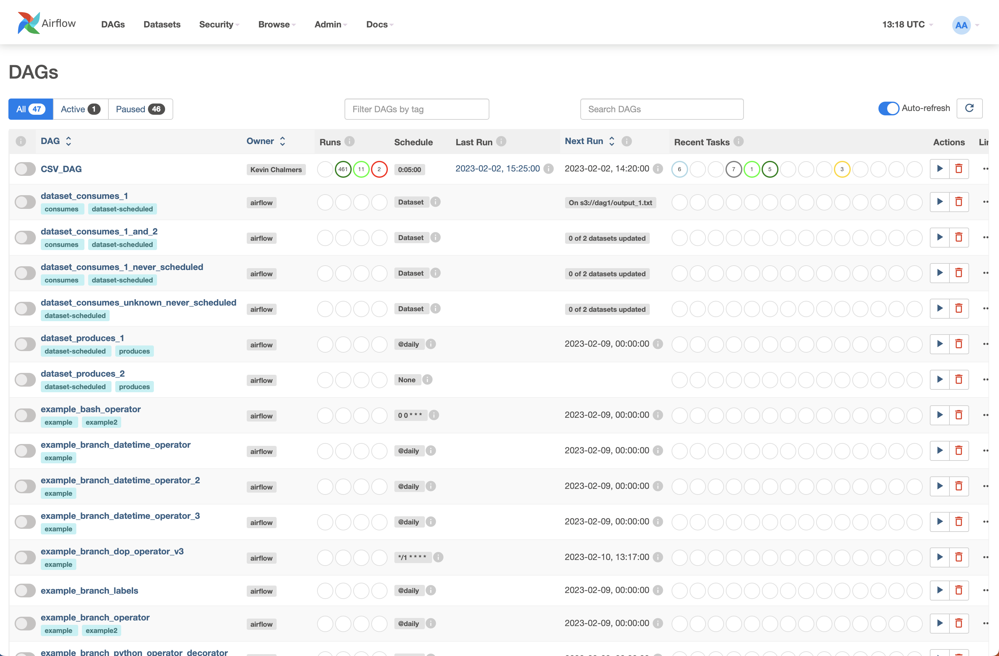
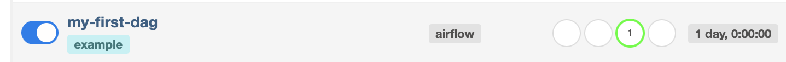
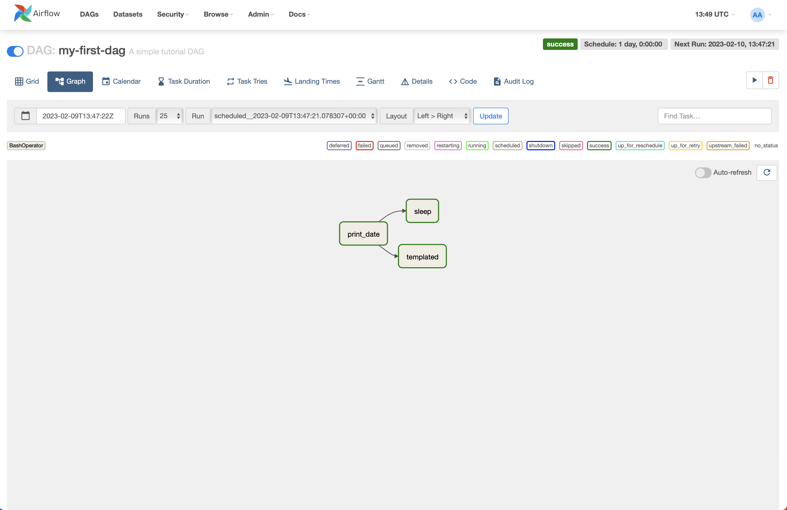
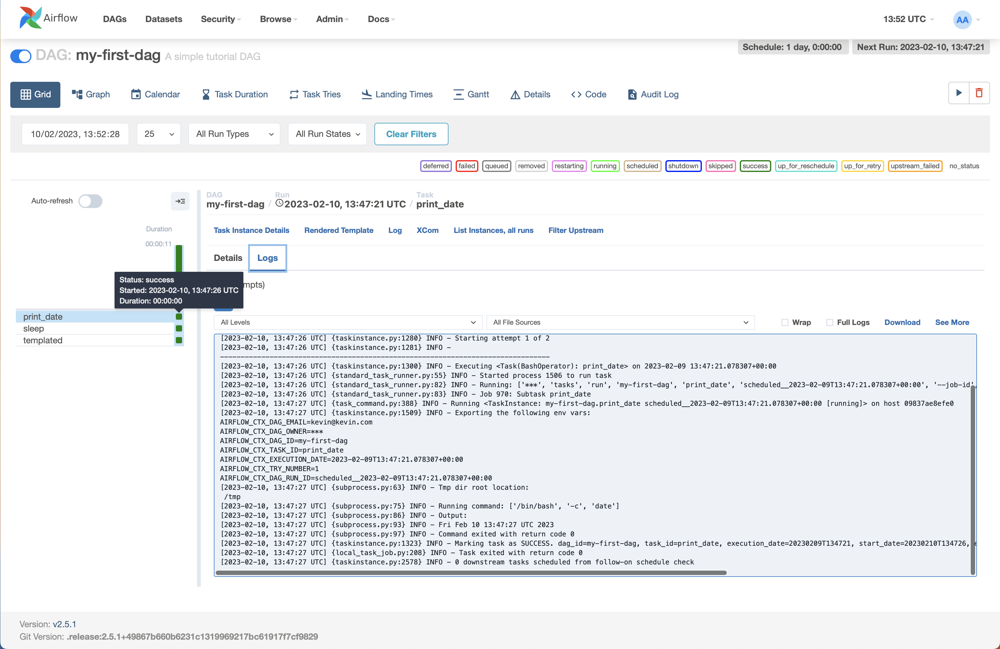

# Data Engineering Lab 02 -- Working with Apache Airflow

In this lab, we will use Apache Airflow to create and run a simple pipeline. Apache Airflow is similar to NiFi, but focused on programming pipelines. Airflow is more popular than NiFi.

## Docker Compose

Apache Airflow provides a Docker compose file for us to use. Perform the following steps:

1. In Visual Studio Code (or similar), open a new folder to work in. **Create a file called `docker-compose.yml.**

2. Go to [Running Airflow in Docker &mdash; Airflow Documentation](https://airflow.apache.org/docs/apache-airflow/stable/howto/docker-compose/index.html). Here you will find a link to a Docker compose file, likely under a heading **Fetching `docker-compose.yaml`.** Don't worry about using `curl` - there is a direct link on the page. **Copy and paste the text from the link into your `docker-compose.yml` file.** For reference, the link as of writing is <https://airflow.apache.org/docs/apache-airflow/2.5.1/docker-compose.yaml>.

3. Create another file in the same folder as `docker-compose.yml` called `.env` (yes there is a dot at the start of the file name). Make the contents as follows: `AIRFLOW_UID=50000`.

4. Make sure you have saved the files. Then, open a terminal and use `docker compose up airflow init`. This will initialise the databases and other services used by Airflow. It might take a few minutes to set up.

5. Once finished, run `docker compose up` to run the full Airflow system.

## Logging into Airflow

Once Airflow has started, you can log in by going to <http://localhost:8080>. You will be asked for a user name and password, which are `airflow` and `airflow`. You will be presented with the following screen:



This is the Apache Airflow dashboard, and it shows you all the DAGs that are currently available, as well as their status.

> **What is a DAG?**
> 
> A DAG is a *Directed Acyclic Graph* -- in other words, a graph (node-link) that has directionality (things flow from one node to the next) and has no cycles (you cannot loop back on yourself). A DAG is a pipeline with data flowing through it, possibly branching out and coming back. We will look at a DAG example soon.

## Creating a DAG

In Visual Studio Code, you will see that some folders were created when you started Airflow. They should be:

- `dags`

- `logs`

- `plugins`

Let us add our own DAG. **Add a file to the `dags` folder called `test.py` with the following content.**

```python
from datetime import datetime, timedelta
from textwrap import dedent

from airflow import DAG

from airflow.operators.bash import BashOperator
with DAG(
    "my-first-dag",
    default_args={
        "depends_on_past": False,
        "email": ["kevin@kevin.com"],
        "email_on_failure": False,
        "email_on_rety": False,
        "retries": 1,
        "retry_delay": timedelta(minutes=5),
    },
    description="A simple tutorial DAG",
    schedule=timedelta(days=1),
    start_date=datetime(2023, 2, 1),
    catchup=False,
    tags=["example"],
) as dag:
    t1 = BashOperator(
        task_id="print_date",
        bash_command="date"
    )
    t2 = BashOperator(
        task_id="sleep",
        depends_on_past=False,
        bash_command="sleep 5",
        retries=3,
    )
    templated_command = dedent(
        """
        
            echo "{{ ds }}"
            echo "{{ macros.ds_add(ds, 7)}}"
        
        """
    )
    t3 = BashOperator(
        task_id="templated",
        depends_on_past=False,
        bash_command=templated_command
    )

    t1 >> [t2, t3]
```

The content of this Python code was explained in class, although you can probably work out most of the content. **Save the file.** This should cause Airflow to build the file. A folder called `__pycache__` will appear in the `dags` folder.

We can now run the DAG. Back at the Airflow dashboard (you may have to refresh the screen) and find **my-first-dag** and turn it on:



**Click on the my-first-dag link and select the Graph view to see the DAG (pipeline) you created. Try and match this with your code.**



If you click on the Grid view, you can see the information from an individual run by clicking on one of the boxes on the left and selecting Logs:



Notice that the command ran the date command on the system as requested.

## Creating a Better DAG

Let's create a DAG that manipulates data. First, we will generate some fake data using Faker. First, stop the Airflow system by using **control-C**  in the terminal.

In Visual Studio Code, create a new file called `csv-gen.py` in the main folder (not the `dags` folder) and use the following content:

```python
from faker import Faker
import csv
output=open('data.csv', 'w')
fake=Faker()
header=['name','age','street','city','state','zip','lng','lat']
mywriter=csv.writer(output)
mywriter.writerow(header)
for r in range(1000):
    mywriter.writerow([
        fake.name(), 
        fake.random_int(min=18, max=80, step=1),
        fake.street_address(),
        fake.city(),
        fake.state(),
        fake.zipcode(),
        fake.longitude(),
        fake.latitude()
    ])
output.close()
```

**In the terminal, install the Faker library as follows:**

- Windows -- `py -m pip install faker`

- MacOS -- `pip3 install faker`

- Linux -- either as MacOS or `pip install faker`

You can now run the file using either `py csv-gen.py` (Windows) or `python3 csv-gen.py` (MacOS). This will generate a file called `data.csv`.

We need to give Airflow access to this data. **Update the docker-compose.yml file to add the following line.**

```docker
- ${AIRFLOW_PROJ_DIR:-.}/data:/home/airflow/data
```

You will find other lines that start `${AIRFLOW_PROJ_DIR:-.}`. It goes right after those.

Now restart your Airflow system using `docker compose up` in the terminal. Once Airflow runs again, a new folder -- `data` -- should have been created. Copy the `data.csv` file into this folder.

Now we can create a new DAG using the following code:

```python
import datetime as dt
from datetime import timedelta

from airflow import DAG
from airflow.operators.bash_operator import BashOperator
from airflow.operators.python_operator import PythonOperator

import pandas as pd

def CSVToJson():
    df=pd.read_csv('/home/airflow/data/data.csv')
    for i,r in df.iterrows():
        print(r['name'])
    df.to_json('fromAirflow.JSON', orient='records')

default_args = {
    'owner': 'Kevin Chalmers',
    'start_date': dt.datetime(2023, 2, 1),
    'retries': 1,
    'retry_delay': dt.timedelta(minutes=5),
}

with DAG(
    'CSV_DAG',
    default_args=default_args,
    schedule_interval=timedelta(minutes=5)
) as dag:
    print_starting = BashOperator(
        task_id="starting",
        bash_command='echo "Reading data"'
    )
    CSVJson = PythonOperator(
        task_id='convertCSVToJson',
        python_callable=CSVToJson
    )
    print_starting >> CSVJson
```

Which you should be able to run and test.
