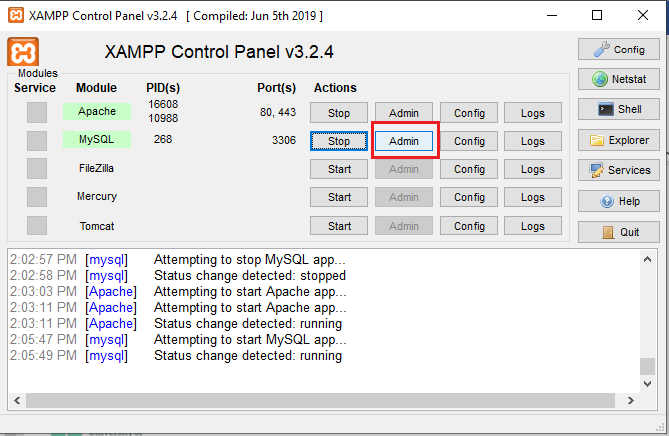
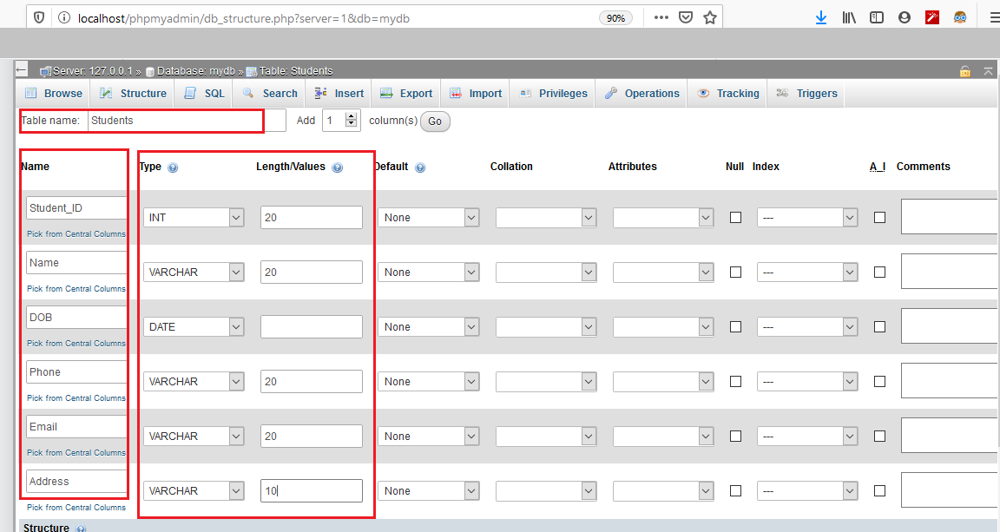
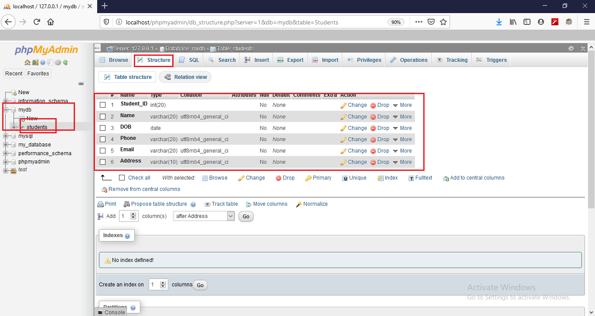
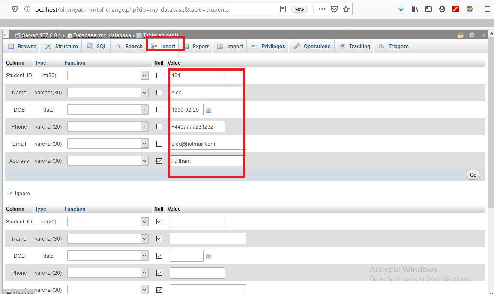

# Databases Lab 1 -- Introduction to the Database Server MySQL

<script src="https://cdn.jsdelivr.net/npm/code-line"></script>
<script>CodeLine.initOnPageLoad({toggleBtn: {show: false}, copyBtn: {show: false}})</script>

<link rel="stylesheet" href="/module-content/css/block.css">

**The contents of this lab are based on operating MySQL database server. Also, by using the graphical user interface of the server how to explore and visualise the database as well the database tables will be covered.**

To begin with, we must have [XAMPP installed](https://www.apachefriends.org/download.html). Through the XAMPP control panel we will get MySQL module and by selecting **Start** we can activate the MySQL server.


Once the server is activated, we will then start accessing its admin panel:



As a user you will then be directed to the `localhost/phpMyAdmin` server:


Here, we will first create the database by clicking on the **Databases** tab. Here we named it `MyDB`.

  

After the database is successfully created, we will be given a notification from the server:


Since all data in a database is stored in the form of tables the database `MyDB` will now work as a repository or storage of our database table(s). We are going to create an example database table `Students` to store the personal information, such as Student’s ID, Name, Date of Birth, Phone Number, Email, and Home Address/Location. To do so, we need to do the following:

1. First, we must select the database, in which we would create table, in this case it will be `MyDB`.

2. We need to provide a valid name of the table.

3. The number of fields/attributes that we want to see in the table.

   

4. The attributes of the `Students` table must be named properly.

5. All the attributes must be provided with appropriate datatypes and the length properly.



Once the above input is given correctly and executed, the `Students` table will be formed. This creates the *structure* of the table and it can be seen by clicking the **Structure** tab, as shown below:



To see any already defined table in the server, we execute the following SQL command:

```sql
DESC [table_name]
```

To display the `Students` table we use:

```sql
DESC Students; 
```

## Value Insertion

Now, under each attribute of `Students` database we can populate values (instances).



After inserting values, the `Students` table will look like:


## Lab Task

1. In the same database `MyDB`, now try to create table `Modules` where we would store information about Module’s Code, Title, Credit Hour and Prerequisites.
2. Create another table `Teachers` which will store information about Teacher’s ID, Name and Designation.