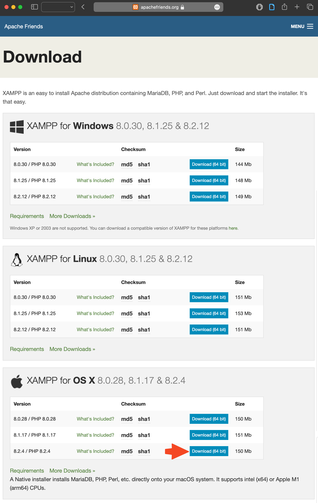
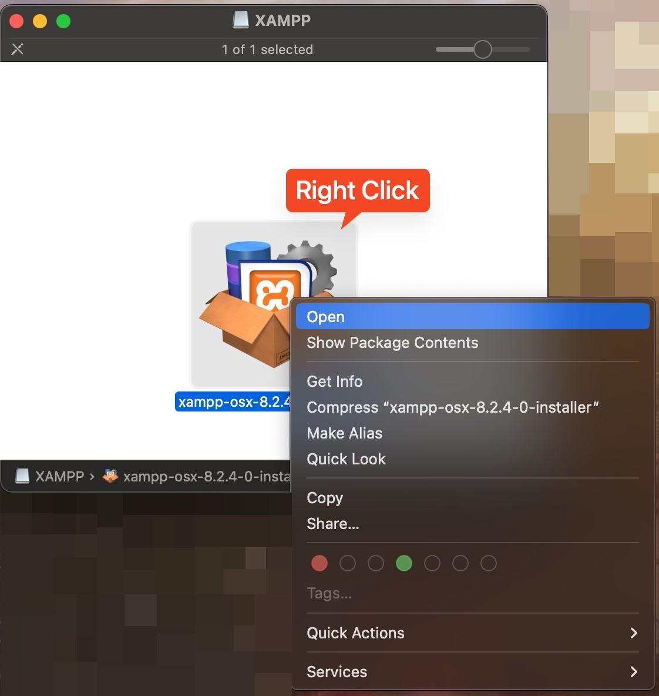
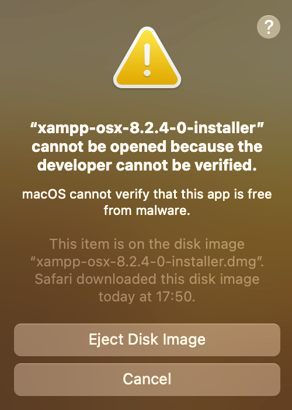
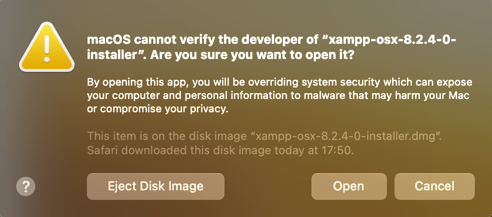
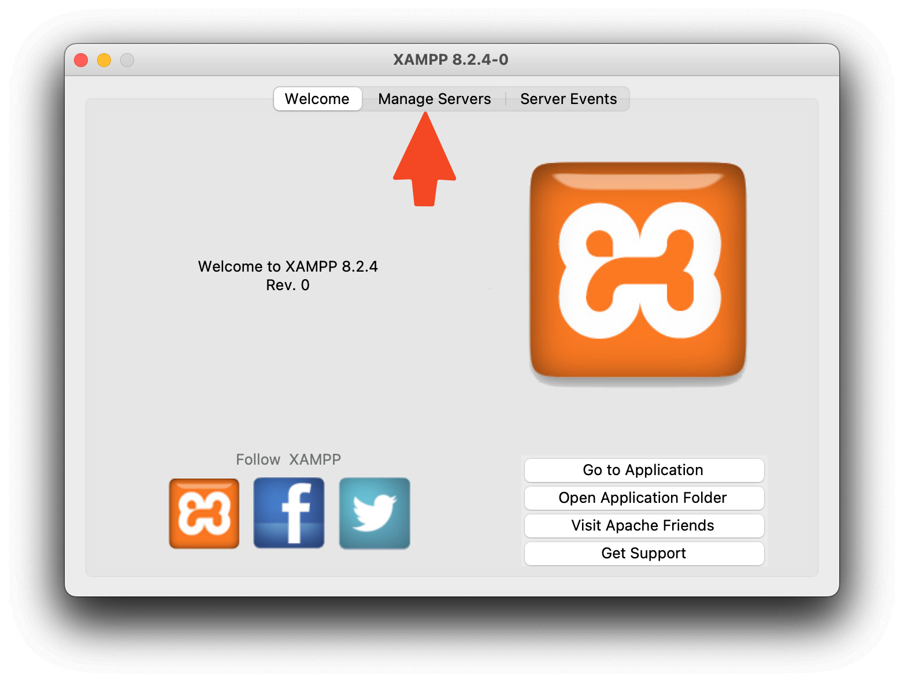
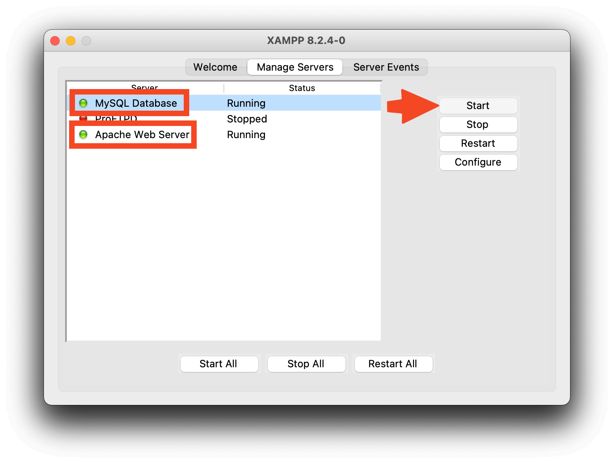
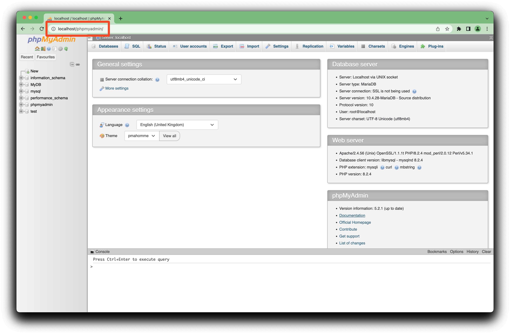

 # Setting Up XAMPP on Your Mac

1. **Download XAMPP for OS X**
   - Visit [https://www.apachefriends.org/download.html](https://www.apachefriends.org/download.html) to download the XAMPP package for OS X.

    

2. **Installation Process**
   - Once the DMG file is downloaded, open it. To install XAMPP, **right-click** on the application.

    

  You are likely to obtain the following message: 

    

  If so, repeat this step twice or 3 times. Do it until you get the following window:

    

  And click **Open**

3. **Provide User and Password**
   - Enter your OS X username and password to initiate the installation process.
  The installation will begin.

4. **Launch XAMPP**
   - After installation, open XAMPP. You'll be greeted with a window like this:

    

5. **Manage Servers**
   - Click on `Manage Servers` and activate both `Apache Web Server` and `MySQL Database`.

    

6. **Access PHPMyAdmin**
   - Open your web browser and navigate to [http://localhost/phpmyadmin](http://localhost/phpmyadmin).

 

    

  