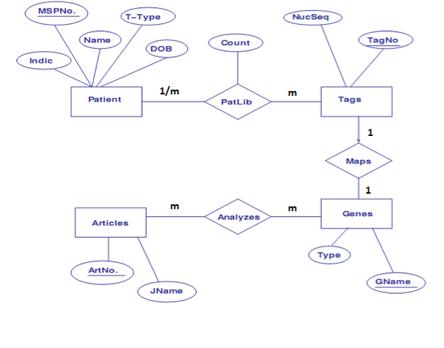

# Databases Lab 2 -- Data Definition Language

<script src="https://cdn.jsdelivr.net/npm/code-line"></script>
<script>CodeLine.initOnPageLoad({toggleBtn: {show: false}, copyBtn: {show: false}})</script>

<link rel="stylesheet" href="/module-content/css/block.css">

## Answers

1. Entity Sets:

   - Patients: Attributes are MSP Number, Name, DOB, Tissue Type and Indicator.

   - Tags: Attributes are Tag Number, Nucleotide Sequence.

   - Genes: Attributes are Gene Name, Type.

   - Articles: Attributes are Article Number and Journal Name.

     

2. Tables:

   - Patient Table
     - `Create Table Patient (MSPNo VARCHAR(10), Name VARCHAR (30), T_Type VARCHAR(30), DOB DATE, Indicator VARCHAR (10));`
   - Tags Table
     - `Create Table Tags(Tagno VARCHAR(10), NucSeq VARCHAR (30));`
   - Genes Table
     - `Create Table Genes(Gname VARCHAR (30), Type VARCHAR(30));`
   - Articles Table
     - `Create Table Articles(ArtNo int(10), Jname VARCHAR(10));`

3. `Alter Table Articles Add Column Publishing_Date Date;`

4. `Alter Table Articles RENAME Column JName TO Journal_Name VARCHAR(10);`

5. `RENAME Table Patients TO Patient_Information;`

6. `TRUNCATE Table Tags;`

7. ```sql
   Drop table Patient_Info;
   Drop table Tags;
   Drop table Articles;
   Drop table Genes;
   ```