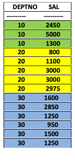

# Databases Lab 6 -- Aggregation Functions

**This lab focuses on aggregation of data using group functions.**

Group functions are operated on set(s) of rows to provide one result per group. Types of aggregation functions are:

- `AVG`
- `COUNT`
- `MAX`
- `MIN`
- `SUM`

Each function accepts an argument and results accordingly on sets of rows, where appropriate.

`AVG`, `SUM`, `MIN`, and `MAX` functions are used against columns that can store numeric data; for example the average, highest, lowest, and sum of monthly salaries for the employees. The group functions are contained in the `SELECT` block  of SQL.

```sql
SQL> SELECT MAX(salary) FROM employee;
SQL> SELECT MIN(salary) FROM employee;
SQL> SELECT AVG(salary) FROM employee;
SQL> SELECT SUM(salary) FROM employee;
```

`COUNT` function returns the number of rows in a table -- for instance, the number of departments present in the department table can be found using this group function.

```sql
SQL> SELECT COUNT(deptno) FROM department;
```

However, the number of departments can also be found from the employee table, but as multiple employees work in the same department, the number of departments can be repetitive. In that case, the query can be like:

```sql
SQL> SELECT COUNT( DISTINCT deptno) FROM employee;
```

`DISTINCT` is a keyword, used within the `SELECT` block to ensure that while accessing any data from a table, it avoids redundancy of a single value until the execution sustains.

Another example of `COUNT` function:

```sql
SQL> SELECT COUNT(empno) FROM employee WHERE deptno=10;
```

## Creating Group Data

Until now, all group functions have treated the table as one large group of information. At times, you need to divide the table of information into smaller groups. This can be done by using the `GROUP BY` clause.



In the example above, the employees salary data is provided as per the department they are working in (each department is a group). `GROUP BY` clause can be used to divide the rows in a table into groups. You can then use the group functions to return summary information for each group. Some important notes about `GROUP BY` clause:

- If a group function is included in a `SELECT` clause, selection of individual result can not be produced unless the individual column appears in the `GROUP BY` clause. 
- Using a `WHERE` clause, the pre-exclution of rows before dividing them into groups can be done.
- The columns must be included in the `GROUP BY` clause.
- Column alias cannot be used in the `GROUP BY` clause.
- By default, rows are sorted by ascending order of the columns included in the `GROUP BY` list.

```sql
SQL> SELECT AVG(salary) FROM employee GROUP BY deptno;
```

The `GROUP BY` result can be excluded using a `HAVING` clause:

- Rows are grouped.

- The group function is applied.

- Groups matching the `HAVING` clause are displayed.

```sql
SQL> SELECT deptno FROM employee GROUP BY deptno HAVING salary > 1000;
```

It’s a **MUST** to remember the order of `GROUP BY` function:

- `WHERE` clause
- `GROUP BY` clause
- `HAVING` clause 

**`ORDER BY` Function:**

`ORDER BY` sorts row values in two different ways:

- `ASC` is ascending order, the default
- `DESC` is descending order

The order of rows returned in a query result is undefined. The `ORDER BY` clause can be used to sort the rows. If the `ORDER BY` clause is used , it must be placed in the last line. Aliases can be used if needed.

```sql
SQL> SELECT hiredate, ename FROM employee ORDER BY hiredate;
```

To see the same result in descending rder, the query can be written as,

```sql
SQL> SELECT hiredate, ename FROM employee ORDER BY hiredate DESC;
```

## Lab Task

1. Before starting with the lab task today, keep the sample tables of `EmployeeInfo` database from Week-5 ready in your MySQL server. You can copy and paste the SQL statements step by step to define the tables and populate them with values as it is provided to you in the file. This task SHOULD NOT take you more than 15 minutes.
2. In `EmployeeInfo`, continue executing the following SQL:
   1. Find department wise total number of employees and department number in the employee table.
   2. Find the average of the salaries for each department.
   3. Find the summation of the salaries for the job "manager".
   4. Find the average of the salary for each type of job.
   5. Find the employee’s name and hire date whose salaries are not more than 2400 and not less than 1000 order by the hire date.
   6. Find the department number and department wise average salaries to be presented as "average payroll" only for those whose hire date is before 1982-01-01.
   7. Find the total number of distinct departments in the employee table.
   8. Find the employees hire date and job in a descending order of their hire date.
   9. Display the project details order by the end date in ascending order.
   10. Find the latest project ending date and its project number.

 Solutions are available [here](solution).