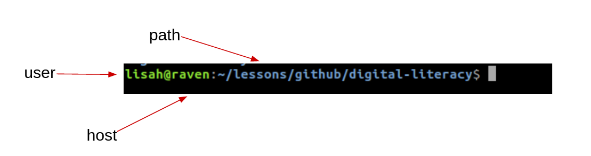

## Home directory and prompt.

In Unix and unix-like operating systems, when you open a terminal you will be placed in your ‘home’ directory by default. Each user on the system has a home directory corresponding to their username.

You will see a blinking cursor infront of a dollar sign, indicating where you will begin typing.  This is called the 'prompt' (note that you can't use the mouse to change position when you are using the CLI).

The characters you see in your prompt can be customised but by default are per the following example.  Whats printed here can help you navigate and remember which user you are working as.

Note the tilde (~) character which is a common shorthand for the home directory of the current user.

Next: [File system commands][1cf2bfed]

  [1cf2bfed]: navigating-file-tree.html "File system commands"
