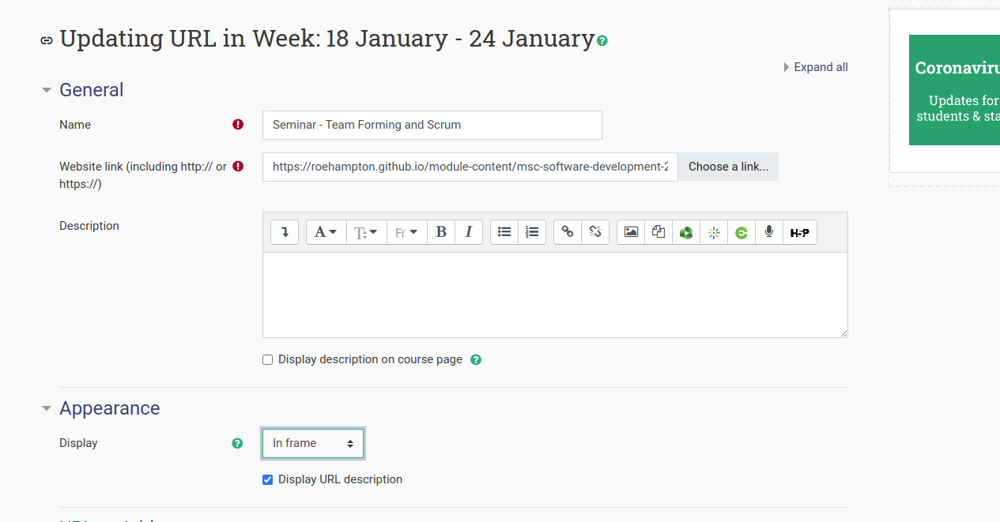

# How to use our github

The repo is here: 

1. https://github.com/roehampton/module-content: You can clone it to your local machine.
1. You can create your own branch and edit the files as you wish.  Markdown works well as its fully text based. 
1. Merge with master and push.  This will trigger your pages to be displayed as HTML on https://roehampton.github.io/module-content/  plus the relevant path to your file (README.md files will show be default in a directory path if the one is present)
1. To embed the github page into moodle, choose a 'link' moodle type and use the settings as illustrated below (Note the 'Display' setting in 'appearance')

