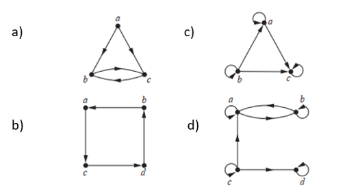

# Mathematics for Computer Science -- Relations

**Solve the following mathematical problems.**

1. List all the ordered pairs in the relation $$R = \{(a, b) \mid a \text{ divides } b \}$$ on the set {1, 2, 3, 4, 5, 6}.
2. For each of these relations on the set {1, 2, 3, 4}, decide whether it is reflexive, symmetric, antisymmetric, and/or transitive.
   1. {(2, 2), (2, 3), (2, 4), (3, 2), (3, 3), (3, 4)}
   2. {(1, 1), (1, 2), (2, 1), (2, 2), (3, 3), (4, 4)}
   3. {(2, 4), (4, 2)}
   4. {(1, 2), (2, 3), (3, 4)}
   5. {(1, 1), (2, 2), (3, 3), (4, 4)}
   6. {(1, 3), (1, 4), (2, 3), (2, 4), (3, 1), (3, 4)}
3. Let $$R$$ be the relation {(1, 2), (1, 3), (2, 3), (2, 4), (3, 1)}, and let $$S$$ be the relation {(2, 1), (3, 1), (3, 2), (4, 2)}. Find $$S \circ R$$.
4. How many relations are there on the set {a, b, c, d}?
5. Let $$P$$ = {a, b, c}, $$Q$$ = {a, b, c, d}, $$R_1$$ = {(a, a), (b, b), (c, c)}, and $$R_2$$ = {(a, a), (a, b), (a, c), (a, d)}. Find:
   1. $$R_1 \cup R_2$$
   2. $$R_1 \cap R_2$$
   3. $$R_2 - R_1$$
   4. $$R_1 \oplus R_2$$
6. Suppose that the relations $$R_1$$ and $$R_2$$ on set $$A$$ are represented by the following matrices. Define the matrices for $$R_1 \cup R_2$$ and $$R_1 \cap R_2$$.

$$
\begin{aligned}
M_{R_1} &=
\begin{bmatrix}
1 & 0 & 1 \\
1 & 0 & 0 \\
0 & 1 & 0
\end{bmatrix} \\
M_{R_2} &=
\begin{bmatrix}
1 & 0 & 1 \\
0 & 1 & 1 \\
1 & 0 & 0
\end{bmatrix}
\end{aligned}
$$

7. List the ordered pairs in the relations represented by the graphs below.

Answers are available [here](exercise-answers).