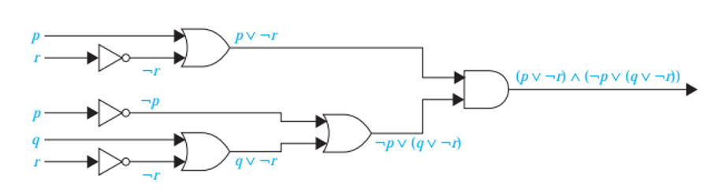

# Mathematics for Computer Science -- Propositional Logic 2

## Answers

1. Tautologies.

   1. | $p$  | $q$  | $\neg p$ | $p \lor q$ | $\neg p \land (p \lor q)$ | $(\neg p \land (p \lor q)) \implies q$ |
      | ---- | ---- | -------- | ---------- | ------------------------- | -------------------------------------- |
      | T    | T    | F        | T          | F                         | T                                      |
      | T    | F    | F        | T          | F                         | T                                      |
      | F    | T    | T        | T          | T                         | T                                      |
      | F    | F    | T        | F          | F                         | T                                      |

   2. | $p$  | $q$  | $\neg q$ | $\neg p$ | $p \implies q$ | $\neg q \land (p \implies q)$ | $\neg q \land (p \implies q)) \implies \neg p$ |
      | ---- | ---- | -------- | -------- | -------------- | ----------------------------- | ---------------------------------------------- |
      | T    | T    | F        | F        | T              | F                             | T                                              |
      | T    | F    | T        | F        | F              | F                             | T                                              |
      | F    | T    | F        | T        | T              | F                             | T                                              |
      | F    | F    | T        | T        | T              | T                             | T                                              |

2. | $p$  | $q$  | $r$  | $p \lor q$ | $p \lor r$ | $(p \lor q) \land (p \lor q)$ | $q \land r$ | $p \lor (q \land r)$ |
   | ---- | ---- | ---- | ---------- | ---------- | ----------------------------- | ----------- | -------------------- |
   | T    | T    | T    | T          | T          | T                             | T           | T                    |
   | T    | T    | F    | T          | T          | T                             | F           | T                    |
   | T    | F    | T    | T          | T          | T                             | F           | T                    |
   | T    | F    | F    | T          | T          | T                             | F           | T                    |
   | F    | T    | T    | T          | T          | T                             | T           | T                    |
   | F    | T    | F    | T          | F          | F                             | F           | F                    |
   | F    | F    | T    | F          | T          | F                             | F           | F                    |
   | F    | F    | F    | F          | F          | F                             | F           | F                    |

3. $$
   \begin{aligned}
   (\neg p \land (p \lor q)) \implies q &\equiv ((\neg p \land p) \lor (\neq p \land q)) \implies q &\text{ [Distributive Law]} \\
   &\equiv (F \land (\neg p \land q)) \implies q &\text{ [Negation]} \\
   &\equiv (\neg p \land q) \implies q &\text{ [Identity Law]} \\
   &\equiv \neg (\neg p \land q) \lor q &\text{ [ULE]} \\
   &\equiv (\neg\neg p \lor \neg q) \lor q &\text{ [De Morgan's Law]} \\
   &\equiv (p \lor \neg q) \lor q &\text{ [Double Negation]} \\
   &\equiv p \land (\neg q \lor \neq q) &\text{ [Associative Law]} \\
   &\equiv p \lor T &\text{ [Domination Law]} \\
   &\equiv T
   \end{aligned}
   $$

4. 

5. Circuit diagrams.

   1. $\neg p \lor \neg q$
   2. $\neg (p \lor (\neg p \land q))$
   3. $\neg (p \land (\neg r \lor q))$
   4. $((\neg p \land \neg q) \lor (p \land r))$

6. 

7. Construct truth tables.

   1. | $p$  | $q$  | $\neg p$ | $q \implies \neg p$ | $p \iff q$ | $(q \implies \neg p) \iff (p \iff q)$ |
      | ---- | ---- | -------- | ------------------- | ---------- | ------------------------------------- |
      | T    | T    | F        | F                   | T          | F                                     |
      | T    | F    | F        | T                   | F          | F                                     |
      | F    | T    | T        | T                   | F          | F                                     |
      | F    | F    | T        | T                   | T          | T                                     |

   2. | $p$  | $q$  | $\neg q$ | $p \iff q$ | $p \iff \neg q$ | $(p \iff q) \oplus (p \iff \neg q)$ |
      | ---- | ---- | -------- | ---------- | --------------- | ----------------------------------- |
      | T    | T    | F        | T          | F               | F                                   |
      | T    | F    | T        | F          | T               | F                                   |
      | F    | T    | F        | F          | T               | F                                   |
      | F    | F    | T        | T          | F               | F                                   |

8. Bitwise values

   1. 0101 1010
   2. 01 1100 0110
   3. 00 0000 0000