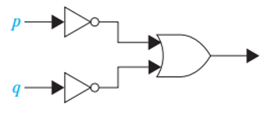
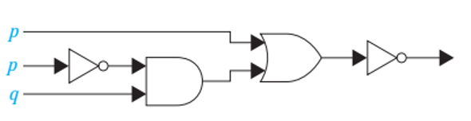
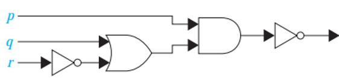
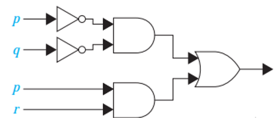

# Mathematics for Computer Science -- Propositional Logic 2

**Solve the following mathematical problems.**

1. Using a truth table, show that:
   1. $(\neg p \land (p \lor q)) \implies q$ is a tautology.
   2. $(\neg q \land (p \implies q)) \implies \neg p$ is a tautology.
2. Show that $p \lor (q \land r)$ and $(p \lor q) \land (p \lor r)$ are logically equivalent.
3. Show that $(\neg p \land (p \lor q)) \implies q$ is a tautology using a series of logical equivalences.
4. Design the logic circuit for $(p \lor \neg r) \land (\neg p \lor (q \lor \neg r))$.
5. Find the output for the following logic circuits using propositional logic.
   1. 
   2. 
   3. 
   4. 
6. Construct a combinatorial circuit using inverters, OR gates, and AND gates that produces the output $((\neg p \lor \neg r) \land \neg q) \lor (\neg p \land (q \lor r))$ from input bits $p$, $q$, and $r$.
7. Construct a truth table for each of these compound propositions.
   1. $(q \implies \neg p) \iff (p \iff q)$
   2. $(p \iff q) \oplus (p \iff \neg q)$
8. Find the bitwise value for the following combinations.
   1. 1111 0000, 1010 1010 (XOR)
   2. 00 0111 0001, 10 0100 1000 (Bi-conditional)
   3. 11 1111 1111, 00 0000 0000 (AND)

Answers are available [here](exercise-answers).