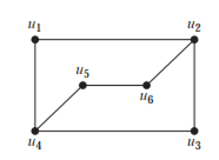

# Mathematics for Computer Science -- Graphs 1

## Answers

1. Undirected graphs.
   - For graph "a)".
     - Vertices: 6
     - Edges: 6
     - Degree of a: 2
     - Degree of b: 4
     - Degree of c: 2
     - Degree of d: 0
     - Degree of e: 2
     - Degree of f: 3
   - For graph "b)".
     - Vertices: 5
     - Edges: 12
     - Degree of a: 6
     - Degree of b: 6
     - Degree of c: 6
     - Degree of d: 5
     - Degree of e: 3
   - For graph "c)".
     - Vertices: 9
     - Edges: 11
     - Degree of a: 3
     - Degree of b: 2
     - Degree of c: 4
     - Degree of d: 0
     - Degree of e: 6
     - Degree of f: 0
   
2. In and out degrees.

   - For graph "a)".
     - In-degrees:
       - a - 1
       - b - 1
       - c - 2
       - d - 1
     - Out-degrees:
       - a - 1
       - b - 2
       - c - 1
       - d - 3
   - For graph "b)".
     - In-degrees:
       - a - 1
       - b - 3
       - c - 2
       - d - 1
     - Out-degrees:
       - a - 2
       - b - 3
       - c - 1
       - d - 1
   - For graph "c)".
     - In-degrees:
       - a - 6
       - b - 1
       - c - 2
       - d - 4
       - e - 0
     - Out-degrees
       - a - 1
       - b - 5
       - c - 5
       - d - 2
       - e - 0

3. The graph is not a $K_6$ graph as it's not complete. We know in any complete graph denoted at $K_n$ each vertex must be connected with all the other vertices of the graph independently. This condition is not satisfied in the graph provided.

4. Yes, $C_6$ is a bipartite graph but it cannot be considered as a complete bipartite graph. If among these six vertices all the odd vertices and even vertices remain in two different groups, then the relation itself shows that $C_6$ is a bipartite graph.

5. Adjaceny lists.

   - For graph "a)".
     - a - b, c, d.
     - b - a, d.
     - c - a, d.
     - d - a, b, c.
   - For graph "b)".
     - a - b, d.
     - b - a, d, e.
     - c - d, e.
     - d - a, b, c.
     - e - b, c.
   - For graph "c)".
     - a - a, b, c, d.
     - b - d.
     - c - a, b.
     - d - b, c, d.
   - For graph "d)".
     - a - b, d.
     - b - a, c, d, e.
     - c - b, c.
     - d - a, e.

6. Adjacency matrices.

   - |      | a    | b    | c    | d    |
     | ---- | ---- | ---- | ---- | ---- |
     | a    | 0    | 0    | 1    | 0    |
     | b    | 0    | 0    | 1    | 2    |
     | c    | 1    | 1    | 0    | 1    |
     | d    | 0    | 2    | 1    | 0    |

   - |      | a    | b    | c    | d    |
     | ---- | ---- | ---- | ---- | ---- |
     | a    | 0    | 3    | 0    | 1    |
     | b    | 3    | 0    | 1    | 0    |
     | c    | 1    | 1    | 0    | 1    |
     | d    | 0    | 2    | 1    | 0    |

   - |      | a    | b    | c    | d    |
     | ---- | ---- | ---- | ---- | ---- |
     | a    | 1    | 0    | 2    | 1    |
     | b    | 0    | 1    | 1    | 2    |
     | c    | 2    | 1    | 1    | 0    |
     | d    | 1    | 2    | 0    | 1    |

7. 

