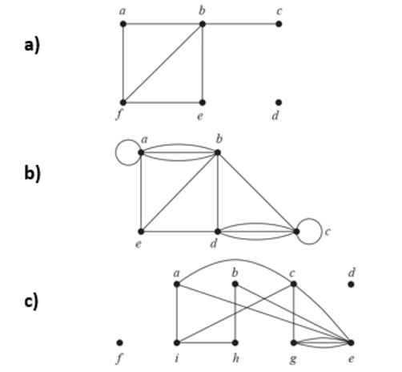
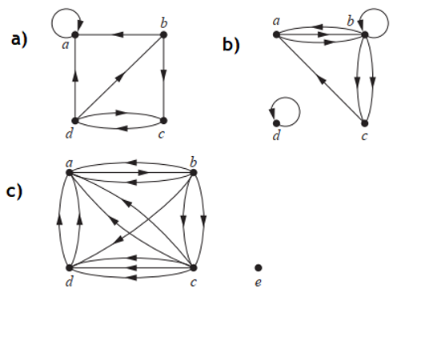
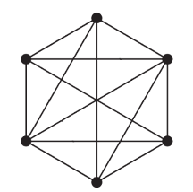
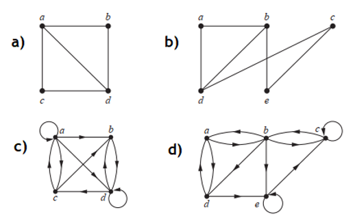
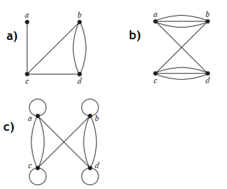
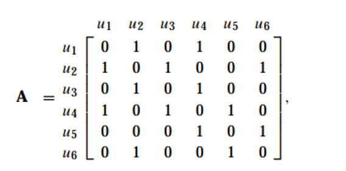

# Mathematics for Computer Science -- Graphs 1

**Solve the following mathematical problems.**

1. Find the number of vertices, the number of edges, degree of vertex from the given undirected graphs.  
2. Find out the in-degrees and out-degrees of each of the following multigraphs.  
3. Is the graph presented below a complete $K_6$ graph? Why or why not?  
4. Is $C_6$ a bipartite graph?
5. Represent the adjacency list(s) of the following graphs.  
6. Represent the adjacency matrices of the following graphs.  
7. What will be the graph representation of the given matrix?

Answers are available [here](exercise-graphs-1-answers).