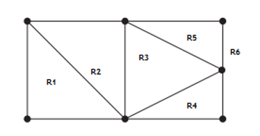
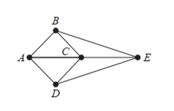
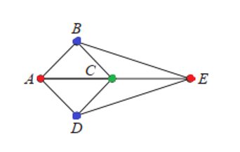

# Mathematics for Computer Science -- Graphs 2

## Answers

1. Both the graphs in the example above have the same number of vertices and edges. In both graphs, there are two vertices with degree three, and three vertices with degree two. Both have a simple circuit of length three, a simple circuit of length four, and simple circuit of length 5. Because of all these isomorphic invariants, both are isomorphic.

   Alternatively, to find a possible isomorphism, we can follow paths that go through all vertices so that the corresponding vertices in the two graphs have the sam degree. For example, the paths $<u_1, u_4, u_3, u_2, u_5>$ in $G$ and $<v_3, v_2, v_1, v_5, v_4>$ in $H$. By following these paths through the graphs, we define the mapping $f$ with $f(u_1) = v_3, f(u_4) = v_2, f(u_3) = v_1, f(u_2) = v_5$ and $f(u_5) = v_4$.

   We can also show the adjaceny matrix representation of each graph is isomorphic.

2. Components.

   1. 3
   2. 1
   3. 2

3. $G1$ has a Euler Circuit, for example $<a, e, c, d, e, b, a>$. Neither of the graphs $G2$ or $G3$ have a Euler Circuit.

4. $H2$ has a Euler Circuit, for example $< a, g, c, b, g, e, d, f, a>$. Neither of the graphs $H1$ or $H3$ has a Euler Circuit.

5. There is no Hamilton Circuit in $G$ because $G$ has a vertex ($a$) with degree one.

   Now consider $H$. Because the degrees of the vertices $a, b, d$, and $e$ are all two, every edge incident with these vertices must be part of any Hamilton Circuit. It is now easy to see that no Hamilton Circuit can exist in $H$, as any Hamilton Circuit would have to contain four edges incident with $c$, which is impossible.

6. There are four possible paths:

   - $<a, b, c, z> = 4 + 3 + 2 = 9$.
   - $< a, b, e, z> = 4 + 3 + 1 = 8$
   - $< a, d, e, z > = 2 + 3 + 1 = 6$
   - $<a, d, e, b, c, z> = 2 + 3 + 3 + 3 + 2 = 13$

7. Using Euler's Forumula, we can find the number of regions. $R = 11 (edges) - 7 (vertices) + 2 = 6$.

   

8. The planar graph derived is:

   

   Let's say if $A$ is coloured RED then neight of the vertices $B, C$ or $D$ can be RED as they are directly connected. $E$ can be RED as there is no edge between $A$ and $E$.

   Now, if $B$ becomes BLUE then we cannot colour $C$ BLUE as there is an edge between $B$ and $C$. $C$ can also not be RED, so we colour $C$ GREEN. $D$ is not connected to $B$ so can be BLUE.

   

