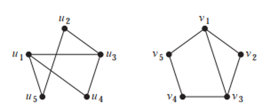
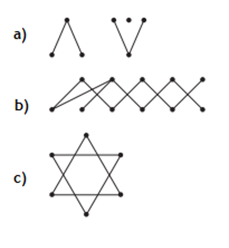
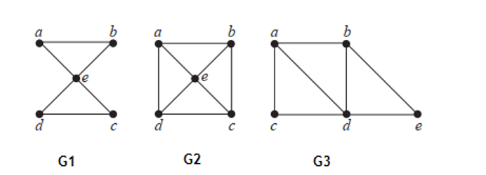
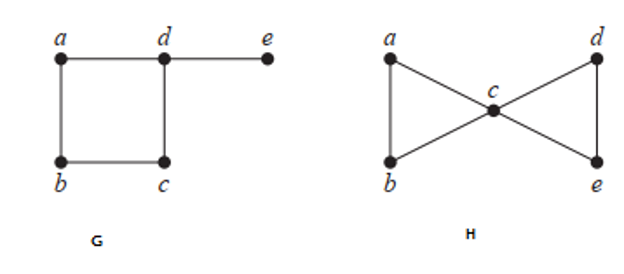
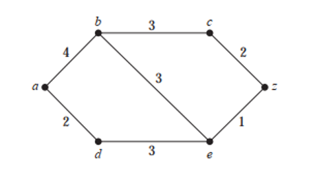
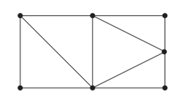
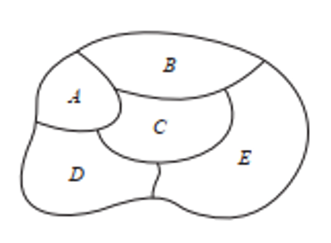

# Mathematics for Computer Science -- Graphs 2

**Solve the following mathematical problems.**

1. Determing whether the graphs below are isomorphic.

   

2. Find the number of components for the below graphs.

   

3. Which of the following undirected graphs have a Euler Circuit?

   

4. Which of the following directed graphs have a Euler Circuit?

   

5. Determine whether the following graphs contain any Hamiliton Circuits.

   

6. What is the length of the shortest path between $a$ and $z$ from the graph below? How can you determine the shortest path?

   

7. How many regions are there in the following Planar Graph?

   

8. Let’s consider an example of a GeoLocation of Earth. The cities are $A$, $B$, $C$, $D$ and $E$ respectively. Now if you want to represent the cities from the map using a graph then how can you do that? Hint: Represent the scenario using a planar graph, where each city is a vertex and the cities sharing the common border will be connected by an edge] Also identify the number of chromatics you need to represent the graph using “Graph colouring theorem”. 

   

Answers are available [here](exercise-graphs-2-answers).