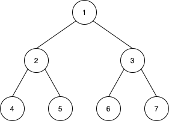
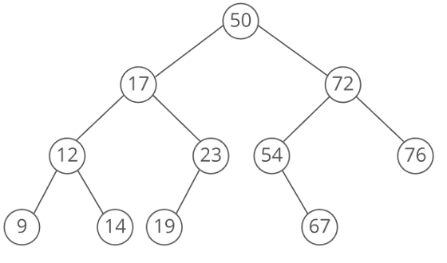
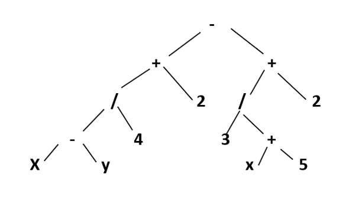

# Mathematics for Computer Science -- Trees

## Answers

1. Here, $n = 10000$, so $e = n - 1 = 9999$.
2. Here, $m = 5, i = 100$. Therefore, $n = mi + 1 = 5 \cdot 100 + 1 = 501$.
3. Here, $m = 2, i = 1000$. Therefore, $n = mi + 1 = 2 \cdot 1000 + 1 = 2001$. Therefore, $e = n - 1 = 2001 - 1 = 2000$.
4. Here, $m = 3, n = 100$. Therefore, $i = ((m - 1)\cdot n + 1) / m = ((3 - 1)\cdot 100 + 1) / 3 = 201 / 3 = 67$.
5. 
6. Traversal
   - Preorder: 10, 5, 2, 8, 6, 15, 13, 19
   - Inorder: 2, 5, 6, 8, 10, 13, 15, 19
   - Postorder: 2, 6, 8, 5, 13, 19, 10
7. 
8. Graphs
   1. Tree.
   2. Two trees, thus a forest.
   3. Tree.
   4. Not a tree as there is a circuit (loop).
   5. Tree
   6. Not a tree as there is a circuit (loop).
9. 
10. Infix expression
    - Prefix: - + / - x y 4 2 + / 3 + x 5 2
    - Postfix: x y - 4 / 2 + 3 x 5 + / 2 + -