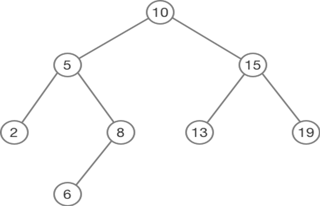
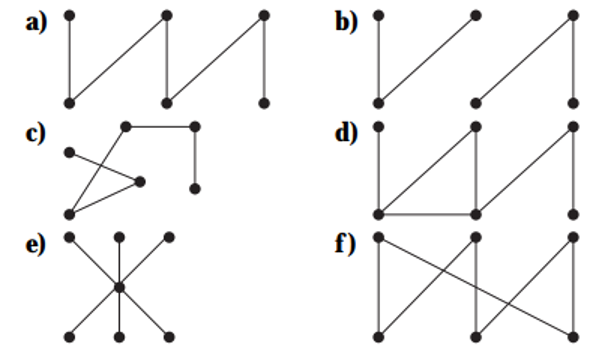

# Mathematics for Computer Science -- Trees

**Solve the following mathematical problems.**

1. How many edges does a tree with 10,000 vertices have?
2. How many vertices does a full 5-ary tree with 100 internal vertices have?
3. How many edges does a full binary tree with 1000 internal vertices have?
4. How many leaves does a full 3-ary tree with 100 vertices have?
5. Construct a complete binary tree of height 2.
6. Determine the preorder, inorder, and postorder traversal for the following tree. 
   
7. Generate a BST for the following set of vertices $\{50, 72, 17, 23, 12, 76, 54, 14, 9, 19, 67\}$.
8. Which of the graphs are trees?
   
9. Create an expression parsing tree from the given infix expression: $(2 + ((x - y) / 4)) - ((3 / (x + 5)) + 2)$.
10. Determine the prefix and postfix expressions for the following infix expression: $(2 + ((x - y) / 4)) - ((3 / (x + 5)) + 2)$.

Answers are available [here](exercise-answers).