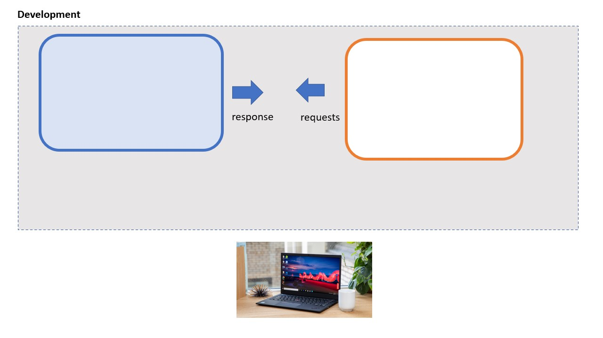
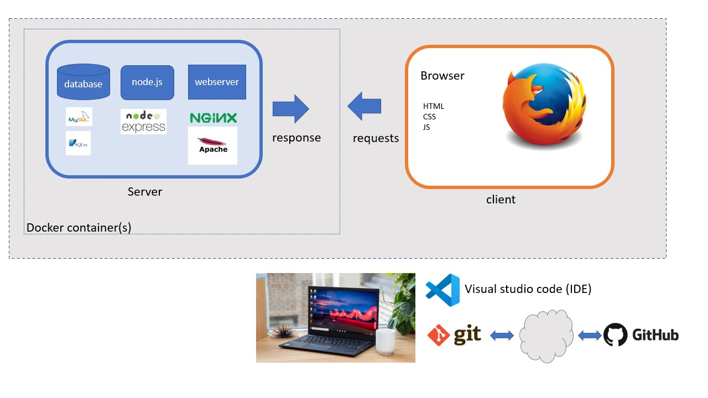

# Software Development 2 Seminar 01 -- Overview of the course and the technology components

## SD2 - What's it all about?

This MIGHT just be the most important course of your MSc - it brings together a lot of different technology skills with professional practice and team working.  Its going to be a challenge.

*You will create a web application ie. a dynamic website that fulfills a 'business' need* 

Here are the 'moving parts'

#### Web technologies

* 'Frontend' - HTML markup, CSS styling, Javascript for dynamic features on the page
* 'Backend' - SQL database, node.js / express 'backend' framework
* Angular.js - a framework for integrating frontened and backend code

#### Teamworking technologies/tools

* Git - Source code version control
* Docker - consistent development environments and deployment pipeline
* Visual studio Code - your personal 'Integrated Development Environment'

#### Teamworking methods /tools

* Scrum/kanban
* Agile user stories

## What you will do

1. Learn the key web development technologies - frontend then backend
1. Learn about professional development tools
1. Form teams in which you will specify a project, and use the teamworking and frontend/backend technologies to realise it

## Technology components of your web app

Fill in the gaps! 

Production - The pages and server-side functionality are accessed over the internet

> 

Development - The pages and server-side functionality AND the client side (browser) are all one computer

> 

Development with containers - The pages and server-side functionality AND the client side (browser) are all one computer BUT the server-side software is in Docker 'containers' to allow for consistent development environments.  This version also shows your software development tools - IDE (visual studio code for development and GIT for version control, connected online to github, allowing you to share with colleagues)

> 

## Where is all this leading?

* Consider static web pages eg. 'brochureware'
* Now consider a dynamic 'web app' that does something: eg. online shopping, moodle, and that is 'personalised'
* You will use the tools described here to create a dynamic, web app by integrating a 'backend' database, using node.js framework into dynamic web pages

## Exercise

Lets think of some web sites we use frequently and see what we can find out about the frontend/backend technologies they use, and take an educated guess at how they store and retrieve data.

Use 'developer tools' in your browser to examine the source code. For reference: 
https://developer.mozilla.org/en-US/docs/Learn/Common_questions/What_are_browser_developer_tools

## How will we go about this?

* Next week, we will form our teams.
* Our teams will use an Agile / scrum methodology to create projects.
* Your assigments will be the results of 3 week 'sprints'
* You will maintain a taskboard, and have regular standups
* You will use professional teamworking methods and tools to specify, organise and develop code
* Though you might have different roles in the group project, EVERYONE should master the fundamentals of building a database-driven application.

*Please use Moodle to share ideas and start to form teams.*

