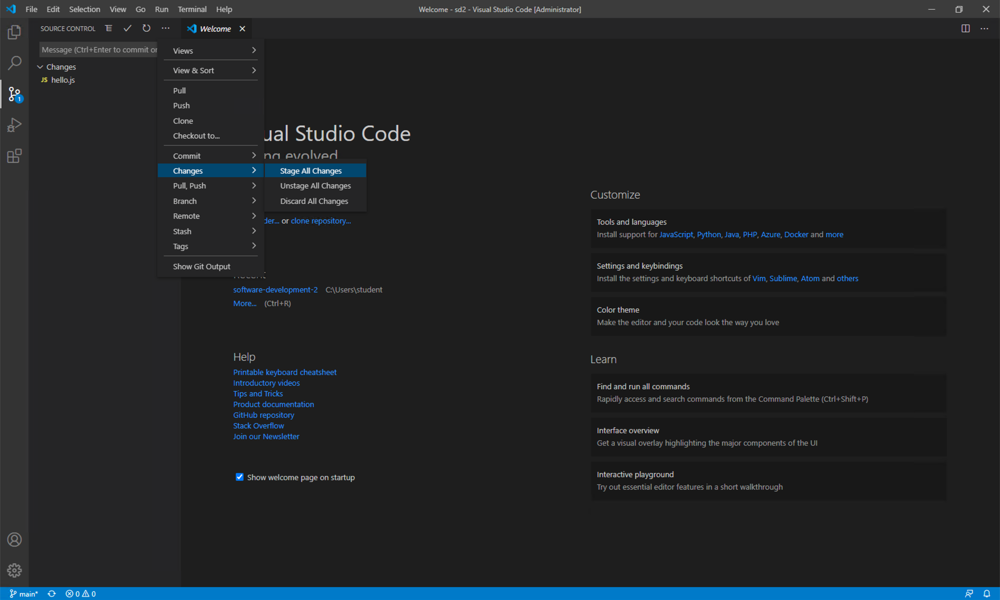
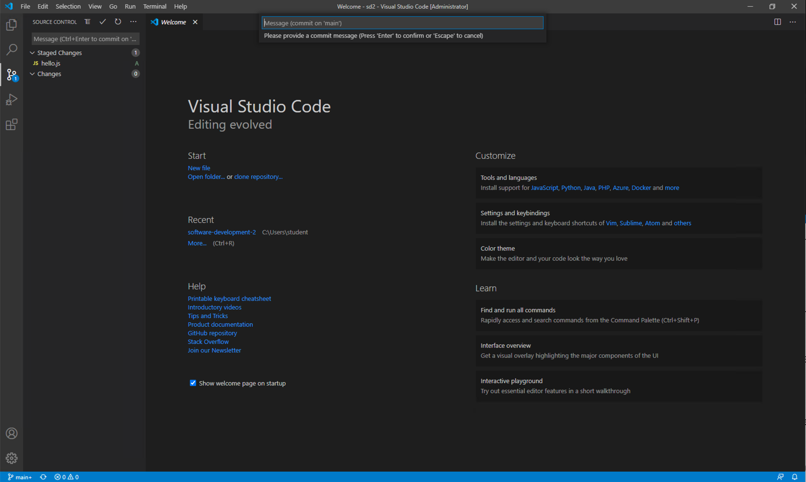

# Software Development 2 Lab 2 -- Version Control, Classes and Debugging

## Creating a GitHub Account

The whole point of version control is to maintain your code somewhere backed-up and shareable with your team.  We will use *GitHub* as a repository for this module.  First, you will need to create an account on GitHub if you haven't already.  Go to [GitHub](https://github.com/) and **Sign Up**.  Two things to note:

1. You do not need a paid for account.
2. If you are a student, GitHub will give you [unlimited private repositories](https://education.github.com/pack).

Once you have an account, you need to create a repository.  In GitHub, you will see a **+** near the top of the page, which you can select **New repository** from:


This will open a new window.  You need to enter the name for the repository (for example, `sd2`), make sure the repository is **Public** and then select the **Apache 2.0** license type.  **Ensure that a README is added**.  You have one already.  This details are illustrated below:


Click on **Create repository** and you will be presented with the following:


## Installing Git -- Mainly for Windows

Git is normally installed on MacOS and Linux by default. For Windows do the following:

1. **Go to Git home page https://git-scm.com/**.
2. **Download Git**.
3. **Install Git. During install make sure you select to use Visual Studio Code as the default editor.**
4. **All other settings can remain as default.**
5. **Once installed continue with the rest of the lab.**

## Initial Git Configuration

Git commits have a collection of information attached to them, including who created the commit -- their name and email address. We must set this information up when we start using Git. Enter the two following lines into your terminal:

```shell
git config --global user.email "you@example.com"
git config --global user.name "Your Name"
```

Replacing `you@example.com` with the email you used for your GitHub account, and `Your Name` with your name.

## Cloning Your Project in Visual Studio Code

Now we need to clone the GitHub project in Visual Studio Code. 

1. **Open Visual Studio Code.**
2. **Make sure no folder is currently open. We can do this by using File then Close Folder from the main menu.**
3. **Click on the Source Control button on the left-hand side of the Visual Studio Code window.**
4. **Your window should now look like this.**


We need the the location of our repository.  This is the URL of the repository you created, which should be of the form `https:\\github.com\<user-name>\sd2` (or whatever project name you gave).  For example, my repository is [https:\\github.com\kevin-chalmers\sd2](https:\\github.com\kevin-chalmers\sd2).

**Click the Clone Repository button and Visual Studio Code will ask for the repository URL at the top of the window**.


1. **Press return, and Visual Studio Code will ask you where you want to save the repository. Pick somewhere sensible.**

2. **Visual Studio Code will ask you if you want to open the repository. Choose to do so.**

You now have your GitHub repository cloned to the local machine and opened in Visual Studio Code. Let us add some files to the repository.

1. **Copy the code files you created in Lab 01 to the repository folder.**

2. **Open the Source Control panel in Visual Studio Code using the button on the left-hand side.**
3. **You will now see a list of changes. We will just add all of them just now. Click the three dots at the top of the Source Control panel and select Changes then Stage All Changes as shown below.**



You have now added your existing files to the *Staging Area* of the local Git repository. Next we need to create a commit from these changes. **Click the three dots again and select Commit then Commit. Visual Studio will ask you for a commit message. Enter `First commit, adding initial files.`**



We have now created a checkpoint in our code that we can **always** return to.  This is the power of version control.  We are check-pointing our code so we can rewind to previous versions.  As long as you commit often, you can always revert back to a previous version.

Now we need to push these changes to GitHub. **Click the three dots again, and select Push**. You will be asked to log into GitHub. Do so. This will automate most of your work with GitHub.

Refresh the GitHub page.  You should see your files there:


We have now defined our core workflow with Git using Visual Studio Code:

1. Add the files to the commit -- **Changes then Stage All Changes.**
2. Commit the changes -- **Commit then Commit.**
3. Push the changes -- **Push**.

**Get used to this process - it will save your code from disaster!**.  We have created a checkpoint where we know our code is working and doing what we expect.  Whenever you do a change -- and make your changes small -- and tested the build works, commit and push.  I will remind you a few more times, but this is a habit for you to form.

## Object-orientation in JavaScript

JavaScript is an object-oriented language. But what does object-oriented mean? Let us take the [Wikipedia](https://en.wikipedia.org/wiki/Object-oriented_programming) definition (emphasis mine):

> Object-oriented programming (OOP) is a **programming paradigm** based on the concept of **"objects"**, which can **contain data and code**: **data in the form of fields (often known as attributes or properties)**, and **code, in the form of procedures (often known as methods).**

Object-oriented programming (OOP or OO) is a programming paradigm. This just means it is an approach to write programs. For example, you are probably used to *imperative procedural programming*. This is where we build our programs from functions/procedures. Object-orientation is also imperative, but uses objects to construct programs.

OOP has the following terms associated with it:

- **Objects** -- are a collection of data and/or code. Objects are *instances* of classes.
- **Classes** -- are a description of what data and/or code an object has within it.
- **Data** -- the attributes or properties of an object. Essentially, the variables *associated* with an object.
- **Code** -- the procedures, functions, or methods of an object that can be used to manipulate its data.

You've already been using objects in JavaScript -- `document.write()` means call (invoke, use) the `write` method on the `document` object. The `document` object is the web page your JavaScript program was executing on.

> ### JavaScript's History of OOP
>
> JavaScript is actually an implementation of something called [ECMAScript](https://en.wikipedia.org/wiki/ECMAScript). Until 2015, objects where possible in JavaScript, but not in a manner most programmers would recognise. For example, there was no `class` keyword. ECMAScript 2015 (or ES6) introduced classes and a variety of other language features, making it more similar to Python.
>
> This means there are many JavaScript tutorials online that ignore classes, and write object-oriented code in a strange and hard to maintain manner. We will be using the language features of ES6 which provides a better OOP experience.

### Classes in JavaScript

To declare a class in JavaScript we use the `class` keyword. For example:

```javascript
class Foo {
  // ... contents of the class.
}
```

A class needs a `constructor` which is used to create instances of the class. For example:

```javascript
class Foo {
  constructor() {
    // ... define initial variables
  }
}
```

We can then create instances of this class using the `new` keyword:

```javascript
var foo = new Foo();
```

We can say that a class has attributes (data) just by listing them in the class:

```javascript
class Foo {
  // Attributes
  value1;
  value2;
  
  constructor() {
    // ... define values
  }
}
```

And we can pass parameters to the constructor that will set the initial values of these attributes.

```JavaScript
class Foo {
  // Attributes
  value1;
  value2;
  
  // Constructor builds the object
  constructor(value1, value2) {
    // Set local values to parameters given.
    this.value1 = value1;
    this.value2 = value2;
  }
}
```

The `this` keyword is used to refer to the local object. So saying `this.value1` means `value1` associated with this particular object instance. Let us look at a more concrete example -- a `Student` class:

```javascript
// A definition of a student
class Student {
    // Student ID
    id;
    // Student name
    name;

    // Creates a new instance (object) of type Student
    constructor(id, name) {
        // Set the id and name of the object instance
        this.id = id;
        this.name = name;
    }
}

var student = new Student("001", "Kevin Chalmers");
```

Let us turn the student example into a more concrete example. **Create `students.html` with the following code:**

```html
<!DOCTYPE html>
<html>
    <head>
        <title>Student List</title>
        <script src="student.js"></script>
    </head>
    <body>
        <h1>
            Click the button!
        </h1>
        <input type="button" value="Click Me!" onclick="printStudents()">
        <div id="main"></div>
    </body>
</html>
```

> #### What is a `<div>` Tag?
>
> A `<div>` tag is used to define a division or a section of your HTML document. A `<div>` can have any other HTML within it. It is a useful method for creating areas of our document we can manipulate independently. For example, we have created a section called `main` here.

Now we need our `student.js` file:

```javascript
// Tells the browser we want JavaScript to run in strict mode.
// This means faster code, but JavaScript needs to be cleaner.
"use strict";

// A definition of a student
class Student {
    // Student ID
    id;
    // Student name
    name;

    // Creates a new instance (object) of type Student
    constructor(id, name) {
        // Set the id and name of the object instance
        this.id = id;
        this.name = name;
    }
}

// An array of students.
var students = [
    new Student("001", "Kevin Chalmers"), 
    new Student("002", "Lisa Haskel"), 
    new Student("003", "Arturo Araujo")];

function printStudents() {
    // Build text to display
    var text = "";
    // Iterate over all the students
    for (var student of students) {
        text = text + student.id + ": " + student.name + "<br>";
    }
    // Get the main element
    var main = document.getElementById("main");
    // Set the innerHTML to text
    main.innerHTML = text;
}
```

> #### `"use strict";`
>
> `"use strict"` is useful as it tells the browser to have a strict interpretation of our JavaScript code. This means your code must avoid certain issues that lazy JavaScript programmers perform. Our code will be less error-prone, and faster.

> #### `<br>` Tag
>
> The `<br>` tag is just a line break. We are putting a new line after each student in our output.

**Open the web page file so it is opened in your browser. Click the button to ensure that it works correctly.**

#### STOP -- Commit Your Changes!

If your new web page works as expected it is time to commit your updates to GitHub.

1. Add your files to the commit.
2. Create the commit. Use the message `Added students.html and students.js files.`
3. Push your changes to your GitHub repository.

**Once you have committed your changes and pushed them to GitHub:**

1. Close Visual Studio Code.
2. Delete the folder you were working in. It's OK -- it is stored in GitHub.

## Debugging in the Web Browser

### Checking Errors

### Setting Breakpoints

### Examining Values

## Exercises

1. You need a repository for your coursework. Someone in your team needs to create this repository in their GitHub account. Follow the instructions at the start of this lab, and ensure there is a `README.md` file and license attached. Once created, make sure you can clone it to your local machine.
2. Your team should now add some files to your repository. Each team member should add a file called `<name>.txt` where `<name>` is their name. Add some text to the file. Then commit and push the changes. **HINT** -- if someone has already committed a change before you, you will need to pull the changes first before you can push yours.
3. Once everyone on the team has created their files, make sure everyone pulls the current version of the repository so they are up to date.
4. Work through the series of tutorials here https://www.katacoda.com/courses/git/.
5. Work through the following tutorial https://learngitbranching.js.org/.
6. We are now going to create a merge conflict situation in your team's repository. Two team members need to change the same file. This file will be `README.md`. One team member should add a description of the project, whereas the other should add the members of the team. If you want to use Markdown (the text encoding for `.md` files), see a guide here https://www.markdownguide.org/basic-syntax.
7. Both team members should commit and push their code. Whoever is second to commit will have to resolve the merge conflict. Use the information gained from the tutorials above to do so.
8. Each team member should now try and create merge conflicts which they can solve. This is good practice. Merging changes is the biggest hurdle for new Git users.

