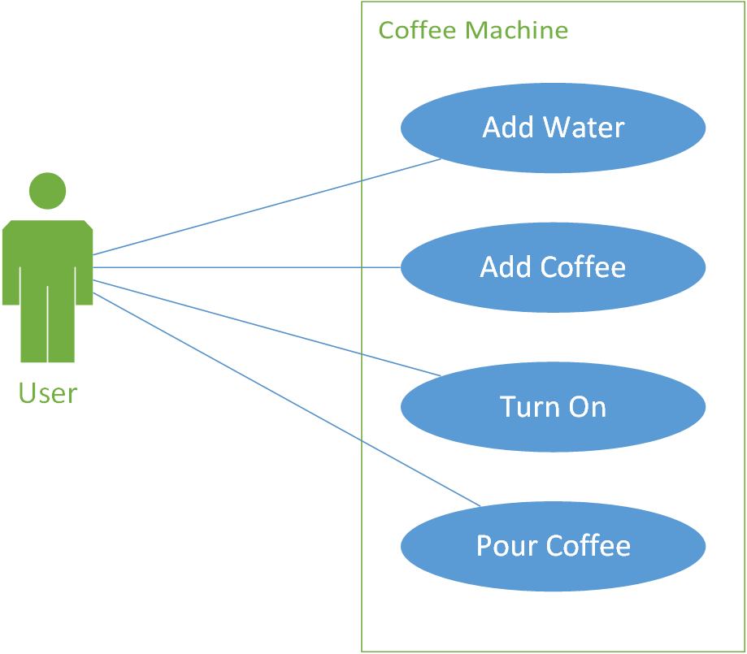
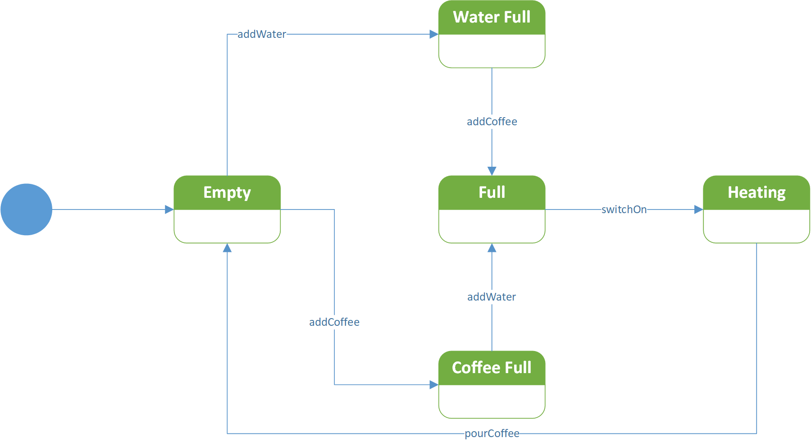
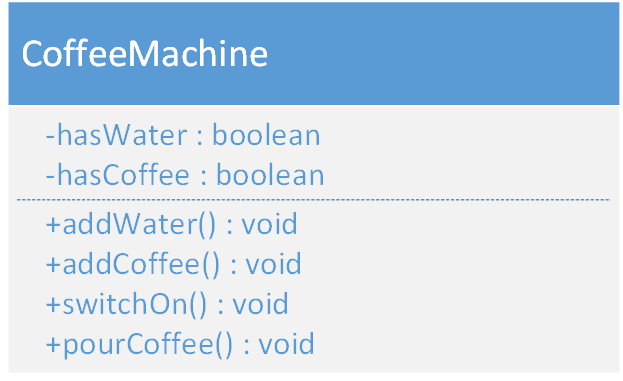

# Software Development 2 Seminar 3 -- UML Workflow

## Using UML as an Analysis and Design Tool

Unfortunately, UML has been promoted as a tool that should be used to do a complete system analysis and design for an application.  The first piece of advice is not to do this.  Many people are still taught UML in this manner, and many proponents try and emphasise this usage.  Remember in agile this makes no sense.  We do enough analysis and design to allow us to deliver working code in an iteration.  The customer is not paying for diagrams which will be wrong as requirements change.

So how to use UML?  There is a good basic workflow with UML:

1. Produce use case diagrams to analyse the use cases needed for the system.
2. Produce activity diagrams to analyse and design the flow of activity through the system.  This should include the use cases defined in step 1.
3. Produce state diagrams to analyse and design the changes in state that occur as the application occurs.  The activities help us define the different state transitions and must all be covered.
4. Produce a class diagram to design the classes required to meet the activity and state diagram requirements.  This takes some skill to divide up the functionality and data into chunks.
5. Produce a sequence diagram to design how objects interact to solve the use cases.  This comes from our activity and state diagrams.

You can add or remove steps as required, or change the order.  The point is to build up a set of diagrams to understand the system being designed.  In this lecture we use steps 1-4.

## Tutorial Example: Coffee Machine

In our tutorial case study we are going to model a coffee machine:

<p><a href="https://commons.wikimedia.org/wiki/File:Consumer_Reports_-_Zojirushi_coffeemaker_alt.tif#/media/File:Consumer_Reports_-_Zojirushi_coffeemaker_alt.tif"></a><br>By <a rel="nofollow" class="external text" href="http://consumerreports.org">Consumer Reports</a>, <a href="https://creativecommons.org/licenses/by-sa/4.0" title="Creative Commons Attribution-Share Alike 4.0">CC BY-SA 4.0</a>, <a href="https://commons.wikimedia.org/w/index.php?curid=48862825">Link</a></p>

This is an intentionally simple example to illustrate the basic use of UML in analysis and design.  Our advice is to always use UML in this simplified manner rather than going through a large analysis and design with UML.

Our coffee machine is going to be restricted just to make the design easier.  The following constraints are in place:

- The coffee machine can only hold enough coffee to make one cup.
- The coffee machine can only hold enough water to make one cup.

We will go through the following analysis and design stages:

- Use case modelling (analysis).
- Activity modelling (analysis and design).
- State modelling (analysis and design).
- Class diagram (design).

### Use Cases

Use cases allow us to analyse the current system or propose how a solution might act.  In both cases, uses cases allow communication with stakeholders, and are therefore simple to understand.

For a coffee machine, we can think of the basic use cases as we are familiar with such a device.  Think about what a user of a coffee machine can do:

- Add water to the coffee machine.
- Add coffee to the coffee machine.
- Switch the coffee machine on.
- Pour coffee.

We would normally find such use cases by talking to users.  There would also be more of them, more relationships between them, and more systems involved.  However, our coffee machine use case diagram is quite simple:



The user can perform any of the following four use cases:

1. Add Water.
2. Add Coffee.
3. Turn On.
4. Pour Coffee.

Obviously these cannot be done whenever we like.  This is the information that is lacking in a use case diagram.  We will add an activity diagram to perform some further analysis and do some initial design.

### Activity Diagram

The point of an activity diagram is to map the flow of activity through our system.  We have identified four use cases, but how do we determine when these happen?

Again, we would speak to our users and other stakeholders, and use our experience to help design a solution.  With the coffee machine, we will use our own experience to map what is happening.  The general flow is:

1. Add water and coffee (the order doesn't matter).
2. Heat coffee.
3. Pour coffee.

Step one is an example of concurrent activity using fork-and-join activities.  Let us assume also that as part of the general activity flow, someone may have filled the water and/or coffee since last time, just to be nice.  This means our activity diagram is:


Let us map this as pseudo code.  There are two possible sequences through the activity:

```
1. IF water IS EMPTY THEN Add Water
2. IF coffee IS EMPTY THEN Add Coffee
3. Heat Coffee
4. Pour Coffee
```

and

```
1. IF coffee IS EMPTY THEN Add Coffee
2. IF water IS EMPTY THEN Add Water
3. Heat Coffee
4. Pour Coffee
```

This is very close to something we could code.  We only have to think about how we represent coffee and water (a design decision) and how to implement the actions.  Before going too far into this let us also look at the system state.

### State Diagram

Our state diagram must capture the different possible states associated with coffee and water, while also capturing the idea of coffee being brewed.  We have already defined some of the actions (state transitions) in our system via our activity diagram.  These are:

1. Add coffee.
2. Add water.
3. Switch on.
4. Pour coffee.

Remember our coffee machine is very basic: it only accepts enough coffee and water to make one cup.  Therefore, we can determine what happens after each state transition above:

1. When add coffee:
   - If empty, then coffee full.
   - If water full, then full.

2. When add water:
   - If empty, then water full.
   - If coffee full, then full.

3. When switch on then heating.
4. When pour coffee then empty.

Our state transition diagram therefore is:



### Class Diagram

Now that we know the transitions (actions or methods) and our state (coffee and water) we can define our class.  This example does not require any relationships, but the general principle should be understandable.  The class diagram is:



We have represented the state of the coffee machine using two attributes, both of which are `boolean`:

- `hasCoffee`.
- `hasWater`.

Our state transitions have been converted into four methods:

- `addWater`.
- `addCoffee`.
- `switchOn`.
- `pourCoffee`.

At this point it is a simple case of adding the code to the methods, which just changes the state of the two attributes.  Our analysis and design is complete.

## Some UML Tips

- UML allows you to **visualise your code**.  Most of your work at university will probably not need to be visualised due to its simplicity.  In the real world, code bases become large, and we need to see what is going on.
- Designing software from the ground up using UML is not a good plan.  Although UML was proposed as a silver bullet to design challenges, this was not the intent.  Overuse of UML is a known issue with UML adoption.
- Stating with the design overuse problem, remember our job as agile software developers: to satisfy customers by early and continuous delivery of valuable software.  Diagrams are not software.
- UML is a large language, so don't expect to understand it all.  Use the parts that are useful.  See it as a common visual metaphor for your code.
- All that being said, UML does offer useful diagrams:
  - Use cases allow communication with stakeholders.
  - Activity diagrams allow flowchart modelling which allows analysis, design, and communication with stakeholders.
  - Class diagrams allow the visualisation of software architecture which is necessary when software becomes too complex.

## Your Task

Your team should now start using UML to help shape some of your software. **This is a key communication tool between the team.** Do any diagrams you think are necessary to help your team understand how your software needs to be constructed.