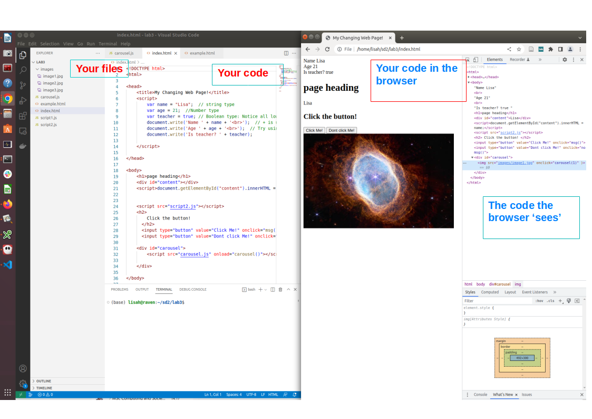
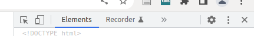
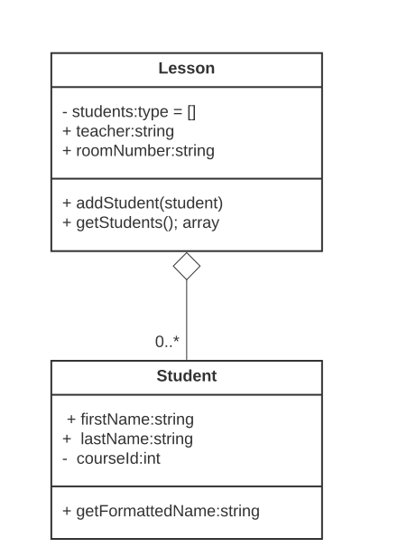

# Development Environment, HTML forms and OOP in Javascript

In this lab we will look at how you can design and organise your code by using Object Orientated principles.  Before that, we will ensure that our development environment is familiar to you, and we will extend our HTML knowledge with HTML forms.

The emphasis in this lab on getting more practice in using our develoment environment:

  * VS code
  * Browser
  * Chrome developer tools
  
We will also learn the basics of of OOP in ways you can apply to all languages that support OOP.

## Preparation

### Setting out your development environment

Your enjoyment writing code, and your productivity will be enhanced by gaining fluency in the fundamental tools of web development and its processes.




Your desktop should look like the image above where:

   * Your code is visible in Visual Studio Code and you can edit it
   * You also have a browser window open.  You can see your changes by refreshing the browser without having to reopen the browser window
   * You can use developer tools to check what the browser is rendering.  You can also use the tools there to check CSS and Javascript as well as other information related to the browser.
   * You can use the VS code file explorer to check your file structure
   
You may also have a terminal window open where you can use git and other command line tools.

## Exercise

   1. Find the code you wrote in week 1 for your first HTML page.   In case you lost it, it is here: [Lab sheet 1](https://roehampton.github.io/module-content/msc-software-development-2/week-01/lab/#introduction-to-html-and-web-pages)
   2. Set up your desktop as per the image above, including opening developer tools.
   2. Add a new paragraph in p tags somewhere in the page, like this ```<p> some content </p>```.
   3. Refresh the page so you can see your update, without having to re-open any browser window.
   4. Add some styling to the page by adding the following in the 'head' section of the document 

</span><br></p>
<p><span style="font-size: 0.9375rem;"><br></span></p>
<p><span style="font-size: 0.9375rem;"></span></p>
<p>&lt;style&gt;</p>
<p> h1 {</p>
<p>    color: blue;</p>
<p>    background-color: yellow;</p>
<p> }</p>
<p> p {</p>
<p> color:brown;</p>
<p> font-size: 4em;</p>
<p> }</p>
<p><br></p>
<p> &lt;/style&gt;</p><br>
<p></p>
<p></p>


5. Refresh the browser.  Your page should not be very pretty, but have some new colours!  
6. Now find the inspector button of your developer tools: its the square with the arrow pointing into it




7. Click on the inspector tool, and then onto the heading of your page. You will see the relevant part of the code highlighted in the main 'elements' part of developer tools, and below in the 'styles' window, you will see the CSS rules that have been applied.
8. Play with your page some more, so you are full familiar with the relationship between the code editor, browser and developer tools.


NOTE: that the 'em' measurement is a relative measurement that can be used for font size, for more info see: [Mozilla html reference: measurement units](https://developer.mozilla.org/en-US/docs/Learn/CSS/Building_blocksValues_and_units)


## HTML forms

When we start to work with a more sophisticated backend, we will need to know how to create forms that eventually we will use to send information into the backend server for storage or to make a customised request.  Lets see how to make input forms in HTML. This example shows the three main types of form element for different types of input.

Example:

```html
<!DOCTYPE html>
<html>

<head>

</head>

<body>

  <h1>HTML Forms example</h1>

  <form action="" method="GET">
    <div>
      <label for="name">Name:</label>
      <input type="text" id="name" name="name">
    </div>
    <div>
      <label for="mail">E-mail:</label>
      <input type="email" id="mail" name="email">
    </div>
    <div>
      <label for="msg">Message:</label>
      <textarea id="msg" name="message"></textarea>
    </div>
    <button type="submit">Submit!!</button>
  </form>

  <p>If you click the "Submit" button, the form-data will be sent back to this page.
    Usually, the action sends data to a different file with scripts that can process it.</p>

</body>

</html>
```

1. Create a new file called form.html with this code. 
2. Load the new file in your browser and open developer tools
3. Fill out the form and click 'submit'
4. What happens? Where can you find the data you just submitted? (hint: look right up at the top of the page in the address bar)

## Sending parameters: GET vs POST

1. Clear the URL so that it only shows 'form.html'
2. Change the 'method' attribute from GET to POST. 

Can you spot the difference?  It is very important to understand the differences: see https://www.w3schools.com/tags/ref_httpmethods.asp.

## Examining and receiving parameters

When you use the POST method, you will need to find another way to examine your parameters.

In Chrome, open developer tools, choose the network tab, uncheck 'preserve log' and check 'disable cache'.  Now open te 'Headers' section. Submit the form by GET or POST, you should see the values you send (you may need to open the 'payload' tab.

.  Note that the values you send are labelled using the value of the "name" attribute in the HTML form, in this case name, email and message.  See image below...


>


In your dynamic web application, sending these kinds of variable values to your application either to SELECT or UPDATE data will be a crucial part of your work and you will mostly use HTML forms to pass in this dynamic data.


## Object-orientation in JavaScript

JavaScript is an object-oriented language. 

In OOP, your objects are designed to model entities or objects in the real world.

Remember the following:

 * Classes are the code that define objects​: objects are specific **instances of** classes

 * Classes contain both Data (properties) and behaviour (functions/methods) ​

 * Classes should be modelled on real-world entities or concepts​

 * The 'black box' principle – the implementation within a class can be changed so long as the inputs and outputs remain the same.  This supports maintainability​

 * Re-usability – classes can be re-used throughout your programme and exported into others.  Inheritance and abstraction can be used to make the code even more re-usable

You've already been using objects in JavaScript -- `document.write()` means call (invoke, use) the `write` method on the `document` object. The `document` object is the web page your JavaScript program was executing on.

> ### JavaScript's History of OOP
>
> JavaScript is actually an implementation of something called [ECMAScript](https://en.wikipedia.org/wiki/ECMAScript). Until 2015, objects where possible in JavaScript, but not in a manner most programmers would recognise. For example, there was no `class` keyword. ECMAScript 2015 (or ES6) introduced classes and a variety of other language features, making it more similar to Python and Java, for example.
>
> This means there are many JavaScript tutorials online that ignore classes, and write object-oriented code in a strange and hard to maintain manner. We will be using the language features of ES6 which provides a better OOP experience.

### Classes in JavaScript

To declare a class in JavaScript we use the `class` keyword. For example:

```js
class Student {
  // ... contents of the class.
}
```
Note: that class names usually start with a capital letter. This is a style convention, preferred, but not imposed by the language.  Languages and indeed individual companies set style guides for example: https://google.github.io/styleguide/jsguide.html.


You will usually put the class definition in a file with the same name as the class, but in lower case.  You can also tidy your codebase by putting your class definition in a directory called 'models'.  We are calling it models because we are loosly using the MVC (Model View Controller) design pattern in which the 'models' contain code related to data, the 'views' handle presentation and the 'controller' mediates between the two.  Currently, the app.js file is your controller, and we will add views later on.

### Getting started...

1. create a new file called student.js

Now you can begin writing your Student class.

A class needs a `constructor` which is used to create instances of the class. For example:

```js
class Student {
  constructor() {
    // ... define initial variables
  }
}
```


We define the attributes (properties) (data) of the class by listing them in the class definition.  Depending on the languge, we may or may not set a data type and we may be able to set default values that will be present in every object (instance of the class, remember)

```js
class Student {
  // Attributes
  firstName;
  lastName;
  courseId;
  
  constructor() {
  }
}
```

Add this code to your student.js file

### Using your class definition

Your class doesn't do much right now, but we can make use of it from our index.html file.


1. Add the following somewhere in your ```index.html``` file.  

```js
<script src="student.js"></script>

        <script>
            var s1 = new Student();
            s1.firstName = "Lisa";
            s1.lastName = "Haskel";
            s1.courseId = 1;

            console.log(s1);
        </script>
```

2. Save the index.html file and the student.js file.
3. Refresh the HTML page in the browser.
4. You won't see any output in your page right now, but if you click the 'console' tab in your developer tools, you will see the class student data structure shown there.


**Well done** You have created your first class, made it available to your application, instantiated an object using your class definition and examined it in the console.


## Building your Student class


Our class becomes a lot more useful if we add parameters to the constructor that will set the initial values of our attributes.  This will also help us understand the relationship between a class (a template or blueprint for our object) and our object (a specific instance of a given class )

```js
class Student {
  // Attributes
  firstName;
  lastName;
  courseId;
  
  constructor(firstName, lastName, courseId) {
  
	  this.firstName = firstName;
	  this.lastName = lastName;
	  this.courseId = courseId;
  }
}
```

The `this` keyword is used to refer to the local object, ie. the very object we are defining, So writing `this.firstName(firstName)` means...
Assign the value of the argument supplied to the function firstName, and assign it to the object property called firstName.  

*Note that in this case the name of the parameter and the class property match, but they don't have to, as this.firstName and firstName are completely different variables.


#### Your task
Go back to your index.html file and amend as follows:

1. Create an object called Student1 with firstName Lisa and lastName Haskel and courseId 1.  You will be creating the object like this:

```html

var s1 = new Student("Lisa", "Haskel", 1);
```
2. Create a second object called Student2 with firstName Kevin and lastName Chalmers and courseId 2 in the same way.

3. Use console.log() to examine both of your objects.


### Methods

So far we have looked at the following ideas with objects:

- Defined classes using the `class` keyword.
- Defined a `constructor` for a class.
- Created objects (class instances) using the `new` keyword.
- Added attributes to a class.
- Set attributes of an object in the `constructor` using the `this` keyword.

So far, we have covered the data aspect of an object. Classes become much more interesting when we add behaviour that uses that data. Remember that we use our classes to model real-world things and their behaviour to make our code more understandable.

Methods are very much like functions ie. re-usable sections of code that can be passed parameters.  

Lets add a method to our student class to return a formatted version of a student's name.

Add the method inside the body of the class, underneath the constructor:

```js
 getFormattedName() {
        return this.firstName + ' ' + this.lastName;
    }
```

Now go back to your html file and use this method to output some student names to the browser.

**Exercise:** Add an additional attribute to your Student class called Year of Birth.  Write a method to return the current age of the student.


### Referencing classes within other classes

You start to see the power of OOP when you see how an object can be an attribute of another object.

Imagine a student records system that wants to print a register which consists of a list of expected students plus a teachers name and room number. We could implement this by having a class called Lesson, where one of its attributes is an array of Students.  OOP encourages us to take a design led approach, so lets do a diagram before we try any implementation.  See the below:




**Your task**
Implement the Lesson class as shown here.
In the addStudents method, you should push a student object onto the students array in the lesson class.

In your html file, write some code that will

1. create a lesson object with a teachers name and room number
2. populate the students attribute of the Lesson object with student objects
3. Finally, create a register by printing out the lesson teacher, room number and all students


### Public and private modifiers

Serverside JavaScript supports private attributes and methods. These are attributes and methods only accessible from within the object itself. We denote a private member with a `#`.

The reason for this is the OOP principles of 'ecapsulation' and the 'black box'.  We want to control how other parts of your program access the attributes and methods so we can continually improve their internal implementation if we want to.


```js
class Example {
  // A private attribute
  #value1;
  
  // A private method
  #method1() {
  
	}
}
```

Let us look at an example by extending our student class. Update your `student.js` file to the following:

```js

class Student {
    // Attributes
    #firstName;
    #lastName;
    #courseId;
    
    constructor(firstName, lastName, courseId) {
    
        this.#firstName = firstName;
        this.#lastName = lastName;
        this.#courseId = courseId;
    }

    getFormattedName() {
        return this.#firstName + ' ' + this.#lastName;
    }
  }

  module.exports = {
      Student
  }
```

In this way, we have ensured that the only way other parts of our program can access the names of our students is via the getFormattedName() method.  This helps us enforce consistency and quality.

## Getters and Setters

JavaScript classes support special methods known as getters and setters. These allow getting and setting attributes of an object while keeping them private within the class.  This is part of the principle of encapsulation.

We use the keywords `get` and `set` to do so.

```js 
class Example {
  #value;
  
  constructor(value) {
    this.#value = value;
  }
  
  // Get value
  get value() {
    return this.#value;
  }

	// Set value
	set value(value) {
    this.#value = value;
  }
}

// Create Example object.
var example = new Example(5);
// Get value
var val = example.value;
// Set value
example.value = 10;
```

We can update our `student.js` file to have getters and setters:

```js

class Student {
    // Attributes
    #firstName;
    #lastName;
    #courseId;
    
    constructor(firstName, lastName, courseId) {
    
        this.#firstName = firstName;
        this.#lastName = lastName;
        this.#courseId = courseId;
    }

    getFormattedName() {
        return this.#firstName + ' ' + this.#lastName;
    }

    get firstName() {
        return this.#firstName;
    }

    get lastName() {
        return this.#lastName
    }

    set firstName(firstName) {
        this.#firstName = firstName;
    }

    set lastName(lastName) {
        this.#lastName = lastName;
    }
  }


  module.exports = {
      Student
  }
```

Now in our code that uses the class we can do the following

```js
// use the getter
 output += '<p>' + student.firstName + '</p>';
 
// use the setter: make the firstname john
student.firstName = 'john';
 
```


> ### Why Have Getters and Setters?
>
> OK, why did we do through this process when we could have just left our attributes public. Getters and setters have a number of benefits, but in particular they allow:
>
> - Public getters allow access to an attribute while stopping it being updated outside the object.
> - Getters and setters can have additional code, which can, for example, check that the correct value is being set.

### Do more...

Make the attributes private and write getters and setters for the `Lesson` class. 

