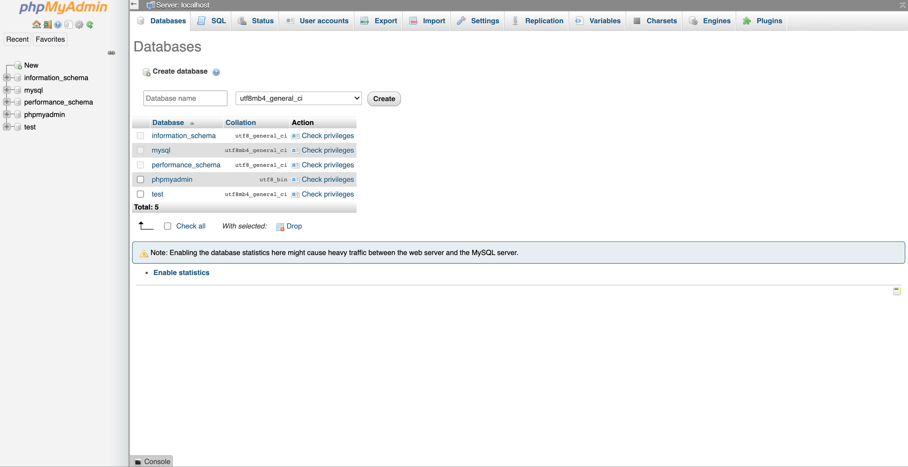

# Software Development 2 Additional Lab -- Using MySQL

This lab repeats much of the ideas from Lab 4 and Lab 5 but uses MySQL as a database backend. It is assumed that you have installed and used XAMPP already.

## Adding Initial Students Database

First, you need to start XAMPP and ensure that you have run both the Apache and MySQL services. Then go to `localhost/phpmyadmin`. Then select the Databases tab to add a new database.



**Name the database `students` and click Create.**

Now select the SQL tab.


Enter the following SQL to setup the `students` database:

```sql
CREATE TABLE Modules (
code VARCHAR(10) PRIMARY KEY,
name VARCHAR(50) NOT NULL);
INSERT INTO Modules VALUES('CMP020C101','Software Development 1');
INSERT INTO Modules VALUES('CMP020C102','Computer Systems');
INSERT INTO Modules VALUES('CMP020C103','Mathematics for Computer Science');
INSERT INTO Modules VALUES('CMP020C104','Software Development 2');
INSERT INTO Modules VALUES('CMP020C105','Computing and Society');
INSERT INTO Modules VALUES('CMP020C106','Databases');
INSERT INTO Modules VALUES('PHY020C101','Physics Skills and Techniques');
INSERT INTO Modules VALUES('PHY020C102','Mathematics for Physics');
INSERT INTO Modules VALUES('PHY020C103','Computation for Physics');
INSERT INTO Modules VALUES('PHY020C104','Classical Physics');
INSERT INTO Modules VALUES('PHY020C105','Introduction to Modern Physics');
INSERT INTO Modules VALUES('PHY020C106','Introduction to Astrophysics');
CREATE TABLE Programmes (
id VARCHAR(8) PRIMARY KEY,
name VARCHAR(50));
INSERT INTO Programmes VALUES('09UU0001','BSc Computer Science');
INSERT INTO Programmes VALUES('09UU0002','BEng Software Engineering');
INSERT INTO Programmes VALUES('09UU0003','BSc Physics');
CREATE TABLE Programme_Modules(
programme VARCHAR(8) NOT NULL,
module VARCHAR(10) NOT NULL,
FOREIGN KEY (programme) REFERENCES Programmes(id),
FOREIGN KEY (module) REFERENCES Modules(code));
INSERT INTO Programme_Modules VALUES('09UU0001','CMP020C101');
INSERT INTO Programme_Modules VALUES('09UU0001','CMP020C102');
INSERT INTO Programme_Modules VALUES('09UU0001','CMP020C103');
INSERT INTO Programme_Modules VALUES('09UU0001','CMP020C104');
INSERT INTO Programme_Modules VALUES('09UU0001','CMP020C105');
INSERT INTO Programme_Modules VALUES('09UU0001','CMP020C106');
INSERT INTO Programme_Modules VALUES('09UU0002','CMP020C101');
INSERT INTO Programme_Modules VALUES('09UU0002','CMP020C102');
INSERT INTO Programme_Modules VALUES('09UU0002','CMP020C103');
INSERT INTO Programme_Modules VALUES('09UU0002','CMP020C104');
INSERT INTO Programme_Modules VALUES('09UU0002','CMP020C105');
INSERT INTO Programme_Modules VALUES('09UU0002','CMP020C106');
INSERT INTO Programme_Modules VALUES('09UU0003','PHY020C101');
INSERT INTO Programme_Modules VALUES('09UU0003','PHY020C102');
INSERT INTO Programme_Modules VALUES('09UU0003','PHY020C103');
INSERT INTO Programme_Modules VALUES('09UU0003','PHY020C104');
INSERT INTO Programme_Modules VALUES('09UU0003','PHY020C105');
INSERT INTO Programme_Modules VALUES('09UU0003','PHY020C106');
CREATE TABLE Students(
id INT PRIMARY KEY,
name VARCHAR(50) NOT NULL);
INSERT INTO Students VALUES(1,'Kevin Chalmers');
INSERT INTO Students VALUES(2,'Lisa Haskel');
INSERT INTO Students VALUES(3,'Arturo Araujo');
INSERT INTO Students VALUES(4,'Foo Bar');
INSERT INTO Students VALUES(100,'Mohammed Ali');
INSERT INTO Students VALUES(200,'Ada Lovelace');
CREATE TABLE Student_Programme(
id INT,
programme VARCHAR(8),
FOREIGN KEY (id) REFERENCES Students(id),
FOREIGN KEY (programme) REFERENCES Programmes(id));
INSERT INTO Student_Programme VALUES(1,'09UU0002');
INSERT INTO Student_Programme VALUES(2,'09UU0001');
INSERT INTO Student_Programme VALUES(3,'09UU0003');
INSERT INTO Student_Programme VALUES(4,'09UU0001');
```

**Click Go to execute the SQL.** The `students` database is now initialised.

## MySQL with Node.js

We can use Node.js to talk to our MySQL database. First, we need to install the MySQL package for Node.js.

1. **Open Visual Studio Code.**

2. **Open the folder of your repository in Visual Studio Code.**

3. **Open the terminal in Visual Studio Code.**

4. **Run the following command:**

   ```shell
   npm install mysql
   ```

You now have the necessary packages to work with MySQL databases in Node.js. *But wait!* Look at your Source Control panel in Visual Studio Code. Over 1000 untracked files. What has happened?

`npm` installs packages locally by default. That is, the files are installed in your project folder. This is good as it avoids create conflicts in your system, but means we have over 1000 new files to track. What do we do?

We update our `.gitignore` file. Thankfully, someone else has defined which things we need to ignore in Node projects.

1. **Go to https://github.com/github/gitignore/blob/master/Node.gitignore.**
2. **Click on the Raw button.**
3. **Copy the page contents.**
4. **Paste it into your `.gitignore` file and save.**
5. **Add changes (there should only be two), commit, and push.**

You have now learned about setting up appropriate `.gitignore` for a project. Simple searches on Google like `node.js .gitignore` will find these for you.

**NOTE** -- as your packages are not in the repository, you will have to install them in each machine you work on. However, you can do this quickly by just running the following in the root directory of your repository:

```shell
npm install
```

### Opening a MySQL Database in Node.js

We can now create a Node.js program to open our MySQL database. **Create `db_test.js` with the following code:**

```javascript
// Import MySQL library
const mysql = require('mysql');

// Connect to the database.
// Assumes there is a root user with no password.
var con = mysql.createConnection({
    host: "localhost",
    user: "root",
    password: "",
    database: "students"
});

// Function is callback when connection completed.
// err is any error message that occurs
con.connect(function(err) {
    // If an error, print it out.
    if (err) {
        return console.error(err.message);
    }
    console.log("Connected to students database.");
});

// Close the database connection.
// Always close the connection when you are finished with it.
// Function is callback when connection is closed.
con.end(function(err) {
    // If an error, print it out.
    if (err) {
        return console.error(err.message);
    }
    console.log("Closed connection to students database.");
});
```

We have used three operations to create and close our database connection:

- `mysql.createConnection` takes a collection of data that defines the connection, such as the username, password, and the database to connect to.
- `connection.connect` actually connects to the database.
- `connection.end` closes the database connection on a `Database` object.

**Run `db_test.js` in the Visual Studio Code terminal using the following command:**

```shell
node db_test.js
```

You should get the following output:

```shell
Connected to students database.
Closed connection to students database.
```

**STOP** -- commit and push your changes.

### Performing Queries

You are hopefully familiar with making SQL queries by now. Let us perform one on our `students.db` file now. **Update `db_test.js` to the following**:

```javascript
// Import MySQL library
const mysql = require('mysql');

// Connect to the database.
// Assumes there is a root user with no password.
var con = mysql.createConnection({
    host: "localhost",
    user: "root",
    password: "",
    database: "students"
});

// Function is callback when connection completed.
// err is any error message that occurs
con.connect(function(err) {
    // If an error, print it out.
    if (err) {
        return console.error(err.message);
    }
    console.log("Connected to students database.");
});

// *** NEW CODE STARTS HERE ***
// SQL query to run
var sql = "SELECT * FROM Modules";

// Execute SQL query, and run function on result
con.query(sql, function(err, result) {
    // If error display
    if (err) {
        return console.error(err.message);
    }
    // Print the code column and name column from row seperated by a tab \t
    for (var row of result) {
        console.log(row.code + "\t" + row.name);
    }
});

// *** NEW CODE ENDS HERE ***

// Close the database connection.
// Always close the connection when you are finished with it.
// Function is callback when connection is closed.
con.end(function(err) {
    // If an error, print it out.
    if (err) {
        return console.error(err.message);
    }
    console.log("Closed connection to students database.");
});
```

We have used `db.query` to run a function on the result returned from our query. The following pseudocode provides a similar idea in as a for loop:

```
rows = EXECUTE QUERY ON Database
FOR EACH row IN rows
    PRINT row["code"] TAB row["name"]
```

**Run the code using:**

```shell
node db_test.js
```

You should see the modules printed to the terminal.

**STOP, COMMIT** -- commit and push your changes. The habit should be forming by now. This will be the last reminder.

#### Now you try

Perform some other select queries on your database. For example:

- `SELECT * FROM Students`

- `SELECT * FROM Programmes`

- ```sql
  SELECT Modules.name
  FROM Programmes, Modules, Programme_Modules
  WHERE Programmes.name = "BSc Computer Science"
  AND Programme_Modules.programme = Programmes.id
  AND Programme_Modules.module = Modules.code
  ```

## Next Step

Complete the first part of Lab 5 normally to get Express.js working until you reach the part about JSON.

## JSON -- JavaScript Object Notation

So we can now get data information from our Node.js server. How do we send our database information? That is actually quite easy as JavaScript supports easy sending of data using JavaScript Object Notation (JSON). **First, let us create a new JavaScript file -- `db_server.js`:**

```javascript
// Import MySQL library
const mysql = require("mysql");

// Connect to the database.
// Assumes there is a root user with no password.
var con = mysql.createConnection({
    host: "localhost",
    user: "root",
    password: "",
    database: "students"
});

// Function is callback when connection completed.
// err is any error message that occurs
con.connect(function(err) {
    // If an error, print it out.
    if (err) {
        return console.error(err.message);
    }
    console.log("Connected to students database.");
});

// Import express.js
const express = require("express");

// Create express app
var app = express();

// Add static files location
app.use(express.static("static"));

// Create a get for /student
app.get("/student/:id", function(req, res) {
    var sql = `
        SELECT * FROM Students
        WHERE id = ${req.params.id}`;
    con.query(sql, function(err, results) {
        if (err) {
            return console.error(err.message);
        }
        // We know there is only one student returned. Get results[0]
        res.json(results[0]);
    });
});

// Create a get for /students
app.get("/students", function(req, res) {
    var sql = "SELECT * FROM Students";
    con.query(sql, function(err, results) {
        if (err) {
            return console.error(err.message);
        }
        // Return all students
        res.json(results);
    });
});

// Start server on port 3000
app.listen(3000);
```

Note that we are going to serve static files again from the `/static` folder. **Create that folder in your repository now.**

Everything else you have seen before, except what we do in `app.get`. Here, we execute the SQL as normal using `get` (as we are getting a single student). The callback function now sets `res.json(row)`. **Now run the program with `node db_server.js` in the Visual Studio Code terminal. Then connect to `127.0.0.1:3000/student/1` to see the JSON returned. It should look like this**:

```json
{"id":1,"name":"Kevin Chalmers"}
```

And that is it. It is that easy to send our data back. This will also work for multiple rows of data -- just use `res.json(rows)`. So, to get all students we can add the following endpoint:

### Now you try

Add the following endpoints to the application with appropriate SQL queries:

- `/programme/<id>` to get a programme of a given id.
- `/programmes` to get all programmes.
- `/module/<code>` to get a module of a given code.
- `/modules` to get all modules.

## Putting it All Together -- Reading JSON

We've come very far in this lab -- we've connected to our database, created a RESTful front end, and returned JSON data to our web page. Now we need to get this JSON data into our client web application so we can display it as a table. There are many ways we can do this, and we will use a particular method later in the module. For the moment, we are going to use another common JavaScript library -- jQuery. We won't explain much about jQuery here as we are only going to use one part of it. jQuery is essentially a library that allows easier manipulation of webpages.

**First, create the following`students.html` file in the `static` folder**:

```html
<!DOCTYPE html>
<html>
    <head>
        <title>Student List</title>
        <script src=https://code.jquery.com/jquery-3.5.1.js></script>
        <script src="student.js"></script>
    </head>
    <body onload="printStudents()">
        <h2>Students</h2>
        <div id="main"></div>
    </body>
</html>
```

This is very similar to our last `students.html` file but with the inclusion of jQuery. **Now add `student.js` to the `static` folder with the following content:**

```javascript
// Tells the browser we want JavaScript to run in strict mode.
// This means faster code, but JavaScript needs to be cleaner.
"use strict";

// A definition of a student
class Student {
    // Student ID
    #id;
    // Student name
    #name;

    // Creates a new instance (object) of type Student
    constructor(id, name) {
        // Set the id and name of the object instance
        this.#id = id;
        this.#name = name;
    }

    tableRow() {
        return `<tr><td>${this.#id}</td><td>${this.#name}</td></tr>`;
    }
}

function printStudents() {
    $.getJSON("/students", function(result) {
        // Create array of students
        var students = [];
        // Iterate over data returned
        for (var row of result) {
            var student = new Student(row.id, row.name);
            students.push(student);
        }
        // Build html for table.
        var html = `
        <table border="1">
            <tr>
                <th>ID</th>
                <th>Name</th>
            </tr>
        `;
        // Iterate over all the students
        for (var student of students) {
            html += student.tableRow();
        }
        // End html table.
        html += `</table>`
        // Get the main element
        var main = document.getElementById("main");
        // Set the innerHTML to html
        main.innerHTML = html;
    });
}
```

We've simplified the `Student` class to just work with an ID and name. Then our changes are just to `printStudents()`:

- We use `$.getJSON` to get the JSON document from the server. `$` is how we access jQuery functions. We use the URL `/students` as this is the endpoint we have created.
- When the data is returned, the function is called filling the `result` parameter. This is our JavaScript.
- We create an empty array to store the students.
- We then iterate across every `row` in the `result` parameter. `result` will contain a JSON array of data, so we can use a `for ... of` loop here.
- We then create a `Student` object from the `row` data -- `id` and `name`.
- We then add the `Student` to the `students` array.
- The rest of the function works as before.

**Open your browser and go to `127.0.0.1/students` to see the result. You should get the table of students from the database.**


## Summary

We've gone far in this lab, through RESTful interfaces with Express.js, to displaying our returned JSON data using jQuery. This is a lot of web technology we have covered, but you are now using close to a full-stack of technology. We are now doing the following:

- Displaying HTML webpages in our browser (user-interface).
- Reacting to events in our HTML with JavaScript (client controller).
- Sending data between the server and client using JSON.
- Providing a RESTful interface to our server using Express.js in Node.js (application/business logic).
- Accessing data using an SQLite database via Node.js (data layer).

Next lab we will build a new project from scratch to go over these ideas once again.

## So you want to know more

TutorialsPoint also provides an Express.js tutorial: https://www.tutorialspoint.com/expressjs/index.htm.

## Exercises

1. Add the necessary code to display the table of programmes on the webpage.
2. Add the necessary code to display the table of modules on the webpage.
3. Create a new webpage -- `module_search.html` -- which has a text box allowing getting a single module based on it's code.
4. Do the same for a student.
5. Do the same for a programme.