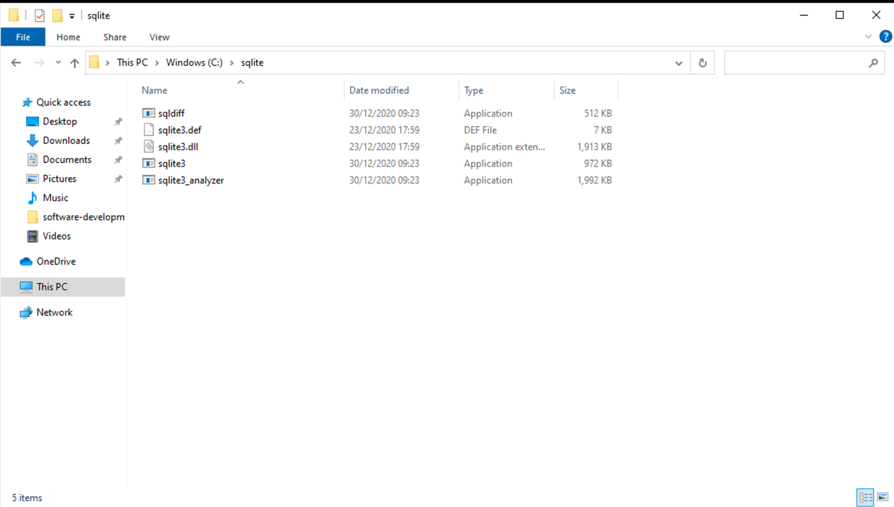
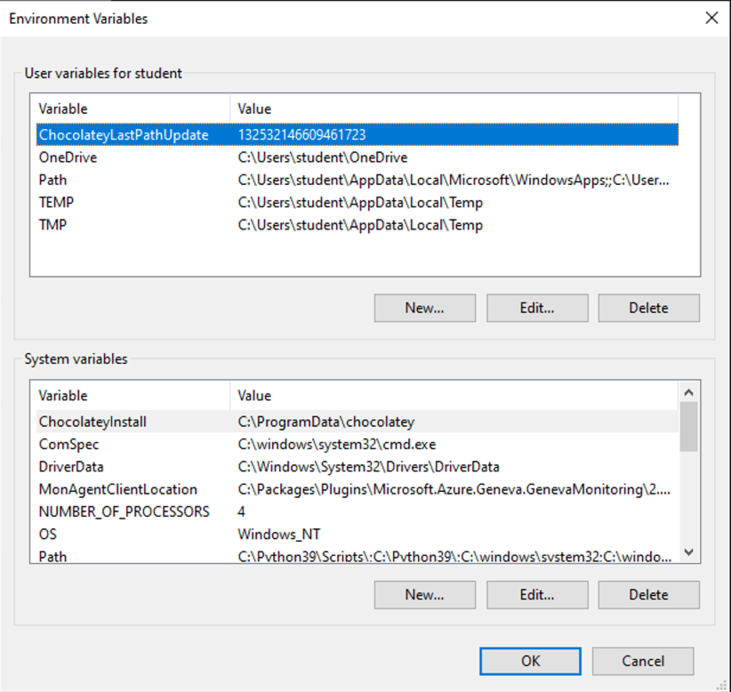
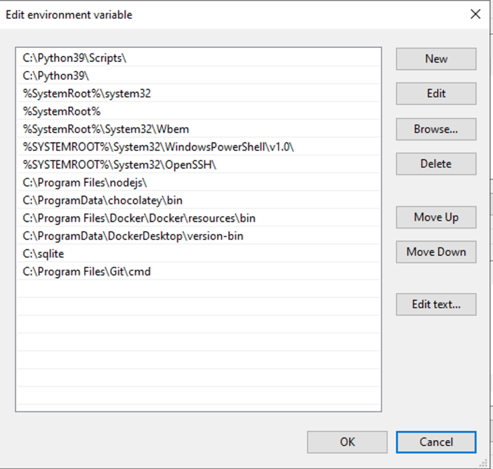

# Software Development 2 Lab 04 -- Connecting to a Database

In this lab, we connect your web page to a database. To give an overview so you can refer to this lab later for certain aspects you might find useful elsewhere:

We will use SQLlite for this example to give you a full overview of how to build a database driven application without too much additional setup.  In a later example we will use MySQL, which you should also use for your project.  

- Installing and using SQLite on the command line.
- How to import SQL into an SQLite database.
- How to connect to an SQLite database in Node.js.
- How to create a RESTful interface using Express.js.
- How to communicate from Node.js to our webpage using JSON.

## SQLite

SQLite is a simple SQL tool that manages a file as a database. It is probably the simplest SQL tool available. Because of this, it is supported in Android and iOS to allow apps to have local (i.e., on device) databases. SQLite is not meant for multiple concurrent users like MySQL. It is a single file solution.

SQLite is installed as standard on MacOS, and if you use Linux is likely installed or easily installed by a package manager. On Windows, we have to do a bit more work.

### Installing SQLite on Windows

SQLite can be downloaded from https://sqlite.org/download.html. There are two ZIP files you need to download:

* `sqlite-dll-win64-x64` -- this contains the DLL for running SQLite databases.
* `sqlite-tools-win32-x86` -- this contains the programmes for creating and manipulating a SQLite database on the command line.

**Unzip both these files into the same folder -- `C:\sqlite`.** Your folder should look like this:



We now have to add this folder to the `PATH` of Windows. The `PATH` is where your operating system looks for programs when you run them from the command line. To add `C:\sqlite` to your `PATH`, **perform the following steps:**

1. **Open the start menu.**

2. **Type `env` and press return.**

3. **The following window is displayed.**

   

4. **Click Environment Variables to open the following screen.**

   

5. **On the bottom panel (System variables), select Path and click Edit...**

   

6. **Click New, and enter `C:\sqlite' as the new entry.**

7. **Click OK on all the windows until they are closed.**

You are now ready to continue on with the lab.

### Working with SQLite

SQLite understands standard SQL. All we need to do it create a database with the command line tool and interact with it from there.

#### Creating a Database

1. Open a terminal / command prompt, and navigate to the folder where you have your Git repository (e.g., `/Users/kevin/sd2`). If you don't remember, we use `cd` to change directory.
2. Now create a SQLite database by running the following command: `sqlite3 students.db`. This will create a file `students.db` which is an SQLite database. It will also open the SQLite command prompt.

```shell
SQLite version 3.32.3 2020-06-18 14:16:19
Enter ".help" for usage hints.
sqlite>
```

#### Importing a database

You can download the SQL here: https://raw.githubusercontent.com/kevin-chalmers/sd2/main/students.sql. 

On Mac and linux, you can do it straight from the command line:

```bash
wget https://raw.githubusercontent.com/kevin-chalmers/sd2/main/students.sql
```

**Make sure this file is saved in the root of your repository.**

You can look at the file with a text editor, you will see that it is simply a text file containing loads of SQL queries that create tables and insert data into them.  This is called an SQL dump file and is a commonly used way to transfer data between databases.


To import the SQL into your database, run the following command in the root of your repository:

 **MacOS and Linux**

```shell
 cat students.sql | sqlite3 students.db
 ```

 **Windows**

 ```shell
 type students.sql | sqlite3 students.db
 ```

### Checking the database from the CLI

You can check that the tables and data are present using the sqllite CLI. Try the following using your terminal plus some more SQL commands to explore the data.

```bash
sqlite3 students.db  # opens a sqllite prompt on the students database
.help  # lists commands available
.tables # shows the tables in the database
select * from Modules;  # a standard SQL query to show the data in the Modules table
.exit # leave the SQLLITE CLI
```

## SQLite with Node.js

Now we have done our work with SQLite, we can use Node.js to talk to our SQLite database. First, we need to install the SQLite package for Node.js.

1. **Open Visual Studio Code.**

2. **Open the folder of your repository in Visual Studio Code.**

3. **Open the terminal in Visual Studio Code.**

4. **Run the following command:**

   ```shell
   npm install --save sqlite3@^5.0.0
   ```

You now have the necessary packages to work with SQLite databases in Node.js. 


### Opening a SQLite Database in Node.js

We can now create a Node.js program to open our SQLite database. 

**Create `db_test.js` with the following code:**

```javascript
// Import SQLite library.
// Use verbose mode to give more detailed error outputs
const sqlite3 = require("sqlite3").verbose();

// Connect to the database.
// Function is callback when connection completed.
// err is any error message that occurs
let db = new sqlite3.Database("students.db", function(err) {
    // If an error, print it out.
    if (err) {
        return console.error(err.message);
    }
    console.log("Connected to students database.");
});

// Close the database connection.
// Always close the connection when you are finished with it.
// Function is callback when connection is closed.
db.close(function(err) {
    // If an error, print it out.
    if (err) {
        return console.error(err.message);
    }
    console.log("Closed connection to students database.");
});
```

Run the file with

```bash
node db_test.js
```

All we have done so far, is used two operations to create and close our database connection:

- `new sqlite3.Database("<filename>", function(err))` opens a database connection by creating a new `Database` object.
- `close(function(err))` closes the database connection on a `Database` object.


### Performing Queries

You will be familiar with making SQL queries from your databases course. Let us perform one on our `students.db` file now. 

**Update `db_test.js` to the following**:

```javascript
// Import SQLite library.
// Use verbose mode to give more detailed error outputs
const sqlite3 = require("sqlite3").verbose();

// Connect to the database.
// Function is callback when connection completed.
// err is any error message that occurs
let db = new sqlite3.Database("students.db", function(err) {
    // If an error, print it out.
    if (err) {
        return console.error(err.message);
    }
    console.log("Connected to students database.");
});

// *** NEW CODE STARTS HERE ***
// SQL query to run
var sql = "SELECT * FROM Modules";

// Execute SQL query, and run function on every row returned.
db.each(sql, function(err, row) {
    // If error display
    if (err) {
        return console.error(err.message);
    }
    // Print the code column and name column from row seperated by a tab \t
    console.log(row.code + "\t" + row.name);
});

// *** NEW CODE ENDS HERE ***

// Close the database connection.
// Always close the connection when you are finished with it.
// Function is callback when connection is closed.
db.close(function(err) {
    // If an error, print it out.
    if (err) {
        return console.error(err.message);
    }
    console.log("Closed connection to students database.");
});
```

We have used `db.each` to run a function on each returned for from our query. The following pseudocode provides a similar idea in as a for loop:

```
rows = EXECUTE QUERY ON Database
FOR EACH row IN rows
    PRINT row["code"] TAB row["name"]
```

**Run the code using:**

```shell
node db_test.js
```

You should see the modules exactly as listed in the database table printed to the terminal.

#### Now you try

Perform some other select queries on your database from within your code. For example:

- `SELECT * FROM Students`

- `SELECT * FROM Programmes`

- ```sql
  SELECT Modules.name
  FROM Programmes, Modules, Programme_Modules
  WHERE Programmes.name = "BSc Computer Science"
  AND Programme_Modules.programme = Programmes.id
  AND Programme_Modules.module = Modules.code
  ```

#### `all`

`db.all` allows us to get all the rows returned by the query and then execute some code accordingly. For example, we can rewrite our query above as:

```javascript
// SQL query to run
var sql = "SELECT * FROM Modules";

// Execute SQL query, and run function with all rows.
db.all(sql, function(err, rows) {
    // If error display
    if (err) {
        return console.error(err.message);
    }
    // Print the code column and name column from row seperated by a tab \t
    for (var row of rows) {
        console.log(row.code + "\t" + row.name);
    }
});
```

This is useful when you want to have all the rows of data available for a particular purpose. `all` is more useful for returning complete data to our webpage from our Node application.

#### `run`

So far, we have focused on how we work with data returned from `SELECT` queries. But what about other SQL statements? For those we use `run`. For example, to insert a new entry into the `Students` table we can do the following:

```javascript
// SQL statement to run
var sql = `
    INSERT INTO Students
    VALUES (200, "Ada Lovelace")`;

// Execute SQL statement
db.run(sql, function(err) {
    // If error, print it out
    if (err) {
        return console.error(err.message);
    }
    console.log("Row inserted into database.")
});
```

##### Now you try

Use `db.run` to delete the students we have just added.


#### Summary of Executing SQLite Statements in Node.js

- `each` -- runs a function on each row returned by a `SELECT`.
- `all` -- runs a function with all the rows returned by a `SELECT`.
- `get` -- runs a function on the first row returned by a `SELECT`.
- `run` -- executes an SQL statement that doesn't return rows (i.e., not a `SELECT`).

## Summary

We've now covered a core idea in software development -- connecting our programs and databases together. With this and (quite a bit of) practice, you can write the majority of applications that exist today. The key ingredient in software development is the building of user interfaces to communicate with a database, so now we will connect our database to our express.js application so that we can access and manipulate the database via a web interface.

## Connecting to the database in Express

Now lets combine what we did just now with last weeks work with Express.

Examine the following line by line, copy it into a file called db_server.js.  It combines your express app with the database queries you have just practiced.

```javascript
// Import SQLite library.
// Use verbose mode to give more detailed error outputs
const sqlite3 = require("sqlite3").verbose();

// Connect to the database.
// Function is callback when connection completed.
// err is any error message that occurs
let db = new sqlite3.Database("students.db", function(err) {
    // If an error, print it out.
    if (err) {
        return console.error(err.message);
    }
    console.log("Connected to students database.");
});

// Import express.js
const express = require("express");

// Create express app
var app = express();

// Add static files location to serve things like CSS and images
app.use(express.static("static"));

// Create a route for /student that can take an ID as a parameter
app.get("/student/:id", function(req, res) {
    // Now query the database to get more information about the student
    var sql = `
        SELECT * FROM Students
        WHERE id = ${req.params.id}`;
    db.get(sql, function(err, row) {
        if (err) {
            return console.error(err.message);
        }
        // Return the information from the database in the response, formatted as json
        res.json(row);
    });
});

// Create a route for /students
app.get("/students", function(req, res) {
    // Query the database
    var sql = "SELECT * FROM Students";
    db.all(sql, function(err, rows) {
        if (err) {
            return console.error(err);
        }
        // Return the rows as json
        res.json(rows);
    });
});

// Start server on port 3000
app.listen(3000,function(){
    console.log(`Server running at http://127.0.0.1:3000/`);
});
```

Run the app

```bash
node db_server.js
```

Visit your new routes for example:

```bash
http://127.0.0.1:3000/student/2
http://127.0.0.1:3000/student/1
http://127.0.0.1:3000/students
```

Are you seeing what you expect?  

Make sure you understand every line of code and what is happening here.

### Now you try

Add the following endpoints to the application with appropriate SQL queries:

- `/programme/<id>` to get a programme of a given id.
- `/programmes` to get all programmes.
- `/module/<code>` to get a module of a given code.
- `/modules` to get all modules.

## Finally - Showing the database results in the frontend

What you want to do now is to access the JSON formatted data that your Express API exposes and format it more nicely in HTML.  (JSON is a commonly used structured text format that is presents data in a way that is easy for programs to read.  By using a JSON API you are separating the functions of manipulating the database from formatting the data, which has a lot of advantages)

To do this, you will want to create some 'static' parts of your application that call the routes you have created in express to get the dynamic data.

**Create the static directory in your repository now**

First, create the following `students.html` file in the static folder:

```html
<!DOCTYPE html>
<html>
    <head>
        <title>Student List</title>
        <script src=https://code.jquery.com/jquery-3.5.1.js></script>
        <script src="student.js"></script>
    </head>
    <body onload="printStudents()">
        <h2>Students</h2>
        <div id="main"></div>
    </body>
</html>
```

This is very similar to our last students.html file but with the inclusion of jQuery. JQuery is a javascript library that we are going to use right now just to easily access the JSON from our Express API.

Now add the file student.js to the static folder with the following content. At this point it just contains the printStudents() function.

```javascript
function printStudents() {
    // Get a JSON formatted result from the Express route for students
    $.getJSON("/students", function(result) {
        // Start the presentation part...
        // Build html for table.
        var html = `
        <table border="1">
            <tr>
                <th>ID</th>
                <th>Name</th>
            </tr>
        `;
        // Iterate over data returned
        for (var row of result) {

            // Format each row and add to the HTMl string
            // The ${} construct allows us to easily add variables into a string
            html += `<tr><td>${row.id}</td><td>${row.name}</td></tr>`;
        }
        // End html table.
        html += `</table>`
        // Get the main element
        var main = document.getElementById("main");
        // Set the innerHTML of the main ID to html string we have created 
        main.innerHTML = html;
    });format each row and add to the HTMl string
}
```

Make sure  your express app is running (node db_server.js), and visit the HTML file by going to:

http://127.0.0.1:3000/students.html

 You should get the HTML formatted table of students from the database.

### So you want to know more

TutorialsPoint also provides an Express.js tutorial: https://www.tutorialspoint.com/expressjs/index.htm.

### Exercises / Practice

 * Add the necessary code to display the table of programmes on the webpage.
 * Add the necessary code to display the table of modules on the webpage.
 * Create a new webpage – module_search.html – which has a text box allowing getting a single module based on it’s code.
 * Do the same for a student.
 * Do the same for a programme.


## Pushing to the repository

Before you push **all** your files to your repository, take a good look.. There are some that should not be pushed.  One is the students.db as this is a binary file that holds the database. This is not suitable for versioning.  The other is all of your node modules - you won't usually push these to a respository, but you will push your package-lock.json file which will allow others to install all the same node.js modules that you have locally.

Lets do a few clean-up tasks before we push...

#### Create a .gitignore file 

All files listed in a .gitignore will NOT be staged, committed or pushed. They will be completely ignored by git.  This is useful for files that you know you will never want to add to the repository.

Create a file in the root directory of your repository with the name '.gitignore`.  Dont for get the dot.

#### Add the database binary file to .gitignore

Add a line to your file 

```
*.db
```

Commit the `.gitignore` file now and push it to GitHub. `.db` files will no longer be tracked in your repository.

####  Add node.js package files to .gitignore

Node.js places many files that you don't need to commit.  This file: https://github.com/github/gitignore/blob/master/Node.gitignore covers off everything and more that you should add to your .gitignore.  Add the contents of this file, in addition to the first line above.

Commit your new changes to .gitignore and push.

#### Add package-lock.json to your repository

What if someone wants to clone your repository and run your code? How might they do that without the node.js files?  The answer is that you commit the package-lock.json file which holds all the information about the necessary packages to run your application. Then another developer runs

```
npm install
```
To replicate your node installation using the information in the package-lock.json file.

#### Creating a database dump and consider adding to the repo

Your application is not complete without the database, so how should you share this with other developers?

A database can be written out into a 'flat' text file, as we saw at the beginning of this lab when we imported an entire database from a file. We can also export our database to a file, and this is a good way to share it with others.  

In usually professional practice, there is information in a database that should not be in a repository, also database dumps can be much too big and to cumbersome to version.  However, for the early stages of prototype development there might be a justification for committing the database.

To create a dump file of the kind we imported earlier, do the following.  Note the `>` operator which in this case is 'redirecting' the output of the dump command from 'standard out', ie. the terminal, to a file.

```shell
sqlite3 students.db .dump > students-1.sql
```

This will output the SQL into `students-1.sql`

You may push this to the repository if you are at very early stages of development and there is no information such as passwords, or you can share the dump file securely with trusted collaborators via, for example, OneDrive or Google drive.  You can consider encrypting the file before sharing.


