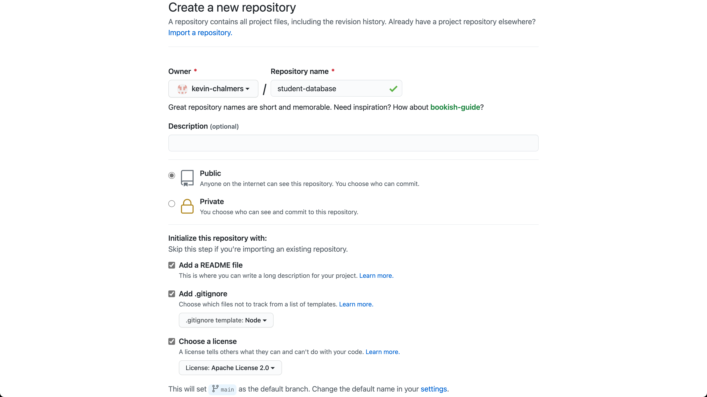

# Software Development 2 Lab 06 -- Starting a Project from Scratch and Introducing Angular.js

## Creating a New Git Repository

In GitHub, you will see a **+** near the top of the page, which you can select **New repository** from:


This will open a new window.  You need to enter the name for the repository (`student-database`), make sure the repository is **Public** and then select the **Apache 2.0** license type.  **Add a .gitignore and select Node.** **Ensure that a README is added**.This details are illustrated below:



Click on **Create repository** and you will be presented with the following:


## Cloning Your Project in Visual Studio Code

Now we need to clone the GitHub project in Visual Studio Code. 

1. **Open Visual Studio Code.**
2. **Make sure no folder is currently open. We can do this by using File then Close Folder from the main menu.**
3. **Click on the Source Control button on the left-hand side of the Visual Studio Code window.**
4. **Your window should now look like this.**


We need the the location of our repository.  This is the URL of the repository you created, which should be of the form `https:\\github.com\<user-name>\student-database` (or whatever project name you gave).  For example, my repository is [https:\\github.com\kevin-chalmers\student-database](https:\\github.com\kevin-chalmers\student-database).

**Click the Clone Repository button and Visual Studio Code will ask for the repository URL at the top of the window**.


1. **Press return, and Visual Studio Code will ask you where you want to save the repository. Pick somewhere sensible.**

2. **Visual Studio Code will ask you if you want to open the repository. Choose to do so.**

You now have your GitHub repository cloned to the local machine and opened in Visual Studio Code. 

## Initialising the Project with `npm`

`npm` is more than just a package manager -- it can also manage our project for us, helping to launch our applications effectively. To do this, we can ask `npm` to initialise a project. **In the Visual Studio Code terminal run the following command:**

```shell
npm init
```

This will now walk you through the process of setting up your project. **When prompted, enter the following**:

- `package name` -- just press return to accept the default `student-database`.
- `version` -- enter whatever you want, although `0.0.2` is probably the most accurate.
- `description` -- enter `Student database application written in JavaScript.`
- `entry point` -- enter `main.js`.
- `test command` -- just press return for now.
- `git repository` -- press return to accept the default which will be your repository URL.
- `keyword` -- enter `JavaScript, Node.js, Express.js, SQLite, Angular.js`
- `author` -- enter your name.
- `license` -- enter `Apache-2.0`,
- Press return to accept the details.

`npm` will have created a new file `package.json` which contains this information for us. **Open this file now in Visual Studio Code.** At about line 6 you should see the following code:

```json
  "scripts": {
    "test": "echo \"Error: no test specified\" && exit 1"
  },
```

**Modify `package.json` to also include a `start` script as follows:**

```json
  "scripts": {
    "start": "node main.js",
    "test": "echo \"Error: no test specified\" && exit 1"
  },
```

**Save updated `package.json` file.** We will now be able to start our application using `npm start`. This will become useful later.

**STOP, COMMIT** -- add the `package.json` file to your GitHub repository.

### Installing Project Dependencies

Let us now add our project dependencies. **Run the following in the Visual Studio Code terminal**:

```shell
npm install sqlite3
npm install express
```

This will have updated your `package.json` file and created a `package-lock.json` file. **Commit these changes to your repository.**

## Creating a Folder Structure

We are now going to create our folder structure for our project. You can add files and folders in Visual Studio Code. The structure we want to have is:

- application
  - app.js
- data
  - data.js
- static
  - index.html
  - index.js
- .gitignore
- LICENSE
- main.js
- package-lock.json
- package.json
- README.md

We will look at each of these files in term shortly. **Commit these changes to GitHub.**

## Adding the Database

We will just use the database we have already created. **Copy `students.db` and `students.sql` to the `data` folder of your project.**

### Updating `.gitignore`

Our `.gitignore` file currently only works for Node.js files. We still need to tell Git to ignore our database file. To do this, **open `.gitignore` in Visual Studio Code and add `*.db` to the end.

**STOP, COMMIT** -- we have now got ourselves back to the position we were in at the end of the last lab (more or less). **If you want to learn about how we can automate the version control of our database read the Git Hooks section next, otherwise skip over it. Warning -- it is an advanced topic.**

### Git Hooks

**WARNING** -- this is a slightly advanced topic, and isn't necessary to manage your database. You can just do it manually as described previously.

We can ask Git to automate the dump, delete, recreate process for us using *Git Hooks.* A Git Hook is just code that is run before or after particular events occur in your repo, such as committing and merging.

When you created a Git repository, Git created some hidden files to manage the repository. These are in a hidden `.git` folder within the root directory of your folder. Within this folder, there is a `hooks` folder which contains any hooks we have defined.

Let us create a pre-commit hook. **In Windows, the easiest thing to do is open Git Bash from the start menu.** Linux and MacOS can do this from the standard terminal. **Change directory in the command prompt to your Git repository folder, and then run the following in the command prompt:**

```shell
nano .git/hooks/pre-commit
```

Enter the following into the file:

```shell
#!/bin/bash
rm data/students.sql
sqlite3 data/students.db .dump > data/students.sql
git add data/students.sql
```

**Use CTRL-O to save the file, and then CTRL-X to exit.** We have now created a script that will do the following just before a commit is finalised:

* Deletes any existing `students.sql` file.
* Dumps `students.db` into `students.sql`.
* Adds `students.sql` to the Git commit.

As Git checks for differences, this will have no effect if the database has not been updated since the last commit.

**Now run the following command**:

```shell
nano .git/hooks/post-merge
```

The contents for this file are:

```shell
#!/bin/bash
rm data/students.db
cat data/students.sql | sqlite3 data/students.db
```

**Use CTRL-O to save the file, then CTRL-X to exit.** We have created a script that will run after a merge (the end of a pull) that does the following:

* Deletes the existing `students.db` file.
* Creates a new `students.db` file from `students.sql`.

**If you are on MacOS or Linux you will need to make these files executable.** This is done as follows:

```shell
chmod +x .git/hooks/pre-commit
chmod +x .git/hooks/post-merge
```

**NOTE** -- these scripts are not shared in your repository. You will need to set them up on each machine you are working on for them to work effectively.

## Our Basic Starting Application

Let us put together our starting application. It is much the same as our last one.

### `index.html`

This will be the main home page of our website. At the moment, we will just use the existing `students.html` code given below.

```html
<!DOCTYPE html>
<html>
    <head>
        <title>Student List</title>
        <script src="index.js"></script>
    </head>
    <body onload="printStudents()">
        <h2>Students</h2>
        <div id="main"></div>
    </body>
</html>
```

> #### Why `index.html`?
>
> `index.html` is the standard webpage your browser will look for. For example, if you go to www.google.com your browser will actually try to get www.google.com/index.html. Your web browser will just not tell you about it.

### `index.js`

`index.js` will communicate with our web service. At the moment, it will just add `Hello World!` to the `main` `<div>`. We will do more later.

```javascript
"use strict";

function printStudents() {
    var main = document.getElementById("main");
    main.innerHTML = "Hello, world!";
}
```

### `app.js`

Our `app.js` file will manage our Express.js interface. At the moment, it will just return `Hello, world!` on the `/students` endpoint and serve the webpages in the `static` directory.

```javascript
"use strict";

// Import express library.
const express = require("express");

// Create express application.
var app = express();

// Add static files location
app.use(express.static("static"));

// Add /students endpoing
app.get("/students", function(req, res) {
    res.send("Hello world!");
});

// Start listening on port 3000
app.listen(3000, function(err) {
    if (err) {
        return console.error(err.message);
    }
    console.log("Server started.");
});
```

### `data.js`

`data.js` will manage the connection to our database. At the moment, it will just connect to the database and do nothing else. The code is below:

```javascript
"use strict";

// Import SQLite library.
// Use verbose mode to give more detailed error outputs
const sqlite3 = require("sqlite3").verbose();

// Connect to the database.
// Function is callback when connection completed.
// err is any error message that occurs
let db = new sqlite3.Database("students.db", function(err) {
    // If an error, print it out.
    if (err) {
        return console.error(err.message);
    }
    console.log("Connected to students database.");
});
```

### `main.js`

`main.js` is our main code file. It's job will be to start our application and connect it to our database. However, at the moment, we are not connecting these together. We will just run the application and data layers independently, as follows:

```javascript
"use strict";

// Include the app.js and data.js files.
// This will run the code.
const app = require("./application/app");
const data = require("./data/data.js");
```

You should now be able to run your application. **Use `npm start` in the Visual Studio Code terminal and you should receive the following output:**

```javascript
> student-database@0.0.2 start /Users/kevin/Repositories/student-database
> node main.js

Server started.
Connected to students database.
```

**Go to the following URLs to see if it works:**

- `127.0.0.1:3000`
- `127.0.0.1:3000\students`

**Remember to commit and push your changes. This is your final reminder.**

## Getting Started with Angular.js

So far, we have spent a lot of time on the back-end (server-side) part of our application, using Node.js, Express.js and SQLite. Our front-end (client-side) webpage is a bit basic. We will now start using a front-end web framework -- Angular.js.

> ### What is Angular.js?
>
> Angular.js is a web framework supported by Google. It uses a technique called *model-view-controller* (which we will cover later in the module) to support development.
>
> **WARNING** -- Angular.js is not Angular. Although strongly related, Angular uses Typescript (a superset of JavaScript) as a language. We are staying with JavaScript and using the Angular.js library instead.

### Your First Angular.js Application

Let us see what Angular.js can do. **Modify your `index.html` file to the following**:

```html
<!DOCTYPE html>
<html>
    <head>
        <title>AngularJS First Application</title>
        <script src="https://ajax.googleapis.com/ajax/libs/angularjs/1.8.0/angular.js"></script>
    </head>
    <body>
        <h1>Sample Application</h1>
        <div ng-app = "">
            <p>Enter your Name: <input type="text" ng-model="name"></p>
            <p>Hello <span ng-bind="name"></span>!</p>
        </div>
    </body>
</html>
```

**Reload `127.0.0.1:3000` and you should be able to enter your name in the text box and immediately see it appear in the hello message.**

OK, how does this work? Angular.js uses a model-view-controller. For the model part, we can name certain values and bind them to other areas. So, we have:

- `<input type="text" ng-model="name">` means the data in the text box has been given the model ID `name`.
- `<span ng-bind="name">` means we have created a `<span>` (just a part of text -- a span of characters) which contains the model data with ID `name`.
- We then create a `<div>` with the property `ng-app` (we can just set it to `""`). This tells the Angular.js library where to look for certain Angular.js HTML elements.

So we just tag parts of our HTML with Angular.js elements and it takes care of the rest. We have so far introduced the following:

- `ng-app` used on a `<div>` to denote an Angular.js application section.
- `ng-model` used to denote a value with an ID.
- `ng-bind` used to bind a value of given ID.

#### Now you try

Extend this application so you have another text box for an age and display `You are <age> years old.`

### Angular.js Controllers

In a model-view-controller system, the controller is responsible for managing our model (the data). We can declare controllers in Angular.js and then use this controller to, for example, set some values. **Update `index.html` to the following**.

```html
<!DOCTYPE html>
<html>
    <head>
        <title>AngularJS Controller</title>
        <script src="https://ajax.googleapis.com/ajax/libs/angularjs/1.8.0/angular.js"></script>
        <script src="index.js"></script>
    </head>
    <body>
        <h2>AngularJS Sample Application</h2>
        <div ng-app = "mainApp" ng-controller = "studentController">
            <p>ID: \{\{ student.id &#123;&#123;</p>
            <p>Name: &#123;&#123; student.name &#123;&#123;</p>
        </div>
    </body>
</html>
```

We have done four new things here:

- We have included `index.js` again. We will use this for our JavaScript code.
- We have given our `ng-app` a name -- `mainApp`. 
- We have defined the `ng-controller` for the `mainApp` -- `studentController`. This we will declare in the `index.js` file.
- We are using &#123;&#123;student.id}}` and `{{student.name}}` to bind the values of `student` to these parts of our HTML file. This is equivalent to having `ng-bind`. Whatever the current values of `student.id` and `student.name` are will appear here.

**Now update `index.js` to the following:**

```javascript
"use strict";

// Definition of Student type
class Student {
    // ID of the student
    id;
    // Name of the student
    name;

    // Creates a new Student object
    constructor(id, name) {
        this.id = id;
        this.name = name;
    }
}

// Get's the mainApp section of the HTML document
var mainApp = angular.module("mainApp", []);

// Creates the controller for the main application.
mainApp.controller("studentController", function($scope) {
  	// Sets a new model value -- student.
    $scope.student = new Student("001", "Kevin Chalmers");
});
```

The `Student` class declaration is our simple one from before. The more interesting part is the second half of the code.

We first get the `mainApp` by using `angular.module`. This will give us the `mainApp` object.

Once we have the `mainApp` object, we define the `studentController` by calling the `mainApp.controller` method. The controller is just a function, taking one parameter -- `$scope`. **This is our key parameter as it defines what our `mainApp` can interact with to automate Angular.js sites.** For example, we define `$scope.student`. This is then seen as a model value `student` in our Angular.js HTML. Thus, in `index.html`, `{{student.id}}` is replaced with `001` and `{{student.name}}` is replaced with `Kevin Chalmers`. **Reload `127.0.0.1:3000` and you will see the new page.**

#### Now you try

Update `index.html` and `index.js` so a second student's details are also shown under the first student's details.

### Responding to Events

To end our initial introduction to Angular.js, let us look at how we can respond to events. This is much the same as we do in standard JavaScript and HTML, although we set Angular.js events rather than standard HTML ones. **Update `index.html` to the following:**

```html
<!DOCTYPE html>
<html>
    <head>
        <title>AngularJS Controller</title>
        <script src="https://ajax.googleapis.com/ajax/libs/angularjs/1.8.0/angular.js"></script>
        <script src="index.js"></script>
    </head>
    <body>
        <h2>AngularJS Sample Application</h2>
        <div ng-app = "mainApp" ng-controller = "studentController">
            <p>ID: {{ student.id }}</p>
            <p>Name: {{ student.name }}</p>
            <p><input type="button" value="Click Me!" ng-click="update()"></p>
        </div>
    </body>
</html>
```

The only difference here is that we have created a new button and set `ng-click` to `update()`. So, rather than set `onclick` we set `ng-click` for Angular.js. The `update()` function has to be declared within the `mainApp` scope. We do this in the `index.js`. **Update `index.js` to the following:**

```javascript
"use strict";

// Definition of Student type
class Student {
    // ID of the student
    id;
    // Name of the student
    name;

    // Creates a new Student object
    constructor(id, name) {
        this.id = id;
        this.name = name;
    }
}

// Get's the mainApp section of the HTML document
var mainApp = angular.module("mainApp", []);

// Creates the controller for the main application.
mainApp.controller("studentController", function($scope) {
  	// Sets a new model value -- student.
    $scope.student = new Student("001", "Kevin Chalmers");
    // Sets the update() function for the scope. Used by the button.
    $scope.update = function() {
        // Update the student value in the scope
        $scope.student.id = "002";
        $scope.student.name = "Lisa Haskel";
    }
});
```

The only addition here is we set `$scope.update` to equal to a `function` where we change the values of the `student` model value.

**Reload `127.0.0.1:3000` and click the button to see the result.**

## So you want to know more

We will be covering more Angular.js through the module, but if you want to get stuck in now there are a few resources that you will find useful:

- TutorialsTeacher -- https://www.tutorialsteacher.com/angularjs/angularjs-tutorials.
- TutorialsPoint -- https://www.tutorialspoint.com/angularjs/index.htm
- w3schools -- https://www.w3schools.com/angular/

It is always a good idea to practice and develop your skills with other tutorials, and Angular.js is a useful technology to learn if web development interests you.

## Exercises

1. Expand the current `index.html` and `index.js` files so that you have an array of `Student` and display them in a table. You should have at least five students.
2. Now modify the table so that each cell is actually a text box displaying the current values of the `Student` array. **HINT** -- remember we used `ng-model` rather than `ng-bind` for the text box.
3. Finally, add a button to each table row. When clicked, a button should reset the data in that row to its original setting.