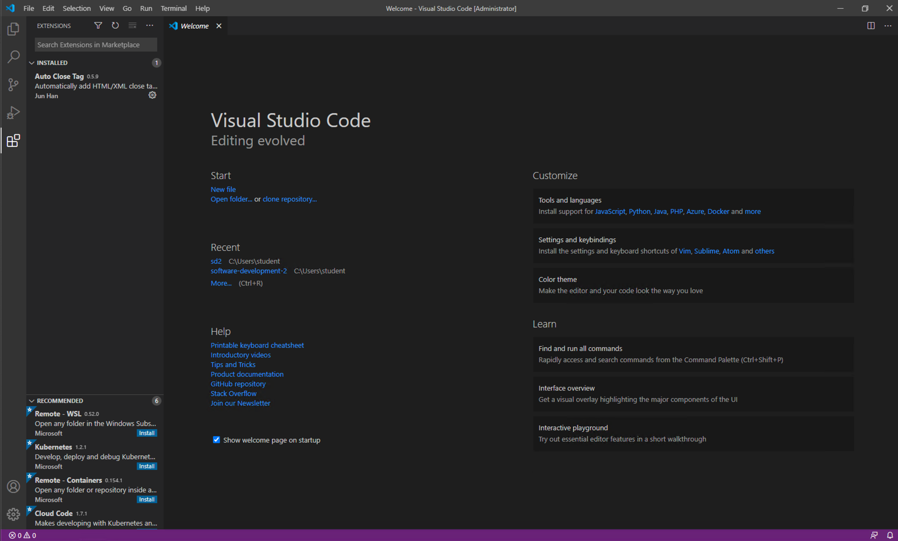
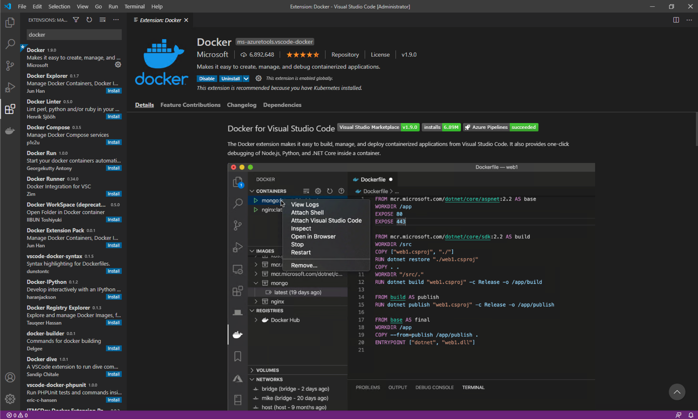
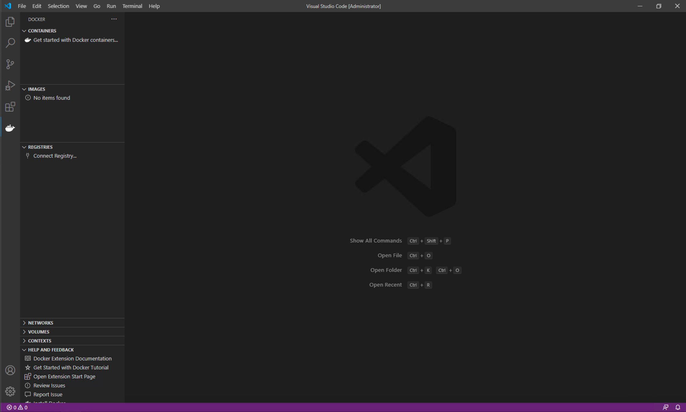

# Software Development 2 Lab 07 -- Docker

## Getting Started with Docker

We will step away from JavaScript for a while to use Docker.  Docker will support our deployment to ensure we run in the same configuration wherever we execute our code.  This ensures we do not have conflicts between what works on our development machine and the deployment machine.

### Checking if Docker is Installed and Working

The simplest method to check if Docker is installed on your system is to open a terminal (or Powershell in Windows) and issue the following command:

```shell
docker --version
```

If installed you will get a response as follows:

```shell
Docker version 19.03.13, build 4484c46d9d
```

To check if Docker is working correctly use the following command:

```shell
docker run hello-world
```

If Docker is working correctly you should get the following output:

```shell
Unable to find image 'hello-world:latest' locally
latest: Pulling from library/hello-world
0e03bdcc26d7: Pull complete
Digest: sha256:1a523af650137b8accdaed439c17d684df61ee4d74feac151b5b337bd29e7eec
Status: Downloaded newer image for hello-world:latest

Hello from Docker!
This message shows that your installation appears to be working correctly.

To generate this message, Docker took the following steps:
 1. The Docker client contacted the Docker daemon.
 2. The Docker daemon pulled the "hello-world" image from the Docker Hub.
    (amd64)
 3. The Docker daemon created a new container from that image which runs the
    executable that produces the output you are currently reading.
 4. The Docker daemon streamed that output to the Docker client, which sent it
    to your terminal.

To try something more ambitious, you can run an Ubuntu container with:
 $ docker run -it ubuntu bash

Share images, automate workflows, and more with a free Docker ID:
 https://hub.docker.com/

For more examples and ideas, visit:
 https://docs.docker.com/get-started/
```

The output explains what Docker actually did when you issued the command.  We will cover aspects of these steps in the following sections.

If Docker is installed and working skip to [Basic Docker Usage](#basic-docker-usage).  If not, continue reading.

#### Installing Docker

Installing Docker on Linux is easy - you should find it in your package manager.  For example, with Ubuntu use:

```shell
sudo apt install docker
```

For Windows, use the installation instructions found [here](https://docs.docker.com/docker-for-windows/install-windows-home/) if you have Windows 10 Home (most likely) or [here](https://docs.docker.com/docker-for-windows/install/) if you have Windows 10 Professional.  For MacOS, the install instructions are [here](https://docs.docker.com/docker-for-mac/install/).  **Ensure that the Docker service has started**.  See the relevant instructions.  On some systems, Docker is not running at the start.

To test that Docker has been installed correctly, run the following command from the shell:

```shell
docker run hello-world
```

Which should produce output similar to:

```shell
Unable to find image 'hello-world:latest' locally
latest: Pulling from library/hello-world
0e03bdcc26d7: Pull complete
Digest: sha256:1a523af650137b8accdaed439c17d684df61ee4d74feac151b5b337bd29e7eec
Status: Downloaded newer image for hello-world:latest

Hello from Docker!
This message shows that your installation appears to be working correctly.
```

### Basic Docker Usage

Docker works by providing application containers.  Several container images already exist for our use: go to [Docker Hub](https://hub.docker.com/) and search to see the available options.  This means we can launch applications easily via Docker, including infrastructure services like web servers and databases.

#### Pulling Docker Images

To get started, let us pull a web server.  Nginx is a common lightweight web server that will illustrate the basic steps.  First, we must `pull` a Docker image from the server to our local repository (machine):

```shell
docker pull nginx
```

This will pull the `nginx` image, which allows us to instantiate (run) it locally as a container.  We can also specify which version of Nginx we want by adding a *tag*:

```shell
docker pull nginx:latest
```

This will pull the latest Nginx version image, which is the default behaviour of `pull`.  See the Nginx image page on [Docker Hub](https://hub.docker.com/_/nginx/) for more details.

#### Starting Docker Containers

Once we have an image in our local repository, we can start it as a container.  To do this we use the `run` command:

```shell
docker run nginx
```

You will notice that nothing happened, and the command line is waiting.  Using `run` in this way is not recommended.  Press **Ctrl-C** to stop the running container.

Docker containers should be started as detached processes.  We do this using the `-d` flag.  Furthermore, for Nginx we need to open up a port for the web server.  We do this using the `-p` flag.  Let us try again and use these new flags:

```shell
docker run -d -p 8080:80 nginx
```

We have run the Nginx server as a detached container, and mapped the local machine's port 8080 to the port 80 of the Nginx web server.  If you don't know, port 80 is the default port a web server operates on.  When you issue this command you will get a hash code value out.  Mine was:

```shell
c147e0b0386f50bc62c39ddeb422633aae6104093f28aa1bfc98fc18243c860b
```

But is a web server running?  We can test that by opening up a web browser and going to `localhost:8080` or `127.0.0.1:8080`.


If you see the Nginx welcome screen congratulations!  You are up and running with your first container.

#### Stopping Containers

It is easy to forget which containers are running on your system.  To check, use the following command:

```shell
docker ps
```

You will get an output similar to the following:

```shell
CONTAINER ID        IMAGE               COMMAND                  CREATED             STATUS              PORTS                  NAMES
c147e0b0386f        nginx               "nginx -g 'daemon of…"   14 minutes ago      Up 14 minutes       0.0.0.0:8080->80/tcp   thirsty_pasteur
```

There is quite a bit of information here, but what we are interested in is the `CONTAINER ID` (`c147e0b0386f`) and the `NAMES` (`thirsty_pasteur`).  Either of these identifiers we can use to stop the container.  We do so with the `stop` command:

```shell
docker stop c147e0b0386f
```

Executing `docker ps` again will now provide empty output:

```shell
CONTAINER ID        IMAGE               COMMAND                  CREATED             STATUS              PORTS
```

And you can test that the web server is stopped by going to `localhost:8080` although you might have to hit refresh to ensure the cached version is not used.

#### Removing Containers

Although the container has stopped it has not been removed from your system.  To list containers on the local system run `ps` with the `-a` flag:

```shell
docker ps -a
```

You will get output similar to the following:

```shell
CONTAINER ID        IMAGE               COMMAND                  CREATED             STATUS                      PORTS               NAMES
c147e0b0386f        nginx               "nginx -g 'daemon of…"   28 minutes ago      Exited (0) 2 seconds ago                        thirsty_pasteur
08b4881360f1        nginx               "nginx -g 'daemon of…"   28 minutes ago      Exited (0) 28 minutes ago                       hopeful_johnson
ce91ec7aa627        hello-world         "/hello"                 38 minutes ago      Exited (0) 38 minutes ago                       modest_mestorf
```

These are the three containers we have started so far: two `nginx` (one detached, one not) and `hello-world`.  To remove a container we use the `rm` command:

```shell
docker rm modest_mestorf
```

If you want a container to be automatically removed when stopped, we can use the `--rm` flag when starting a container:

```shell
docker run -d --rm -p 8080:80 nginx
```

When `stop` is called on this container it will be automatically removed from the local system.

#### Docker Commands Covered

Below are the Docker commands we have covered so far.

| Docker Command                                | Description                                                  |
| --------------------------------------------- | ------------------------------------------------------------ |
| `docker pull <name>`                          | *Pulls the named Docker image from the server to the local repository allowing it to be instantiated.* |
| `docker run <name>`                           | *Starts running an instance of the image `name` as a container.* |
| `docker run -d <name>`                        | *Starts running an instance of the image `name` as a detached container.* |
| `docker run -d -p <local>:<container> <name>` | *Starts a container, mapping the local port `local` to the container port `container`*. |
| `docker run -d --rm <name>`                   | *Starts running an instance of `name` which will be automatically removed when the container is stopped.* |
| `docker ps`                                   | *Lists running containers.*                                  |
| `docker ps -a`                                | *Lists all containers.*                                      |
| `docker stop <id>`                            | *Stops the container with the given `id` which is the `CONTAINER ID` or `NAME`.* |
| `docker rm <id>`                              | *Removes a container from the local system.*                 |

### Writing Dockerfiles

Our aim with Docker is to run our applications within containers.  To do this, we need to create our own Docker images, which we do by writing a **Dockerfile**.  A Dockerfile specifies the set-up for a image which we can create containers from, and the syntax is simple.  Writing Dockerfiles falls into *infrastructure as code* since we can define our execution infrastructure in code files (Dockerfiles).

To start, create a new folder called `test-dockerfile` in the file-system (**not** in your current repository) and open the terminal (Powershell, command prompt) in that folder.  Now create a file called `Dockerfile` and use the following:

```docker
FROM ubuntu:latest
CMD ["echo", "'It worked!'"]
```

We have defined two items for our Docker image:

1. It uses the latest Ubuntu image as its parent (base).  This is the `FROM` statement.
2. It executes `echo 'It worked!'` whenever the container is started.  This is the `CMD` statement.

To build our image we use the following (from the directory that `Dockerfile` is saved):

```shell
docker build -t test-dockerfile .
```

The command tells docker to *build* an image (`build`), with the name `test-dockerfile` (`-t` means we are providing a name), and to use the current directory (`.`).  So the command format is:

```shell
docker build -t <name> <folder>
```

When executed you will get the following output:

```shell
[+] Building 0.2s (5/5) FINISHED
 => [internal] load build definition from Dockerfile  0.0s
 => => transferring dockerfile: 91B                   0.0s
 => [internal] load .dockerignore                     0.0s
 => => transferring context: 2B                       0.0s
 => [internal] load metadata for docker.io/library/u  0.0s
 => [1/1] FROM docker.io/library/ubuntu:latest        0.1s
 => => resolve docker.io/library/ubuntu:latest        0.0s
 => exporting to image                                0.0s
 => => exporting layers                               0.0s
 => => writing image sha256:cb80098a871d1974cb4faf42  0.0s
 => => naming to docker.io/library/test-dockerfile    0.0s
```

OK, let us run an instance of our image.

```shell
docker run --rm test-dockerfile
```

And you should have the received the following output:

```shell
It worked!
```

If so, congratulations!  You have created and run your first personal Docker image.  We will look at further Dockerfile commands as we need them.  Let us get back to Visual Studio Code.

## Docker in Visual Studio Code

Thankfully, there is a Docker extension for Visual Studio Code.  To install, **Extensions tab by clicking the Extensions button on the left-hand side of the Visual Studio Code window.**



**Enter Docker to search for the Docker extension, and then Click Install.**



You will notice that a new button has appeared on the left-hand side. This is the Docker tab. **Click on the Docker button now to open the Docker panel.**



Here you can see a list of containers and images that are available in Docker. At the moment this should be almost empty if not empty. But we have now

## Deploying Our Application to Docker in Visual Studio

We are almost there.  It has been a long process to get to this stage, and it may seem we have not done any software development, which we haven't.  We have setup many processes which means our software development task will be easier.  Trust me!  The process might have been long in this lab but we have made our lives substantially easier in the future.  Let us finish our process by deploying our application to a Docker image and running it.

To finish our process we need to create a Dockerfile in Visual Studio Code for our current project.  **Add a new file called `Dockerfile` to your project in the root directory of your repository.**

```dockerfile
# Base image to use
FROM node:latest

# Create application directory
WORKDIR /usr/src/app

# Install application dependencies
# Copy across project configuration information
COPY package*.json ./

# Ask npm to install the dependencies
RUN npm install

# Copy across all our files
COPY . .

# Expose our application port (3000)
EXPOSE 3000

# On start, run the application using npm
ENTRYPOINT ["npm", "start"]
```

We are using a few new directives here:

1. We now use the `node` image as our base image since we are building a Node.js application.
2. `WORKDIR` states where we want Docker to execute programs from in the container - the *working directory*.  This is `/usr/src/app`.
3. `COPY` will copy a file or folder from the source on the local machine to the destination in the Docker image.  First, we copy the `package.json` files. This is so we can install the package dependencies.
4. `RUN` will run a command during the image building process. So, we are asking Docker to run `npm install` during image creation. `npm install` looks at the `package.json` files and installs any packages that are required -- in our case `express` and `sqlite3`.
5. Next we copy all the files to the working directory (`COPY . .`). We actually don't want all files so we will tell Docker which files to ignore.
6. `EXPOSE` opens a port of the container. Containers by default cannot open ports themselves and we have to expose them during image creation. As our application uses port 3000 we have to expose it.
7. `ENTRYPOINT` tells Docker what to execute when the container is created.  That is, run `npm start` which will run our application.

**Now add a new file `.dockerignore` with the following contents:**

```shell
.git
node_modules
npm-debug.log
```

This tells Docker to ignore these files and folders. We don't need Docker to copy our `.git` folder of the `node_modules` folder. `nom-debug.log` can be generated during debugging so we'll just add it now.

OK, moment of truth. **In Visual Studio Code's terminal enter the following to build your image:**

```shell
docker build -t studentdatabase .
```

**And then we can run your application using the following in the terminal:**

```shell
docker run -d --rm -p 5000:3000 studentdatabase
```

This will run your application in Docker which you can visit at `127.0.0.1:5000` (as we are redirecting local port 5000 to container port 3000). **Make sure it works and if not retrace your steps and make sure your Dockerfile is correct and that your application works normally.**

**Now add the Dockerfile to our Git repository and push to GitHub.**

And you are done.  A lot of work just to run your application again but we are in a good position to carry on in the next lab.  And just one final check for those of you who are interested.  Our created image exists in our local repository.  You can check this by using the `docker images` command:

```shell
docker images
```

You will get an output as follows:

```shell
REPOSITORY                                             TAG       IMAGE ID       CREATED          SIZE
studentdatabase                                        latest    485f8ba3c92a   15 minutes ago   959MB
nginx                                                  latest    ae2feff98a0c   2 weeks ago      133MB
vsc-computersystems-a94657a644b8b60e02417e4836ae85c0   latest    ccdd54b1126c   6 weeks ago      601MB
<none>                                                 <none>    dc0294214b52   6 weeks ago      131MB
mysql                                                  latest    8e85dd5c3255   2 months ago     544MB
test-dockerfile                                        latest    cb80098a871d   3 months ago     72.9MB
ubuntu                                                 latest    9140108b62dc   3 months ago     72.9MB
hello-world                                            latest    bf756fb1ae65   12 months ago    13.3kB
```

The top image is the one IntelliJ just created.  We can create a new instance by using the `IMAGE ID`.  For example, if I run:

```shell
docker run --rm 485f8ba3c92a
```

The application will run again. 

We can share this image on Dockerhub (or via private Docker repositories) so others can run our application easily. You have effectively created your first application that someone else can easily run on their computer without installing a collection of programming tools.

