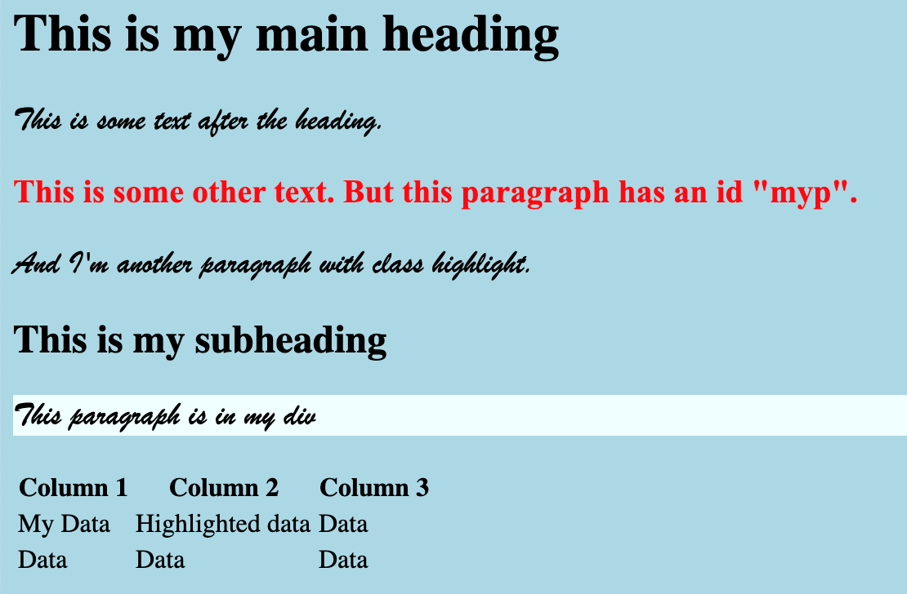
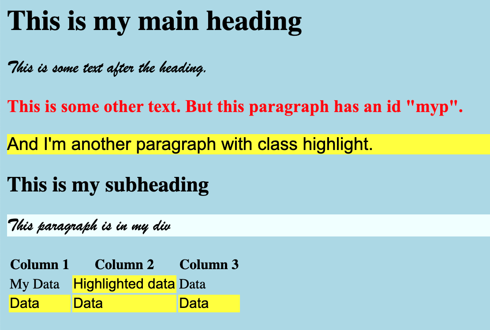

# Software Development 2 Seminar 07 -- UI Design and CSS

**Please note that this is an optional addition to your work and has been put in as part of a seminar session rather than a lab because of that. Feel free to use basic style HTML for your assessment.**

In this seminar, we will look at how we can define the style of our HTML documents using *Cascading Style Sheets (CSS)*. CSS allows us to define how certain elements in our web page look. Let us try a demo. First, create the following HTML document.

```html
<!DOCTYPE html>
<html>
    <head>
        <title>My CSS Testfile</title>
        <link rel="stylesheet" href="mystyle.css">
    </head>
    <body>
        <h1>This is my main heading</h1>
        <p>
            This is some text after the heading.
        </p>
        <p id="myp">
            This is some other text. But this paragraph has an id "myp".
        </p>
        <p class="highlight">
            And I'm another paragraph with class highlight.
        </p>
        <h2>This is my subheading</h2>
        <div id="mydiv" class="highlight">
            <p>This paragraph is in my div</p>
        </div>
        <table>
            <tr>
                <th>Column 1</th>
                <th>Column 2</th>
                <th>Column 3</th>
            </tr>
            <tr>
                <td id="mydata">My Data</td>
                <td class="highlight">Highlighted data</td>
                <td>Data</td>
            </tr>
            <tr class="highlight">
                <td>Data</td>
                <td>Data</td>
                <td>Data</td>
            </tr>
        </table>
    </body>
</html>
```

Most of this should be familiar, but we've done a couple of new things:

- We've linked to a CSS file (stylesheet) using the `<link>` tag.
- We've stated that some HTML elements have a `class` which we set as `highlight`.

The first point allows us to include our stylesheet file which we will do next. We will explore the `class` attribute shortly.

If you view your HTML file in a browser it will look something like this:


## Our First Stylesheet

Create `mystyle.css` and enter the following:

```css
body {
    background-color: lightblue;
}
```

A CSS file is full of entries like this.

- We declare the HTML element type, ID, or class we are defining.
- We declare a list of attributes of that HTML element type, ID, or class we want to set.

Here, we are setting the HTML `<body>` element to have a background colour of light blue. Save your CSS file and reload your web page. It should now look like this:


So we have set our background colour to light blue, but this is just a simple example that we could have done inside our HTML document. Let us update `mystyle.css` by adding the following:

```css
p {
    font-family: 'Brush Script MT', cursive;
    font-size: 20px;
}
```

Reload your webpage, and you will find the following:


Notice that all `<p>` elements have had their font changed. So, when we define a style for an element, it effects all those elements.

## Setting Style by ID

We can also set style by ID. Remember that an ID is a unique identifier in the web page. Add the following to your `mystyle.css` file.

```css
#myp {
    color: red;
    font-weight: bold;
    font-family: "Times New Roman";
}
```

This will set the `<p>` element with `id="myp"` to have a font colour of red, a bold weight, and to change the font family to Times New Roman. If you reload your webpage you will see the effect:


Notice the line with red text which is our `myp` paragraph.

### Now you try

There is another named HTML element on the page -- `mydiv`. Update the stylesheet so this element has a background colour of azure. Your page should look something like this:



Notice that the background colour is override within our `<div>` tag only. The container HTML element (e.g., `<body>`) specifies the style of all its sub elements unless they are also have a specified style. Experiment with this by setting the `font` of the `body` style in `mystyle.css` to see the effect.

## Setting Style by Class

The `class` attribute we set means we are defining a set of HTML elements that will share some of the same style. We can set class based styles in our CSS documents. To do this in our `mystyle.css` file add the following:

```css
.highlight {
    background-color: yellow;
    font-family: "Arial";
}
```

Reloading your web page will give you the following:



Note that the `<tr>` element we defined as having `class="highlight"` has set all its child `<td>` elements to use the `highlight` style.

## Setting Style by Type and Class

We can also set the style of a particular element type and class combined. Let's say that for a `<tr>` element of `class="highlight"` we want the background colour to be green-yellow. To do this, add the following to `mystyle.css`:

```css
tr.highlight {
    background-color: greenyellow;
}
```

We use the `element.class` type to define a particular style on a particular HTML element type for a particular class. Your web page should now look like this:


## So you want to know more?

The following two links will give you further examples and tutorials on CSS.

<[CSS Tutorial (w3schools.com)](https://www.w3schools.com/Css/)>

<[CSS Examples (w3schools.com)](https://www.w3schools.com/Css/css_examples.asp)>

In next week's seminar, we will look at using a CSS template to really drive the look and feel of a web page.