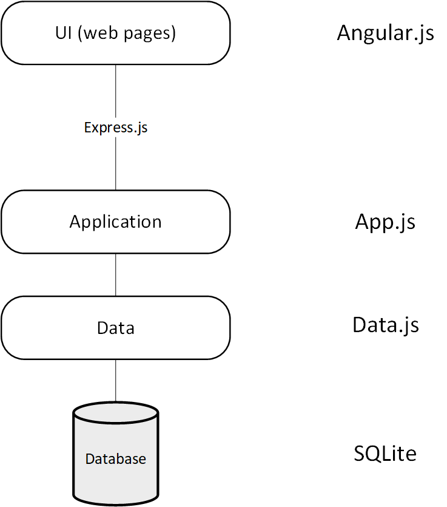
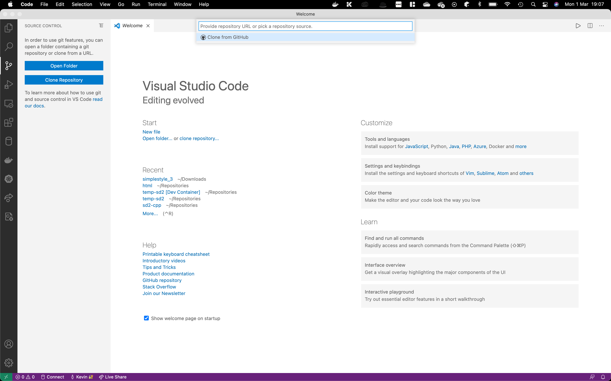
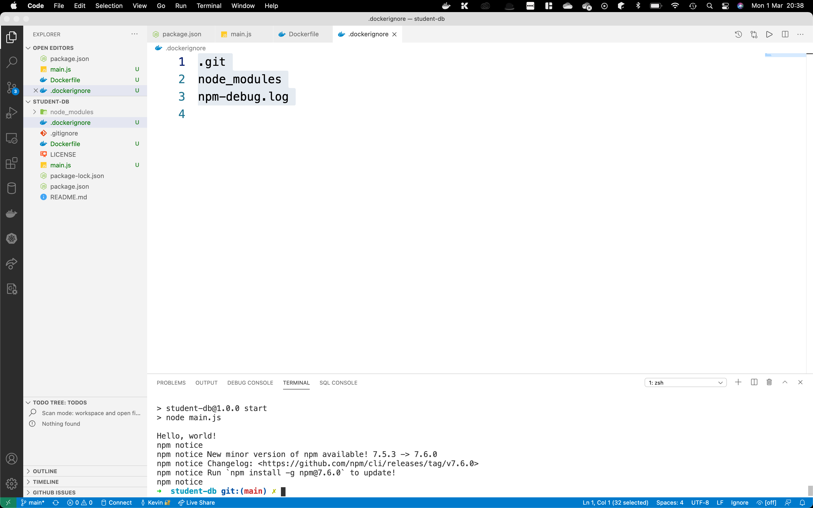
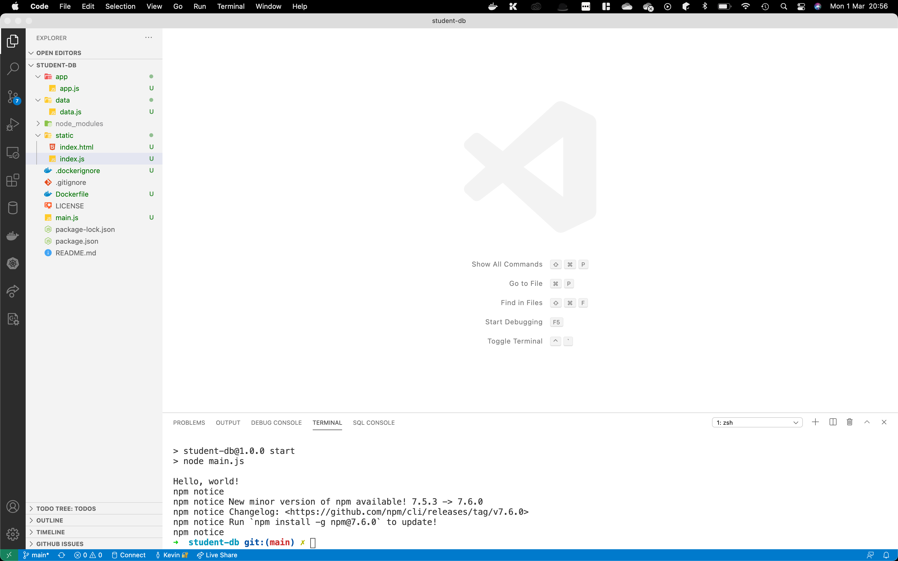
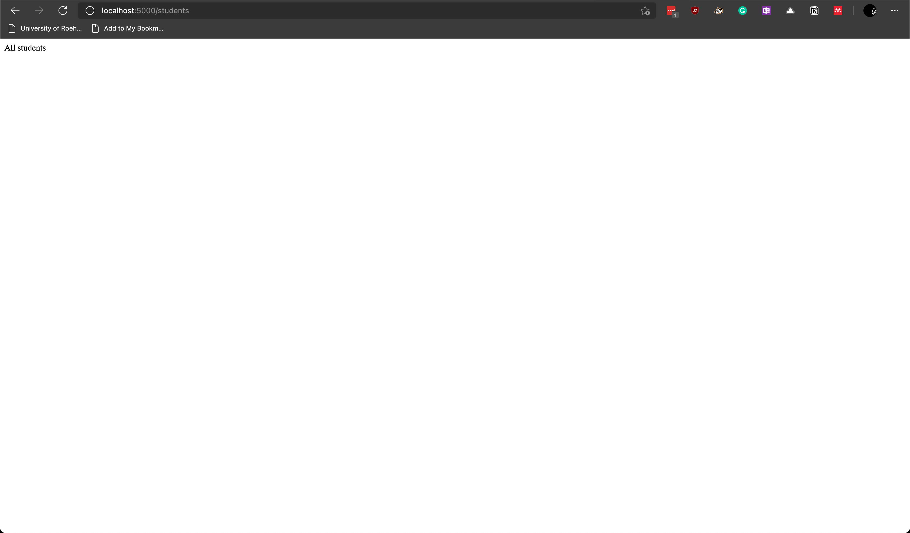

# Software Development 2 Lab 08 -- Case Study: Building the Student Application Part 1

In this lab we will put together all the components we have been discussing throughout the module to complete our Student Database application. There is quite a lot to do, and it is expected that this lab will take a longer time (two weeks) to complete.

## Workflow

To give you an idea of the process we are going to follow, see the below series of steps.

1. Design enough of the system (e.g., user stories, diagrams, database design, frontend design).
2. Populate some of the database.
3. Setup GitHub repository and pull.
4. Initialise project using npm.
   1. Add any dependencies.
   2. Add start script
5. Create Dockerfile (runtime environment)
6. Create folder structure.
7. Create Express.js endpoints -- remember the static pages.
8. Do a test, via Docker, to make sure you can access the endpoints.
9. Turn endpoints into SQL statements and return JSON.
   1. Test each one as you build.
10. Add a frontend page (e.g., student.html).
11. Use dummy data to test frontend page works.
12. Repeat steps 10 and 11 for each page.
13. Change dummy data to talk to correct Express.js endpoints.
    1. Start with requesting pages.
    2. Do updating pages later.
14. Test each addition.
15. Repeat 13 and 14 until all pages talk to the backend.
16. Repeat steps 7 to 15 for functionality that updates the database.
17. Finish.

## Basic Application Architecture

The basic application architecture we have been working to is below. In this lab we will cover everything up to and including Express.js.



## Requirements

Our Student Database system is designed to manage students at university, including their programme of study, the modules on the programme, and the students grades on their modules. The application is designed for both administrators to manage student data, and for students to update their personal data and see their module results. Let us first define our set of user stories for this application.

### User Stories

Our user stories are focused on administrators and students. We will keep these brief for simplicities sake, but there are a number of other user stories we could consider.

1. As an administrator, I want to add a module to the system so we can attach marks to a student.
2. As an administrator, I want to add a programme to the system so I can enrol students on a programme.
3. As an administrator, I want to add a module to a programme so students know which modules they are studying.
4. As an administrator, I want to add a student to the system so I can enrol students to programmes and therefore modules.
5. As an administrator, I want to enter module marks for a student so they can know how they are progressing.
6. As a student, I want to see my module marks soI know how I am progressing with my studies.
7. As a student, I want to update my personal details so the university has the correct information.

### Use Case Diagrams


**TODO**


### Database Design


**TODO**


### Class Diagram


**TODO**


## Logistics -- GitHub, `npm` and Docker

Our first task when creating a project is setup the main configurations:

1. GitHub repository.
2. `npm` initialisation.
3. Docker file.

### GitHub Setup

- **Create a new GitHub repository for your project. For example, the details I used are below**.


- **Next clone your GitHub repository in Visual Studio Code. Use the Version Control tab and select Clone Repository.**



- **When your repository has been cloned, your Visual Studio Code should look something like this.**


We are now ready to set up the Node project via 

### `npm`

- **Open the Terminal in Visual Studio Code and enter `npm init` as shown below.**


- **Just use the default values is you wish. It will create a `package.json` file.**
- **Open `package.json` and add the `start` script `node main.js`. My one is below. See Line 7 for the change.**

```json
{
  "name": "student-db",
  "version": "1.0.0",
  "description": "",
  "main": "main.js",
  "scripts": {
    "start": "node main.js",
    "test": "echo \"Error: no test specified\" && exit 1"
  },
  "repository": {
    "type": "git",
    "url": "git+https://github.com/kevin-chalmers/student-db.git"
  },
  "author": "Kevin Chalmers",
  "license": "Apache-2.0",
  "bugs": {
    "url": "https://github.com/kevin-chalmers/student-db/issues"
  },
  "homepage": "https://github.com/kevin-chalmers/student-db#readme"
}

```

- **Now let us install our dependencies. Enter `npm install express` in the Visual Studio Code Terminal.**


- **Now enter `npm install sqlite3` in your Visual Studio Code Terminal.**

Your `package.json` file should now look like this.

```json
{
  "name": "student-db",
  "version": "1.0.0",
  "description": "",
  "main": "main.js",
  "scripts": {
    "start": "node main.js",
    "test": "echo \"Error: no test specified\" && exit 1"
  },
  "repository": {
    "type": "git",
    "url": "git+https://github.com/kevin-chalmers/student-db.git"
  },
  "author": "Kevin Chalmers",
  "license": "Apache-2.0",
  "bugs": {
    "url": "https://github.com/kevin-chalmers/student-db/issues"
  },
  "homepage": "https://github.com/kevin-chalmers/student-db#readme",
  "dependencies": {
    "express": "^4.17.1",
    "sqlite3": "^5.0.2"
  }
}
```

- **Now add the file `main.js` to the main folder of your project. Use the following code:**

```javascript
console.log("Hello, world!");
```

- **Test your application now by running `npm start` in the Visual Studio Code Terminal. Your output should be `Hello, world!`.**
- **Commit your changes to GitHub now. Remember**:
  - **Add the changes.**
  - **Create a commit.**
  - **Push the changes.**

We have now set up our project to run. Let us now create the execution environment.

### Docker Setup

- **Create a `Dockerfile` file in the main folder of the project, using the below. NOTE -- for most of you this will be the default `Dockerfile` for your project.**

```dockerfile
# Base image to use
FROM node:latest

# Create application directory
WORKDIR /usr/src/app

# Install application dependencies
# Copy across project configuration information
COPY package*.json ./

# Ask npm to install the dependencies
RUN npm install

# Copy across all our files
COPY . .

# Expose our application port (3000)
EXPOSE 3000

# On start, run the application using npm
ENTRYPOINT ["npm", "start"]
```

- **Now add a `.dockerignore` file to your main project folder using the following for its contents.**

```txt
.git
node_modules
npm-debug.log
```

- **Build your docker image now using the following command within the Visual Studio Code Terminal: `docker build -t student-database .` (remember the dot at the end).**

- **Now run your docker image as a container by executing the following: `docker run --rm student-database`**

You should have output similar to the below.



- **Now commit your changes to GitHub. Remember:**
  - **Add your changes.**
  - **Commit the changes.**
  - **Push the changes.**

We now have our configuration set up. Let us move onto our backend development.

## Backend Setup

Our backend is written in Node.js, using SQLite as a database and communicating with the frontend via Express.js. We will now perform the following steps:

- Create our project folder structure.
- Define our classes.
- Define our endpoints (Express.js routes).

### Folder Structure

- **Update your Visual Studio Project folder as follows. Some of these files should already be created. Ensure you create the correct folders and that the files are in the correct place. `student.db` is available on Moodle.**

```txt
\---app
|       app.js
|
\---data
|       data.js
|       student.db
|
+---node_modules
|
\---static
|       index.html
|       index.js
|
|   .dockerignore
|   .gitignore
|   Dockerfile
|   LICENSE
|   main.js
|   package-lock.json
|   package.json
|   README.md
|   student.js
```

- **Below is how this looks in Visual Studio Code.**



- **Commit your changes to GitHub. Remember:**
  - **Add your changes.**
  - **Commit your changes.**
  - **Push your changes.**

### Class Definitions

We can now define our classes. We are going to put these in `student.js`. This file will be a **module** that we can import into other parts of our code. A module requires us to use the `exports` object. This allows other code to use parts of our module. For example, if we want to export a function, `myFunction` from our module, we would do the following:

```javascript
exports.myFunction = function() { 
  // function contents.
};
```

- **Enter the below into the `student.js` file.**

```javascript
"use strict";

exports.Student = class {
  // Student ID
  id;
  // Student first name
  first_name;
  // Student last name
  last_name;
  // Student programme
  programme;
  // Student modules and grades
  modules = [];

  constructor(id, first_name, last_name, programme) {
    this.id = id;
    this.first_name = first_name;
    this.last_name = last_name;
    this.programme = programme;
  }
}

exports.Programme = class {
  // Programme code
  code;
  // Programme name
  name;

  constructor(code, name) {
    this.code = code;
    this.name = name;
  }
}

exports.Module = class {
  // Module code
  code;
  // Module name
  name;

  constructor(code, name) {
    this.code = code;
    this.name = name;
  }
}
```

- **Commit your changes to GitHub. Remember:**
  - **Add the changes.**
  - **Commit the changes.**
  - **Push the changes.**

### Endpoints

Endpoints are the routes that our Express.js application will offer to our front end. We need an endpoint for each data type we can request -- `Student`, `Programme`, and `Module` -- as well being able to get all of the entries for these types in the database. Therefore, we require six endpoints.

1. Module -- `/module/code`
2. Modules -- `/modules`
3. Programme -- `/programme/code`
4. Programmes -- `/programmes`
5. Student -- `/student/id`
6. Students -- `/students`

- **Below is the contents of `app.js`. Enter this code now. We have covered each part of this code so far.**

```javascript
"use strict";

// The application layer uses student classes
const student = require("../student.js");

// The application layer talks to the data layer
const data = require("../data/data.js");

// Import express library.
const express = require("express");

// Create express application
var app = express();

// Add static files location
app.use(express.static("static"));

// Add /module endpoint
app.get("/module/:code", function(req, res) {
  // Return "Module <code>"
  res.send("Module " + req.params.code);
});

// Add /modules endpoint
app.get("/modules", function(req, res) {
  // Return "All modules"
  res.send("All modules");
});

// Add /programme endpoint
app.get("/programme/:code", function(req, res) {
  // Return "Programme <code>"
  res.send("Programme " + req.params.code);
});

// Add /programmes endpoint
app.get("/programmes", function(req, res) {
  // Return "All programmes"
  res.send("All programmes");
});

// Add /student endpoint
app.get("/student/:id", function(req, res) {
  // Return "Student <id>"
  res.send("Student " + req.params.id);
});

// Add /students endpoint
app.get("/students", function(req, res) {
  // Return "All students"
  res.send("All students");
});

// Start listening on port 3000
app.listen(3000, function(err) {
  if (err) {
    return console.error(err.message);
  }
  console.log("Server started.");
});
```

- **Now update the `main.js` file to the following.**

```javascript
"use strict";

// Include the app.js file.
// This will run the code.
const app = require("./app/app");
```

### Testing

Let us now test our application.

- **Build the Docker image using `docker build -t student-database .`**

- **Now run the Docker image in detached mode (`-d`) and redirect the host machine's port 5000 to the container's port 3000: `docker run -d --rm -p 5000:3000 student-database`**
- **Now open your browser and test the endpoints to see if they are working. For example, `localhost:5000/students` returns the following.**



- **Now we need to stop our Docker container. Run the following to list the running containers: `docker ps`. This will output the list of running containers. For example, mine is below:**

```shell
CONTAINER ID   IMAGE              COMMAND       CREATED              STATUS              PORTS                    NAMES
974905b65c5c   student-database   "npm start"   About a minute ago   Up About a minute   0.0.0.0:5000->3000/tcp   wonderful_dijkstra
```

- **To stop the running container use `docker stop <name>` where `<name>` is the name of your container. For example, I will run `docker stop wonderful_dijkstra`.**

- **Commit your changes to GitHub. Remember:**
  - **Add your changes.**
  - **Commit your changes.**
  - **Push your changes.**

## Talking to Our Database


```javascript
"use strict";

// Import SQLite library.
const sqlite3 = require("sqlite3").verbose();

// The application layer uses student classes
const student = require("../student.js");

// Connect to the database.
var db = new sqlite3.Database("data/students.db", function(err) {
    if (err) {
        return console.error(err.message);
    }
    console.log("Connected to students database.");
});
```


`docker build -t student-database .`


`docker run --rm student-database`


Git commit.


## Implementing Endpoints


### Getting All Students


#### `getAllStudents`


```sql
SELECT 
	Students.id, 
  Students.first_name, 
  Students.last_name, 
  Students.programme,
  Programmes.name
FROM
  Students,
  Programmes
WHERE
  Students.programme = Programmes.code
```


```javascript
// Export getStudents function
exports.getStudents = function(callback) {
    // Create SQL statement
    var sql = `
        SELECT 
            Students.id, 
            Students.first_name, 
            Students.last_name, 
            Students.programme,
            Programmes.name
        FROM
            Students,
            Programmes
        WHERE
            Students.programme = Programmes.code
        `;
    // Execute query. Return all
    db.all(sql, function(err, rows) {
        // Check if error
        if (err) {
            return console.error(err.message);
        }
        // Create an array of Students
        var students = [];
        // Loop through rows creating Student objects
        for (var row of rows) {
            // Create programme object
            var prog = new student.Programme(row.programme, row.name);
            // Create student object
            var stud = new student.Student(row.id, row.first_name, row.last_name, prog);
            // Add student to array
            students.push(stud);
        }
        // Execute callback function
        callback(students);
    });
};
```


```javascript
// Add /students endpoint
app.get("/students", function(req, res) {
  // Call getStudents on data
  data.getStudents(function(students) {
    res.json(students);
  });
});
```


`docker build -t student-database .`


`docker run --rm student-database`


Git commit.


### Getting All Programmes


```javascript
// Export getProgrammes function
exports.getProgrammes = function(callback) {
    // Create SQL statement
    var sql = `SELECT * FROM Programmes`;
    // Execute query. Return all
    db.all(sql, function(err, rows) {
        // Check if error
        if (err) {
            return console.error(err.message);
        }
        // Create programme array
        var programmes = [];
        // Loop through rows creating programme objects
        for (var row of rows) {
            // Create programme object
            var prog = new student.Programme(row.code, row.name);
            // Add object to array
            programmes.push(prog);
        }
        // Execute callback function
        callback(programmes);
    });
};
```


```javascript
// Add /programmes endpoint
app.get("/programmes", function(req, res) {
    // Call getProgrammes on data
    data.getProgrammes(function(programmes) {
        res.json(programmes);
    });
});
```


### Getting All Modules


```javascript
// Export getModules function
exports.getModules = function(callback) {
    // Create SQL statement
    var sql = `SELECT * FROM Modules`;
    // Execute query. Return all
    db.all(sql, function(err, rows) {
        // Check if error
        if (err) {
            return console.error(err.message);
        }
        // Create modules array
        var modules = [];
        // Loop through each row and create a module object
        for (var row of rows) {
            // Create module object
            var mod = student.Module(row.code, row.name);
            // Add module to array
            modules.push(mod);
        }
        // Execute callback function
        callback(modules);
    });
};
```


```javascript
// Add /modules endpoint
app.get("/modules", function(req, res) {
    // Call getModules on data
    data.getModules(function(modules) {
        res.json(modules);
    });
});
```


### Getting a Module


```javascript
// Export getModule function
exports.getModule = function(code, callback) {
    // Create SQL statement
    var sql = `
        SELECT * FROM Modules
        WHERE code = ${code}`;
    // Execute query. Only one row returned.
    db.get(sql, function(err, row) {
        if (err) {
            return console.error(err.message);
        }
        // Create a module object
        var module = new student.Module(row.code, row.name);
        // Return module
        callback(module);
    });
};
```


```javascript
// Add /module endpoint
app.get("/module/:code", function(req, res) {
    // Call getModule on data
    data.getModule(function(module) {
        res.json(module);
    });
});
```


### Getting a Programme


Include modules


### Getting Grades


### Getting a Student


#### 

