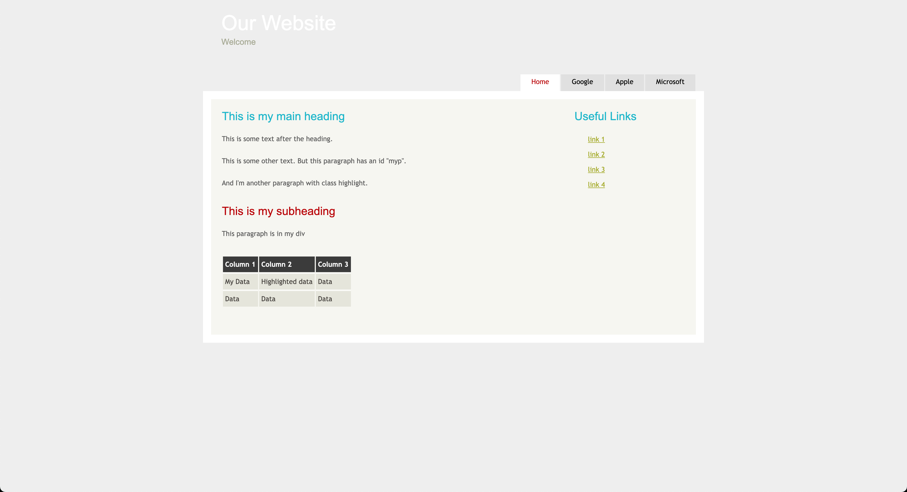

# Software Development 2 Seminar 08 -- More UI Design with CSS Templates

**Please note that this is an optional addition to your work and has been put in as part of a seminar session rather than a lab because of that. Feel free to use basic style HTML for your assessment.**

In this seminar, we will continue our work on CSS and UI design by exploring CSS templates. A CSS template is a reusable CSS file that allows the setup of your HTML. We are going to use the *Simple Light* template available form [Free Download Simple Website Templates, Basic HTML Template (html5webtemplates.co.uk)](https://www.html5webtemplates.co.uk/templates/). You can see a demo of the style here: [simple_light (html5webtemplates.co.uk)](https://www.html5webtemplates.co.uk/wp-content/uploads/2020/templates/simple_light/index.html). Below is an update to our HTML page from last week. Notice the change on Lines 5  to where the style sheet is. You can get the stylesheet file [here](style.css).

```html
<!DOCTYPE html>
<html>
  <head>
    <title>My CSS Testfile</title>
    <link rel="stylesheet" href="style.css">
  </head>
  <body>
    <h1>This is my main heading</h1>
    <p>
      This is some text after the heading.
    </p>
    <p id="myp">
      This is some other text. But this paragraph has an id "myp".
    </p>
    <p class="highlight">
      And I'm another paragraph with class highlight.
    </p>
    <h2>This is my subheading</h2>
    <div id="mydiv" class="highlight">
      <p>This paragraph is in my div</p>
    </div>
    <table>
      <tr>
        <th>Column 1</th>
        <th>Column 2</th>
        <th>Column 3</th>
      </tr>
      <tr>
        <td id="mydata">My Data</td>
        <td class="highlight">Highlighted data</td>
        <td>Data</td>
      </tr>
      <tr class="highlight">
        <td>Data</td>
        <td>Data</td>
        <td>Data</td>
      </tr>
    </table>
  </body>
</html>
```

If you open this webpage, you will get the following output:


OK, a bit of change. But this isn't the reason we are using the template. Let us add some additional features to our webpage.

If you look at the `index.html` file made available from the Simple Light template, it has some `<div>` tags set to define some menu bars. Let us add some now. **Add the following to your HTML file at the top of the `<body>` tag, and also note the class defined for the `<body>` tag.**

```html
<body>
  <div id="main">
    <div id="header">
      <div id="logo">
        <div id="logo_text">
          <h1>Our Website</h1>
          <h2>Welcome</h2>
        </div>
      </div>
      <div id="menubar">
        <ul id="menu">
          <li class="selected"><a href="index.html">Home</a></li>
          <li><a href="https://www.google.com">Google</a></li>
          <li><a href="https://www.apple.com">Apple</a></li>
          <li><a href="https://www.microsoft.com">Microsoft</a></li>
        </ul>
      </div>
    </div>
    <div id="site_content">
      <div class="sidebar">
        <h3>Useful Links</h3>
        <ul>
          <li><a href="#">link 1</a></li>
          <li><a href="#">link 2</a></li>
          <li><a href="#">link 3</a></li>
          <li><a href="#">link 4</a></li>
        </ul>
      </div>
    </div>
  </div>
  <!-- Rest of body as before -->
```

We have used some CSS types here. We have defined the top area of our page, a menu bar, and a sidebar. If you refresh your webpage it will now look like this.


OK, this looks better, although some problems. Our content is not in the correct location. This is easily fixed by putting it in a `<div>` tag in the right place. The complete webpage is below.

```html
<!DOCTYPE html>
<html>
  <head>
    <title>My CSS Testfile</title>
    <link rel="stylesheet" href="style.css">
  </head>
  <body>
    <div id="main">
      <div id="header">
        <div id="logo">
          <div id="logo_text">
            <h1>Our Website</h1>
            <h2>Welcome</h2>
          </div>
        </div>
        <div id="menubar">
          <ul id="menu">
            <li class="selected"><a href="index.html">Home</a></li>
            <li><a href="https://www.google.com">Google</a></li>
            <li><a href="https://www.apple.com">Apple</a></li>
            <li><a href="https://www.microsoft.com">Microsoft</a></li>
          </ul>
        </div>
      </div>
      <div id="site_content">
        <div class="sidebar">
          <h3>Useful Links</h3>
          <ul>
            <li><a href="#">link 1</a></li>
            <li><a href="#">link 2</a></li>
            <li><a href="#">link 3</a></li>
            <li><a href="#">link 4</a></li>
          </ul>
        </div>
        <div id="content">
          <h1>This is my main heading</h1>
          <p>
            This is some text after the heading.
          </p>
          <p id="myp">
            This is some other text. But this paragraph has an id "myp".
          </p>
          <p class="highlight">
            And I'm another paragraph with class highlight.
          </p>
          <h2>This is my subheading</h2>
          <div id="mydiv" class="highlight">
            <p>This paragraph is in my div</p>
          </div>
          <table>
            <tr>
              <th>Column 1</th>
              <th>Column 2</th>
              <th>Column 3</th>
            </tr>
            <tr>
              <td id="mydata">My Data</td>
              <td class="highlight">Highlighted data</td>
              <td>Data</td>
            </tr>
            <tr class="highlight">
              <td>Data</td>
              <td>Data</td>
              <td>Data</td>
            </tr>
          </table>
        </div>
      </div>
    </div>
  </body>
</html>
```

We've added a new `<div>` tag with `id="content"` that is a child of the `site-content` `<div>` tag. If you reload your webpage it will come out as follows:



We're not going to go any further looking at CSS templates as each template is different. You have to be comfortable with HTML if you really want to use them. There are plenty of free CSS templates available for you to use, although some are more complicated than others.