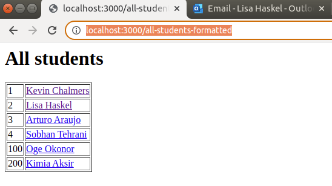

# Software Development 2 Lab 09 -- Models and Controllers

__There is a video of this lab at: [https://roehampton.cloud.panopto.eu/Panopto/Pages/Viewer.aspx?id=209f92cf-978e-4703-9809-af530114afba](https://roehampton.cloud.panopto.eu/Panopto/Pages/Viewer.aspx?id=209f92cf-978e-4703-9809-af530114afba)__

We are going to further improve our code by implementing a fairly rudimentary version of the 'MVC' - Model, View, Controller design pattern.


We have already started by separating the frontend views from the main logic of express by using pug templates.

Now we will look at how we can tidy up the 'business logic' and the database interactions, and delegate these to 'models' in our backend code.


## Using OOP to create Models

We looked at how Object Orientated Programming can create code that more closely models real-world entities and by so doing makes you code architecture robust and understandable.

Look back at [Week 4 lab - OOP ](https://roehampton.github.io/module-content/msc-software-development-2/week-04/lab/)to remind yourself.

In this lab we will re-create the Student class, but this time contruct our classes dynamically from data in the database and adapt it to the data we want to model.

We will also see how this has adavantages when working with PUG templates.

For this lab, we will create a single-student page to utilise OOP and the MVC pattern.  

## Pre-requisites

Your app.js file should have the following contents at the start of the lab. Most but not all you will have done in previous labs.


```
// Import express.js
const express = require("express");

// Create express app
var app = express();

// Add static files location
app.use(express.static("static"));

// Use the Pug templating engine
app.set('view engine', 'pug');
app.set('views', './app/views');

// Get the functions in the db.js file to use
const db = require('./services/db');

// Create a route for root - /
app.get("/", function(req, res) {
    res.render("index");
});


// Task 1 JSON formatted listing of students
app.get("/all-students", function(req, res) {
    var sql = 'select * from Students';
    // As we are not inside an async function we cannot use await
    // So we use .then syntax to ensure that we wait until the 
    // promise returned by the async function is resolved before we proceed
    db.query(sql).then(results => {
        console.log(results);
        res.json(results);
    });

});

// Task 2 display a formatted list of students
app.get("/all-students-formatted", function(req, res) {
    var sql = 'select * from Students';
    db.query(sql).then(results => {
    	    // Send the results rows to the all-students template
    	    // The rows will be in a variable called data
        res.render('all-students', {data: results});
    });
});

// Single student page.  Show the students name, course and modules
app.get("/student-single/:id", async function (req, res) {
    var stId = req.params.id;
    console.log(stId);
    // Query to get the required results from the students table.  
    // We need this to get the programme code for this student.
    var stSql = "SELECT s.name as student, ps.name as programme, \
    ps.id as pcode from Students s \
    JOIN Student_Programme sp on sp.id = s.id \
    JOIN Programmes ps on ps.id = sp.programme \
    WHERE s.id = ?";

    var stResult = await db.query(stSql, [stId]);
    console.log(stResult);
    var pCode = stResult[0]['pcode'];
    
    // Get the modules for this student using the programme code from 
    // the query above
    var modSql = "SELECT * FROM Programme_Modules pm \
    JOIN Modules m on m.code = pm.module \
    WHERE programme = ?";

    var modResult = await db.query(modSql, [pCode]);
    console.log(modResult);

    // Send directly to the browser for now as a simple concatenation of strings
    res.send(JSON.stringify(stResult) + JSON.stringify(modResult));
    });


// JSON output of all programmes
app.get("/all-programmes", function(req, res) {
    var sql = 'select * from Programmes';
    // As we are not inside an async function we cannot use await
    // So we use .then syntax to ensure that we wait until the 
    // promise returned by the async function is resolved before we proceed
    db.query(sql).then(results => {
        console.log(results);
        res.json(results);
    });

});

// Single programme page (no formatting or template)
app.get("/programme-single/:id", async function (req, res) {
    var pCode = req.params.id;
    var pSql = "SELECT * FROM Programmes WHERE id = ?";
    var results = await db.query(pSql, [pCode]);
    //Now call the database for the modules
    //Why do you think that the word modules is coming in before the name of the programme??
    var modSql = "SELECT * FROM Programme_Modules pm \
    JOIN Modules m on m.code = pm.module \
    WHERE programme = ?";
    var modResults = await db.query(modSql, [pCode]);
    // String the results together, just for now.  Later we will push this
    // through the template
    res.send(JSON.stringify(results) + JSON.stringify(modResults));  
});


// Create a route for testing the db
app.get("/db_test", function(req, res) {
    // Assumes a table called test_table exists in your database
    var sql = 'select * from test_table';
    // As we are not inside an async function we cannot use await
    // So we use .then syntax to ensure that we wait until the 
    // promise returned by the async function is resolved before we proceed
    db.query(sql).then(results => {
        console.log(results);
        res.json(results)
    });
});

// Create a route for /goodbye
// Responds to a 'GET' request
app.get("/goodbye", function(req, res) {
    res.send("Goodbye world!");
});

// Create a dynamic route for /hello/<name>, where name is any value provided by user
// At the end of the URL
// Responds to a 'GET' request
app.get("/hello/:name", function(req, res) {
    // req.params contains any parameters in the request
    // We can examine it in the console for debugging purposes
    console.log(req.params);
    //  Retrieve the 'name' parameter and use it in a dynamically generated page
    res.send("Hello " + req.params.name);
});

// Start server on port 3000
app.listen(3000,function(){
    console.log(`Server running at http://127.0.0.1:3000/`);
});


```

From your lab 8, you should also have everything required to produce the following listing of all students at the url: ```http://localhost:3000/all-students-formatted```.



Part of this solution includes the pug template, correctly saved in app/views/all-students.pug as follows:

```
extends layout
block content
    - console.log(data)
    .main-content 
    h1 All students 
    table(border=1)
        for item in data 
            tr  
                td #{item.id}
                td 
                    a(href='/student-single/' + item.id) #{item.name}

```
### The single student page

Visit the page at http://localhost:3000/all-students-formatted, and click on 'Kevin Chalmers.'  You will be taken to a page with URL: ```http://localhost:3000/student-single/1```,  that will have the following content

```
[{"student":"Kevin Chalmers","programme":"BEng Software Engineering","pcode":"09UU0002"}][{"programme":"09UU0002","module":"CMP020C101","code":"CMP020C101","name":"Software Development 1"},{"programme":"09UU0002","module":"CMP020C102","code":"CMP020C102","name":"Computer Systems"},{"programme":"09UU0002","module":"CMP020C103","code":"CMP020C103","name":"Mathematics for Computer Science"},{"programme":"09UU0002","module":"CMP020C104","code":"CMP020C104","name":"Software Development 2"},{"programme":"09UU0002","module":"CMP020C105","code":"CMP020C105","name":"Computing and Society"},{"programme":"09UU0002","module":"CMP020C106","code":"CMP020C106","name":"Databases"}]

```

Look at the code in app.js that has generated this page and you will find that it is the combined results of two queries.

We don't want app.js to contain so much business logic, and we want to be able to send the information needed by the template in a tidy and predictable form,  just as we did with the student formatted page.

### Using 'models'

In the MVC design pattern, the 'model' parts of the program are used to handle all communication with the database and pass objects back to the controller and parts of the program in formats that are easy to use for the display and business logic.  The view and controller parts of your programme should not need to 'know' any of the details of how the database is implemented.

We will use our knowlege of OOP to construct well designed objects from the database that we can pass into the rest of the program.

### The student class

Although data about a single student resides in various tables in the relational database, a student can be modelled as follows:


Lets implement this in code.

Create a new directory called ```models``` inside your app directory.
Within this, create a new file called ```student.js```.

Add the following code. This is the outline of our student class.  It includes 'stubs'.  Stubs are definitions of functions that remind us what needs to be there, but which are not yet complete in implementation.

```javascript

// Get the functions in the db.js file to use
const db = require('./../services/db');

class Student {
    // Student ID
    id;
    // Student name
    name;
    // Student programme
    programme;
    // Student modules
    modules = [];

    constructor(id) {
        this.id = id;
    }
    
    async getStudentName() {
    }
    
    async getStudentProgramme()  {
    }
    
    async getStudentModules() {
    }
}

module.exports = {
    Student
}
```

#### Testing the student class

Lets use the ```single-student``` route in the app.js file to test our development

In ```app.js``` 

1. Add the following near the top of the file to ensure access to the code for our new model

```
// Get the models
const { Student } = require("./models/student");
```

2. amend the single-student route as follows:

```javascript


app.get("/student-single/:id", async function (req, res) {
    var stId = req.params.id;
    // Create a student class with the ID passed
    var student = new Student(stId);
    console.log(student);
    res.send(student);

});
```

Load the page at ```http://localhost:3000/single-student/1```

Note the console output, that usefully indicates to you that the output is a class of type Student.  Note also the use of le-studentthe async keyword.  This prepares us for being able to receive results from the database in this function using the await  keyword.

#### Querying the database: getting the name

To get the name of the student from the ID we need to query the database. So this is where it gets more interesting!

Complete your 'stub' function for getStudentName() as follows:

```javascript
 async getStudentName() {
        if (typeof this.name !== 'string') {
            var sql = "SELECT * from Students where id = ?"
            const results = await db.query(sql, [this.id]);
            this.name = results[0].name;
        }

    }

```

Now amend in ```app.js```: 

(note the addition of the async keyword in the anonymous function signature)

```javascript
// Task 3 single student page
app.get("/student-single/:id", async function (req, res) {
    var stId = req.params.id;
    // Create a student class with the ID passed
    var student = new Student(stId);
    await student.getStudentName();
    console.log(student);
    res.send(student)

});

```

Load the page at ```http://localhost:3000/single-student/1```

And try some other IDs as well.

#### Creating the student template
 
Even though we have just a small amount of data, lets look at how we are going to send this to the frontend to complete our framework and how our student class helps us to this neatly.

1. Add a pug template for a single student.  In ```views`` directory, create ```student.pug``` with the following:

```javascript
extends layout
block content
    h1 Student page for: #{student.name}
    p The ID for the student is: #{student.id}
    p Later on we will be able to display the programme and modules
    
```

2. Amend app.js to call the template as follows

```
app.get("/single-student/:id", async function (req, res) {
    var stId = req.params.id;
    // Create a student class with the ID passed
    var student = new Student(stId);
    await student.getStudentName();
    res.render('student', {student:student});
});
```

(only one line has changed... ie. calling res.render() instead of res.send().  Note how we can pass the student class to the template and access its properties easily)


### Completing the Programmes and Modules classes


__Using the same way of working, you can build models for Programmes and Modules, and note that our student class contains a Programme class and an array of Module classes.  This may seem complicated at first, but note that it is a complete representation of a student in one data structure.__


Here is the class diagram for this example.


To complete the student page you should now 

1. Create a Programme class 
2. Create Module class

(NB for the above you will need to 'require' the new classes into student by including the following at the top of your file:

```
const { Programme } = require('./programme');
const { Module } = require('./module');
```

You will also have to require the db class in each of your models:

```javascript

const db = require('./../services/db');

```

Once those new classes have been created, you should now be able to:

3. Complete the getStudentProgramme() function in the Student class
4. Complete the getStudentModules() function in the Student class
6. Add to your student.pug template to display the complete information

Remember to use the console as you develop your code to see if you are getting the results you need with each step.

[Solutions: Link](./solutions-lab09.md)

See the video starting at 18mins 35seconds to see what the result should look like.
https://roehampton.cloud.panopto.eu/Panopto/Pages/Viewer.aspx?id=209f92cf-978e-4703-9809-af530114afba

### Finally...

You should now be able to complete this small read-only application by adding a programmes page and modules page.